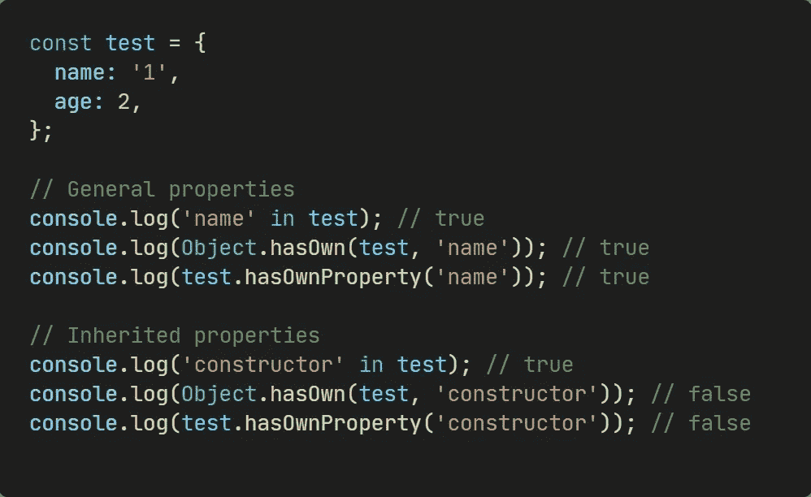
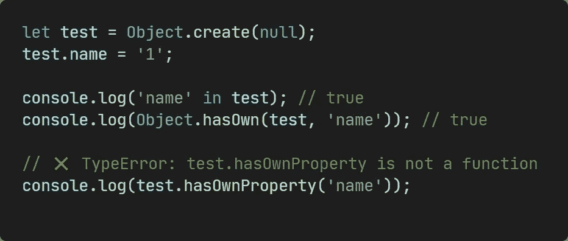
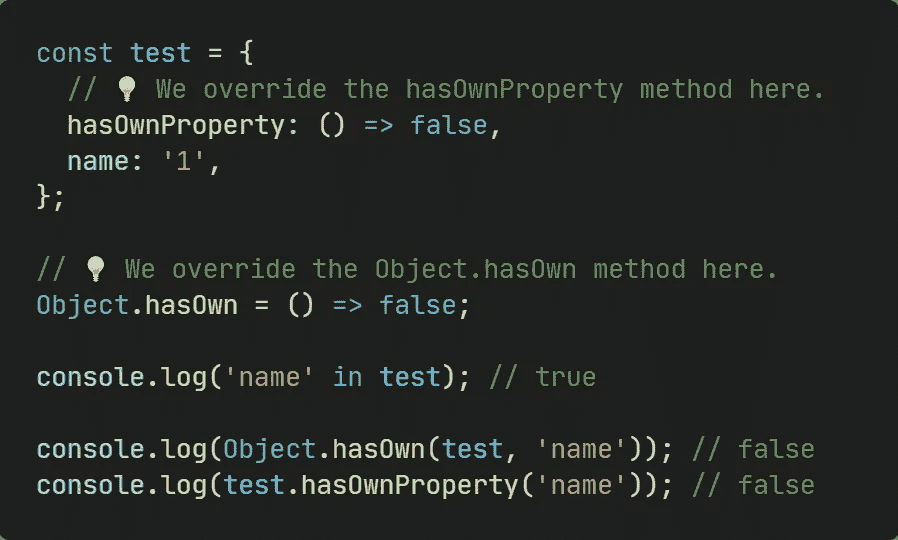
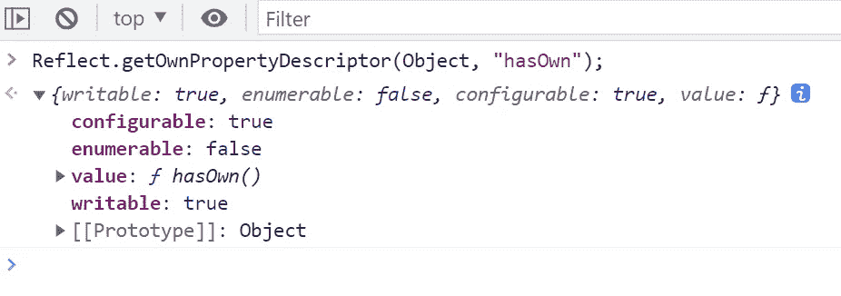
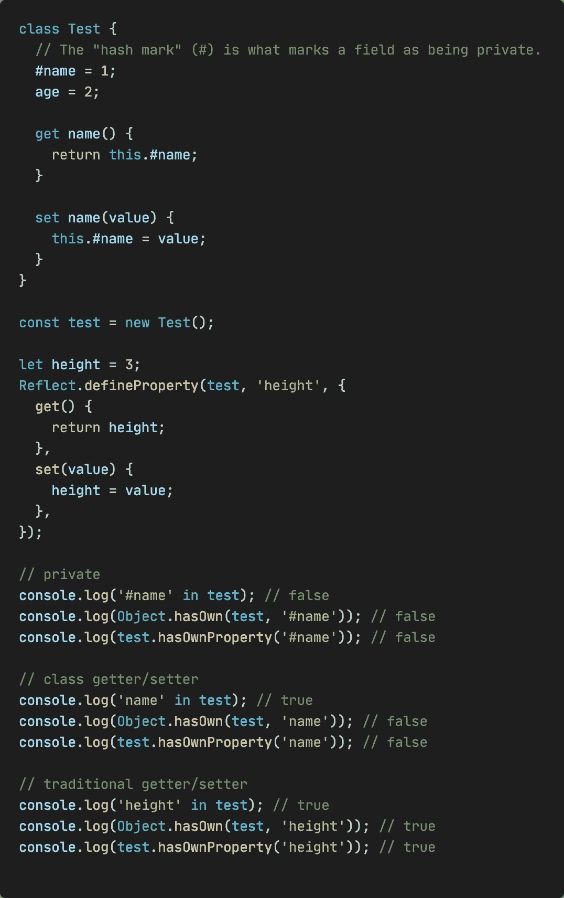
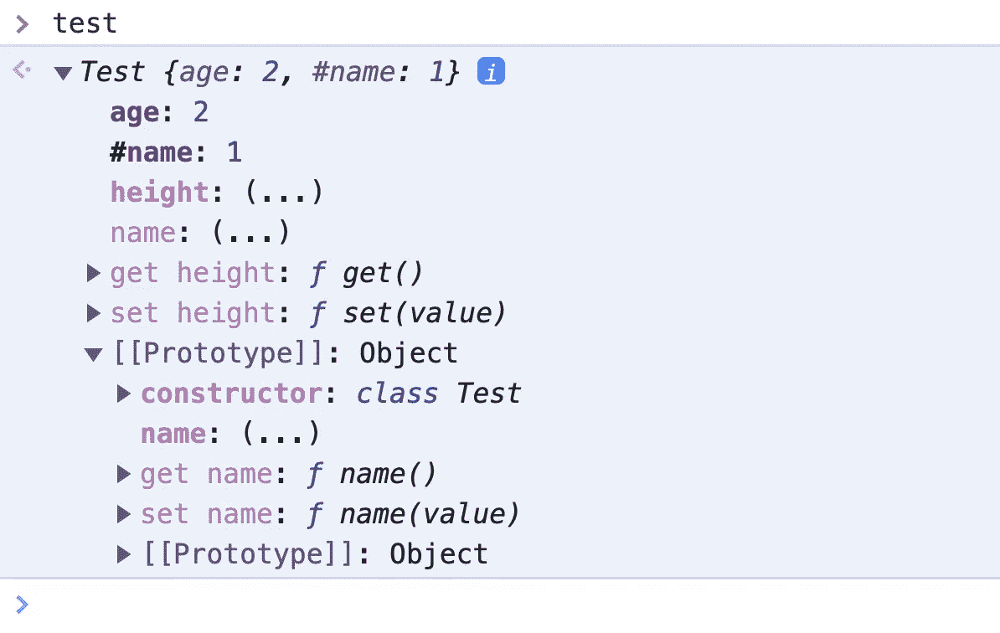

# 在 JavaScript 的“与‘hasOwn’和‘hasOwnProperty’中

> 原文：<https://javascript.plainenglish.io/in-vs-hasown-vs-hasownproperty-in-javascript-885771d2d100?source=collection_archive---------1----------------------->

## 你真的知道区别吗？


Photo by [Glenn Carstens-Peters](https://unsplash.com/@glenncarstenspeters?utm_source=medium&utm_medium=referral) on [Unsplash](https://unsplash.com?utm_source=medium&utm_medium=referral)

`in`操作符、`Object.hasOwn()`和`Object.prototype.hasOwnProperty()`都可以确定一个属性键是否在一个对象中，但是它们之间的区别是什么？跟我一起去看看吧！

# 继承的属性



```
const test = {
  name: '1',
  age: 2,
};**// General properties**
console.log('name' in test); // true
console.log(Object.hasOwn(test, 'name')); // true
console.log(test.hasOwnProperty('name')); // true**// Inherited properties**
console.log('constructor' in test); **// true**
console.log(Object.hasOwn(test, 'constructor')); // false
console.log(test.hasOwnProperty('constructor')); // false
```

可以看到，对于继承的属性，`in`运算符返回 true，而`Object.hasOwn()`和`Object.prototype.hasOwnProperty()`返回 false，顾名思义，它们只检查属于自己属性的属性，忽略继承的属性。

# 不是对象.原型



```
let test = Object.create(null);
test.name = '1';console.log('name' in test); // true
console.log(Object.hasOwn(test, 'name')); // true**// ❌ TypeError: test.hasOwnProperty is not a function**
console.log(test.hasOwnProperty('name'));
```

你可以看到，当我们创建一个原型不是`Object.prototype`的对象时，我们将无法访问 hasOwnProperty 方法，但是`in`操作符和`Object.own`都可以正常工作。

# 重写 hasOwn 或 hasOwnProperty



```
const test = {
  // 💡 We override the hasOwnProperty method here.
  **hasOwnProperty: () => false,**
  name: '1',
};// 💡 We override the Object.hasOwn method here.
**Object.hasOwn = () => false;**console.log('name' in test); // true**console.log(Object.hasOwn(test, 'name')); // false
console.log(test.hasOwnProperty('name')); // false**
```

在上面的代码中，我们覆盖了`test`对象上的`hasOwnProperty`方法，同时也覆盖了`Object.hasOwn`方法，这样无论属性是否实际存在于对象中，这两个方法都将返回 false，甚至是您自定义的任何值。另一方面，`in`操作符不能被覆盖，并且工作正常。



很容易理解`Object.prototype.hasOwnProperty()`方法可以被覆盖。从上图我们也可以看出`Object.hasOwn`也是可以被覆盖的。

# 班级



```
class Test {
  **// The "hash mark" (#) is what marks a field as being private.**
  #name = 1;
  age = 2; get name() {
    return this.#name;
  } set name(value) {
    this.#name = value;
  }
}const test = new Test();let height = 3;
Reflect.defineProperty(test, 'height', {
  get() {
    return height;
  },
  set(value) {
    height = value;
  },
});**// private**
console.log('#name' in test); // false
console.log(Object.hasOwn(test, '#name')); // false
console.log(test.hasOwnProperty('#name')); // false**// class getter/setter**
console.log('name' in test); // true
console.log(Object.hasOwn(test, 'name')); // false
console.log(test.hasOwnProperty('name')); // false**// traditional getter/setter**
console.log('height' in test); // true
console.log(Object.hasOwn(test, 'height')); // true
console.log(test.hasOwnProperty('height')); // true
```

当我们使用`class`创建一个类，实例化一个对象的时候，可以看到新 es 特性的“hash mark”标记的私有属性找不到了。**对于类声明的 getter/setter 属性，只有** `**in**` **操作符可以找到，**`Object.prototype.hasOwnProperty()`和`Object.hasOwn`都找不到。相比之下，**可以找到那些由非类定义的 getter/setter。**这是为什么？



在 DevTools 中打印`test`对象，我们找到原因了！**原来通过类声明的 getter/setter 属性(** `**name**` **)是在原型**上定义的，`test`对象继承了它，所以`Object.prototype.hasOwnProperty()`和`Object.hasOwn`都找不到，而`in`操作符可以找到。

# 摘要

总而言之，`in`操作符可以找到继承的属性，而后两个不能。`Object.hasOwn()`旨在取代`Object.prototype.hasOwnProperty()`，因为它更健壮，但它们都可以被覆盖。

# 快餐

最后补充一些比较相关的知识点。

`Object.getOwnPropertyNames()`和`Object.keys()`的区别:前者会返回对象的所有属性，而后者会返回所有可枚举的属性，即当属性描述符 enumerate 为 true 时，两者返回相同的结果。当然，这些属性不包含继承的属性。

那么`for...in`和上面两个有什么区别呢？你可以看看这篇文章。

[](/difference-between-for-of-and-for-in-7244104133bf) [## “for…of”和“for…in”的区别

### 它们看起来很像，那么如何正确使用呢？

javascript.plainenglish.io](/difference-between-for-of-and-for-in-7244104133bf) 

*感谢阅读。如果你喜欢这样的故事，想支持我，请考虑成为* [*中等会员*](https://medium.com/@islizeqiang/membership) *。每月 5 美元，你可以无限制地访问媒体内容。如果你通过* [*我的链接*](https://medium.com/@islizeqiang/membership) *报名，我会得到一点佣金。*

你的支持对我来说非常重要——谢谢。