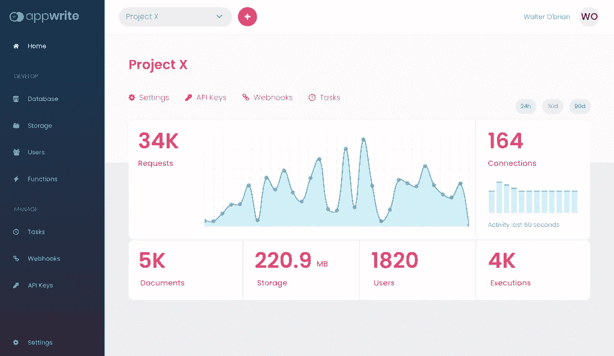
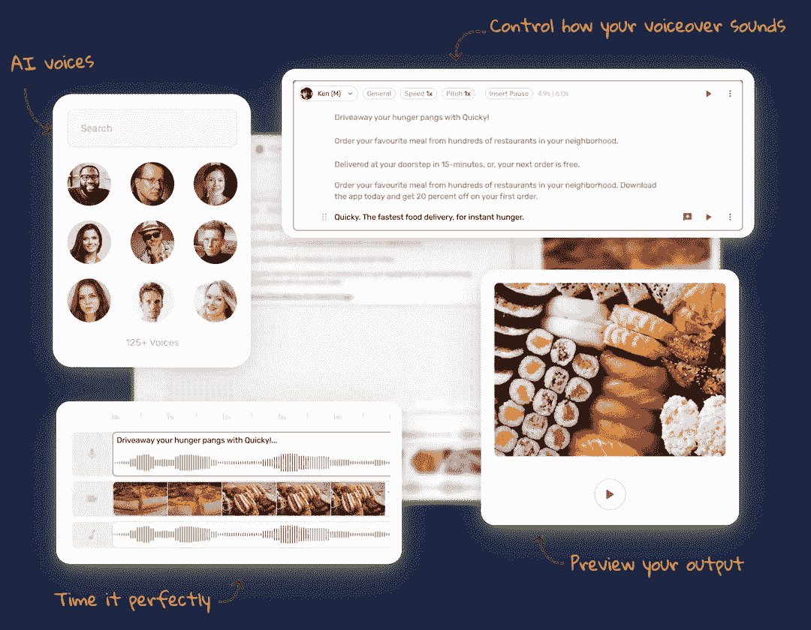

# 借助这 10 个网站，将 Web 开发人员的工作效率提高 10 倍

> 原文：<https://javascript.plainenglish.io/increase-10x-productivity-as-a-web-developer-with-these-10-websites-1eafc3e7093d?source=collection_archive---------5----------------------->

作为 web 开发人员/设计人员，有时我们需要从头开始做很多工作。但是有一些网站我们可以很容易地做到这一点。今天我将分享 10 个网站，它们将会提高你作为一个网站开发者的工作效率。

## 1.AppWrite

Appwrite 是一个非常棒的平台，可以为 web、移动和 flutter 开发人员构建后端服务器。 ***可以替代*** 。您可以从 appwrite 获得一些令人惊叹的支持，如身份验证和用户登录(包括社交登录)、存储、数据库、函数等。

网站链接【https://appwrite.io/ 

## 2.内腔 5

Lumen5 是一个视频创作平台。你会觉得你在做一个演示。你可以用人工智能的力量制作引人入胜的内容。不需要额外的经验或培训来制作视频。

网页链接:[https://lumen5.com/](https://lumen5.com/)

## 3.魔法橡皮擦

作为一名网站开发人员，有时我们需要处理图像，需要从图像中移除不需要的东西。为了缓解这个问题，我们可以使用一个神奇的橡皮擦。它基本上是用 AI 来去除图像中不需要的东西。只需上传一张图片并标记你需要删除的内容，然后下载一张完美的图片。

网页链接:[https://www.magiceraser.io/](https://www.magiceraser.io/)

## 4.白日梦

它基本上是一个为 web 开发人员提供的低代码集成平台，可以帮助您非常快速地连接 API。您不需要编写任何样板代码或与认证斗争。支持数百个 API，每月 10k 次免费操作。今天可以试试。

网页链接:[https://pipedream.com/](https://pipedream.com/)

## 5.开源替代方案

发现 400 多种流行的开源软件替代您专有的 SaaS。分析，沟通，电子商务，以及其他一吨。对于 web 开发人员来说，这绝对是可检查的。

网页链接:[https://www.opensourcealternative.to/](https://www.opensourcealternative.to/)

## 6.穆尔夫·艾

Murf AI 是一个基于人工智能的语音生成器网站。这将把你的文本转换成真实的人的声音。它可以产生大约 20 种语言的声音。简单地说，这是强大的纯魔法。几分钟后开始制作画外音。

网页链接:[https://murf.ai/](https://murf.ai/)

source: murf ai

## 7.卡尔德

Cardd 是一个免费的平台，你可以在这里建立完全响应的单页网站。无论是个人资料、获取电子邮件的登录页面，还是更复杂的内容，Carrd 都能满足您的需求。简单，响应迅速，**和完全免费。**

网页链接:[https://carrd.co/](https://carrd.co/)

source cardd.co

## 8.一页纸的爱情

对于想要获得构建单页面 web 应用程序的灵感的人来说，它可以是一个很好的平台。page love 基本上是一个网站设计画廊，他们在这里展示最好的单页网站、不同的模板和资源。

网页链接:【https://onepagelove.com/ 

## 9.托格尔

Toggl 是一个无压力的时间跟踪软件，以提高性能。它可以是一个很棒的工具，让整个团队的跟踪变得轻松。你也可以看看这个很棒的网站。

网页链接:【https://toggl.com/ 

## 10.Jotform

Jotform 是一个很棒的网站，可以构建不同类型的表单。您可以使用 Jotforms online form builder 创建没有编码的专业外观的表单，然后您可以使用自己的徽标、字体和颜色来设计表单的样式。看起来棒极了，对吧？是的，它也是免费的！

网页链接:[https://www.jotform.com/](https://www.jotform.com/)

👋**我们做朋友吧！**在 [**LinkedIn**](https://www.linkedin.com/in/ruhulcse/) 上联系我。别忘了在这里跟我一起上 [**中、**](https://medium.com/@ruhul-amin) 和 [**五更**](https://www.fiverr.com/share/1NQ4R5) 也是。

*更多内容请看*[***plain English . io***](https://plainenglish.io/)*。报名参加我们的* [***免费周报***](http://newsletter.plainenglish.io/) *。关注我们关于*[***Twitter***](https://twitter.com/inPlainEngHQ)[***LinkedIn***](https://www.linkedin.com/company/inplainenglish/)*[***YouTube***](https://www.youtube.com/channel/UCtipWUghju290NWcn8jhyAw)*[***不和***](https://discord.gg/GtDtUAvyhW) *。对增长黑客感兴趣？检查* [***电路***](https://circuit.ooo/) *。***