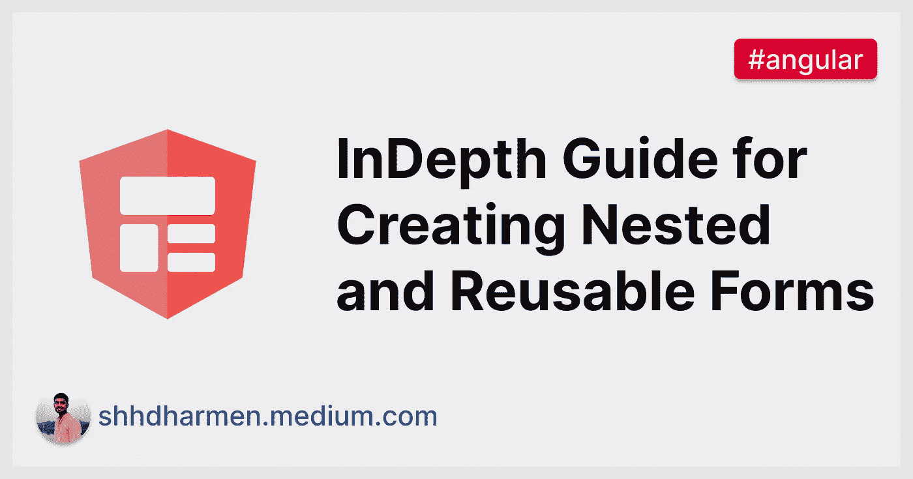
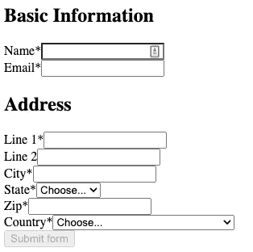
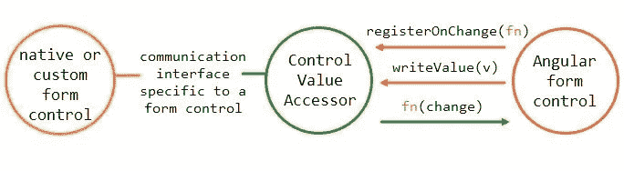

# 如何创建嵌套和可重用的表单

> 原文：<https://javascript.plainenglish.io/indepth-guide-for-creating-nested-and-reusable-forms-a9da9d651f1?source=collection_archive---------11----------------------->

## 关于创建嵌套和可重用表单的深入教程&通过使用复合 ControlValueAccessor 实现完全的可靠性。

在本教程中，您将学习如何创建和使用窗体组。我们还将了解如何通过使用复合 ControlValueAccessor 来实现完全的可靠性。



## 介绍

在 web 应用程序中，我们可以拥有大型表单，如帐户注册表单、配置文件创建表单、信用卡表单、地址表单等。这些大型表单通常有一组重复的字段。

例如，所有注册表中通常都有地址字段。在本教程中，我们将学习如何将这样的字段包装在一个可重用的表单中，以便它们可以作为嵌套表单在任何其他表单中使用。

在本教程中，我们将讨论创建表单的 4 种方法，并了解每种方法的优缺点:

1.  如何创建和使用表单组
2.  如何创建嵌套的窗体组
3.  如何使用嵌套窗体组的子组件
4.  如何用 Composite `ControlValueAccessor`创建可重用表单

## 如何创建和使用表单组

窗体通常包含几个相关的控件。[反应式表单](https://angular.io/guide/reactive-forms)提供了两种将多个相关控件组合成单一输入表单的方法:`[FormGroup](https://angular.io/api/forms/FormGroup)`和`[FormArray](https://angular.io/api/forms/FormArray)`。对于本教程，我们将重点关注`FormGroup`。

正如表单控件实例使您可以控制单个输入字段一样，表单组实例跟踪一组表单控件实例(例如，表单)的表单状态。创建窗体组时，窗体组实例中的每个控件都按名称进行跟踪。

我们将以 Profile 表单为例，它将包含姓名、电子邮件、地址行、城市、州、邮政编码和国家的输入字段。



相同的表单组如下所示:

```
// src/app/simple-form-group/simple-form-group.component.ts

@Component({
  selector: "app-simple-form-group",
  templateUrl: "simple-form-group.component.html",
})
export class SimpleFormGroupComponent {
  profileFormGroup = new FormGroup<SimpleProfileForm>({
    name: new FormControl("", {
      validators: [Validators.required],
      nonNullable: true,
    }),
    email: new FormControl("", {
      validators: [Validators.email, Validators.required],
      nonNullable: true,
    }),
    line1: new FormControl("", {
      validators: [Validators.required],
      nonNullable: true,
    }),
    // other address form controls
  });

  readonly COUNTRIES = COUNTRIES;
  constructor() {}

  get nameFC() {
    return this.profileFormGroup.get("name");
  }
  get emailFC() {
    return this.profileFormGroup.get("email");
  }
  get line1FC() {
    return this.profileFormGroup.get("line1");
  }
  // other form-control getters
}

export type SimpleProfileForm = {
  name: FormControl<string>;
  email: FormControl<string>;
  line1: FormControl<string>;
  line2?: FormControl<string | null>;
  zipCode: FormControl<string>;
  city: FormControl<string>;
  state: FormControl<string>;
  country: FormControl<string>;
};
```

请注意，我们还利用了在 Angular 14 中引入的严格类型表单特性[。](https://github.com/angular/angular/pull/43834)

在上面的代码中，我们简单地创建了一个所有字段都为`[FormControl](https://angular.io/api/forms/FormControl)`的`FormGroup`。HTML 模板代码可能如下所示:

```
<!-- src/app/simple-form-group/simple-form-group.component.html -->

<form [formGroup]="profileFormGroup">
  <h2>Basic Information</h2>
  <div>
    <label for="name">Name*</label>
    <input
      type="name"
      formControlName="name"
      id="name"
      required
      [ngClass]="{
        'is-invalid': nameFC?.invalid && (nameFC?.touched || nameFC?.dirty)
      }"
    />
    <div class="invalid-feedback">Name is required</div>
  </div>
  <!-- other basic information fields -->
  <div>
    <h2>Address</h2>
    <div>
      <label for="line1">Line 1*</label>
      <input
        [id]="'line1'"
        [name]="'line1'"
        autocomplete="address-line1"
        formControlName="line1"
        required
        type="text"
        [ngClass]="{
          'is-invalid': line1FC?.invalid && (line1FC?.touched || line1FC?.dirty)
        }"
      />
      <div class="invalid-feedback">Address line 1 is required</div>
    </div>
    <!-- other address fields -->
  </div>
  <button type="submit" [disabled]="profileFormGroup.invalid">
    Submit form
  </button>
</form>
```

由`[FormControlName](https://angular.io/api/forms/FormControlName)`指令提供的`formControlName`输入将每个单独的输入绑定到在`FormGroup`中定义的表单控件。表单控件与其各自的元素进行通信。它们还将更改传达给表单组实例，该实例为模型值提供了真实的来源。

**优点**

1.  简单明了的模板和表单组

**缺点**

1.  难以创建和维护复杂的表单模型
2.  字段集之间缺少逻辑隔离

## 如何创建嵌套的窗体组

构建复杂表单时，在较小的部分中管理不同的信息区域更容易。使用嵌套的窗体组实例可以将大型窗体组分成更小、更易于管理的窗体组。

让我们将地址相关字段分组到一个嵌套组中:

```
// src/app/nested-from-group/nested-from-group.component.ts

@Component({
  selector: "app-nested-form-group",
  templateUrl: "nested-form-group.component.html",
})
export class NestedFormGroupComponent {
  profileFormGroup = new FormGroup<ProfileForm>({
    name: new FormControl("", {
      validators: [Validators.required],
      nonNullable: true,
    }),
    email: new FormControl("", {
      validators: [Validators.email, Validators.required],
      nonNullable: true,
    }),
    address: new FormGroup<AddressForm>({
      line1: new FormControl("", {
        validators: [Validators.required],
        nonNullable: true,
      }),
      // other address fields...
    }),
  });
}

type ProfileForm = {
  name: FormControl<string>;
  email: FormControl<string>;
  address: FormGroup<AddressForm>;
};

type AddressForm = {
  line1: FormControl<string>;
  line2?: FormControl<string | null>;
  zipCode: FormControl<string>;
  city: FormControl<string>;
  state: FormControl<string>;
  country: FormControl<string>;
};
```

注意，现在在`profileForm`中，与地址相关的字段被分组到`address`元素中。我们还创建了一个`AddressForm`类型来获得更好的类型安全性，以及 ide 中更好的自动完成功能。让我们分组模板中的嵌套表单:

```
<!-- src/app/nested-from-group/nested-form-group.component.html -->

<form [formGroup]="profileFormGroup">
  <h2>Basic Information</h2>
  <!-- basic information fields -->
  <!-- notice the usage of formGroupName below -->
  <div formGroupName="address">
    <h2>Address</h2>
    <div>
      <label for="line1">Line 1*</label>
      <input
        [id]="'line1'"
        [name]="'line1'"
        autocomplete="address-line1"
        formControlName="line1"
        required
        type="text"
        [ngClass]="{
          'is-invalid': line1FC?.invalid && (line1FC?.touched || line1FC?.dirty)
        }"
      />
      <div class="invalid-feedback">Address line 1 is required</div>
    </div>
    <!-- other address related fields -->
  </div>
  <button type="submit" [disabled]="profileFormGroup.invalid">
    Submit form
  </button>
</form>
```

我们添加了`[formGroupName](https://angular.io/api/forms/FormGroupName)`指令来表明子窗体控件是`address`窗体组的一部分。

**优点**

1.  易于创建和维护复杂的表单模型
2.  字段集之间存在逻辑隔离

**缺点**

1.  由于更多的字段和复杂的表单，模板更大

## 如何使用嵌套窗体组的子组件

在上一节中，我们在类中实现了逻辑分离，但是我们的模板仍然很复杂。我们将创建另一个组件来处理模板复杂性。

```
// src/app/nested-form-group-child/address-form/address-form.component.ts

@Component({
  selector: "app-address-form",
  templateUrl: "address-form.component.html",
})
export class AddressFormComponent {
  @Input("formGroup") addressFormGroup!: FormGroup;

  get line1FC() {
    return this.addressFormGroup.get("line1");
  }
  // other form-control getters...
}
```

我们创造了`AddressFormComponent`。它有一个名为`formGroup`的输入属性，父组件可以通过它传递表单组。让我们来看看模板:

```
<!-- src/app/nested-form-group-child/address-form/address-form.component.html -->

<div [formGroup]="addressFormGroup">
  <h2>Address</h2>
  <div>
    <label for="line1">Line 1*</label>
    <input
      [id]="'line1'"
      [name]="'line1'"
      autocomplete="address-line1"
      formControlName="line1"
      required
      type="text"
      [ngClass]="{
        'is-invalid': line1FC?.invalid && (line1FC?.touched || line1FC?.dirty)
      }"
    />
    <div class="invalid-feedback">Address line 1 is required</div>
  </div>
  <!-- other address fields -->
</div>
```

模板非常简单，它只有与地址相关的字段。下面是我们如何在父组件中使用它:

```
<!-- src/app/nested-form-group-child/nested-form-group-child.component.html -->

<form [formGroup]="profileFormGroup">
  <!-- basic fields →

  <!-- notice the usage of child component -->
  <app-address-form [formGroup]="addressFormGroup"></app-address-form>

  <button type="submit" [disabled]="profileFormGroup.invalid">
    Submit form
  </button>
</form>
```

在课堂上，我们会得到如下的地址形式组:

```
// src/app/nested-from-group/nested-from-group.component.ts

@Component({
  // ...
})
export class NestedFormGroupChildComponent {
  profileFormGroup = new FormGroup<ProfileForm>({ /*...*/ });

  get addressFormGroup() {
    return this.profileFormGroup.get("address") as FormGroup;
  }
}
```

**优点**

1.  更简单的模板 a .使用这种方法，我们现在可以处理与`AddressFormComponent`中的地址相关的一切，这样我们的主要组件就更容易处理了。

**缺点**

1.  不完全可重用 a .如果您想将此组件用作独立的表单组件，目前还不可能。

## 如何用 Composite `ControlValueAccessor`创建可重用表单

在上一节中，我们创建了一个组件，并将地址表单的模板移入其中。但是，它仍然不是完全可重复使用的。我所说的完全可重复使用是指:

1.  逻辑、错误处理和地址格式创建应该是地址组件的一部分，而不是父组件的一部分。
2.  该组件应该可以在任何表单中使用。
3.  该组件应该可用于模板驱动和反应式表单。
4.  该组件应该支持本机表单控制功能，以便父组件或消费者组件可以利用这一点，例如，如果整个地址表单无效，则显示错误。

在这一节中，我们将学习如何创建一个完全可重用的表单，既可以在其他表单中使用，也可以作为一个独立的表单使用。我们将要使用的技术称为“复合控制值访问器”，引用自 [Kara Erickson 在 AngularConnect 2017](https://youtu.be/CD_t3m2WMM8?t=1523) 中的观点。

我们的目标是使用类似下面的地址形式:

```
<!-- src/app/reusable-form/reusable-form-wrapper/reusable-form-wrapper.component.html -->

<form [formGroup]="profileFormGroup">
  <!-- other basic information fields -->
  <app-reusable-form formControlName="address"></app-reusable-form>
</form>
```

## ControlValueAccessor

一个`ControlValueAccessor`充当了 Angular forms API 和 DOM 中一个本地元素之间的桥梁。通过实现`ControlValueAccessor`接口并将自己注册为`NG_VALUE_ACCESSOR`提供者，任何组件或指令都可以变成表单控件。

其中，该接口定义了两个重要的方法— `writeValue`和`registerOnChange`。

formControl 使用 writeValue 方法将值设置为本机窗体控件。formControl 使用 registerOnChange 方法注册一个回调，该回调预计在每次更新本机窗体控件时触发。将更新后的值传递给这个回调函数是您的责任，以便更新相应的角度形状控件的值。registerOnTouched 方法用于指示用户与控件进行了交互。

下面是演示交互的图表:



*From* [*在角度形式中实现 ControlValueAccessor 时再也不会混淆——角度深度*](https://indepth.dev/posts/1055/never-again-be-confused-when-implementing-controlvalueaccessor-in-angular-forms)

要了解更多关于`ControlValueAccessor`的信息，你可以阅读这篇[深度指南](https://indepth.dev/posts/1055/never-again-be-confused-when-implementing-controlvalueaccessor-in-angular-forms)。如果你正在寻找一个实际的例子，你可以参考我之前的[关于日期输入的文章](https://indepth.dev/posts/1467/how-to-use-controlvalueaccessor-to-enhance-date-input-with-automatic-conversion-and-validation)和[关于在表单控件](https://indepth.dev/tutorials/angular/object-in-formcontrol)中管理对象的教程。

## 复合控件值访问器

在之前的文章和教程中，我们看到了`ControlValueAccessor`和一个`&lt;input>`的用法。但是，使用`ControlValueAccessor`的好处是，如果你愿意，你可以有更多的输入。

我们只需要处理该接口的所有 4 个必需的方法，不管我们如何在内部处理它，它都会正常工作。

## 可重复使用的表单

上一节中有一点很清楚，我们希望使用相同的模板，在内部，我们将使用表单组管理字段的状态，因此我们的模板将如下所示:

```
<!-- src/app/reusable-form/reusable-form.component.html -->

<div role="group" [formGroup]="form">
  <div>
    <label for="line1">Line 1*</label>
    <input
      id="line1"
      name="line1"
      autocomplete="address-line1"
      formControlName="line1"
      required
      type="text"
      [ngClass]="{
        'is-invalid': line1FC?.invalid && (line1FC?.touched || line1FC?.dirty)
      }"
    />
    <div class="invalid-feedback">Address line 1 is required</div>
  </div>
  <!-- other address fields -->
</div>
```

为了管理地址对象，我们将创建一个类。这将在上面模板的类的后期使用:

```
// src/app/reusable-form/address.ts

export class Address {
  constructor(
    public line1: string = "",
    public zipCode: string = "",
    public city: string = "",
    public state: string = "",
    public country: string = "",
    public line2?: string | null
  ) {}

  isValid() {
    return (
      this.line1 && this.city && this.country && this.state && this.zipCode
    );
  }
}
```

我们将上面的`Address`类作为表单的值。就像`string`、`number`和`boolean`一样，我们也可以在表单控件中存储对象。你可以在关于在表单控件中管理对象的教程[中了解更多。](https://indepth.dev/tutorials/angular/object-in-formcontrol)

对于验证，您可以有自己的逻辑来验证地址，但现在我们将保持简单。我们将在实现验证时使用它。

接下来，基于之前关于`ControlValueAccessor`的文章，我们将从实现`ControlValueAccessor`接口和作为提供者的`NG_VALUE_ACCESSOR`开始:

```
// src/app/reusable-form/reusable-form.component.ts

@Component({
  selector: "app-reusable-form",
  templateUrl: "reusable-form.component.html",
  providers: [
    {
      provide: NG_VALUE_ACCESSOR,
      useExisting: ReusableFormComponent,
      multi: true,
    },
  ],
})
export class ReusableFormComponent implements ControlValueAccessor {
  form = new FormGroup<AddressForm>({
    line1: new FormControl("", {
      validators: Validators.required,
      nonNullable: true,
    }),
    // other address fields' form-controls
  });

  writeValue(value: Address | null): void {}

  registerOnChange(fn: (val: Partial<Address> | null) => void): void {}

  registerOnTouched(fn: () => void): void {}

  setDisabledState(disabled: boolean) {}
}
```

## writeValue

```
// src/app/reusable-form/reusable-form.component.ts

  writeValue(value: Address | null): void {
    const address = this.createAddress(value);
    this.form.patchValue(address);
  }

  private createAddress(value: Partial<Address> | null) {
    return new Address(
      value?.line1 || "",
      value?.zipCode || "",
      value?.city || "",
      value?.state || "",
      value?.country || "",
      value?.line2
    );
  }
```

在这种情况下，我们将首先转换进入`Address`实例的值，然后调用`form.patchValue`，它将更新所有字段，其中的值被更新。

## 寄存器转换

```
// src/app/reusable-form/reusable-form.component.ts

registerOnChange(fn: (val: Partial<Address> | null) => void): void {
    this.form.valueChanges.subscribe((value) => {
      const address = this.createAddress(value);
      fn(address);
    });
  }
```

我们使用`valueChanges`可观察值来处理`registerOnChange`。`valueChanges` observable 为所有子表单域发射，所以它非常适合`registerOnChange`。

现在，当我们在监听`valueChanges`时，我们将不得不重新访问并修复`writeValue`的`patchValue`，因为每次调用`patchValue`时，`valueChanges`都会触发，这是我们不希望的。

```
// src/app/reusable-form/reusable-form.component.ts

  writeValue(value: Address | null): void {
    const address = this.createAddress(value);
    this.form.patchValue(address, { emitEvent: false });
  }
```

正如你在上面注意到的，我们将`emitEvent`设置为`false`，这样它就不会触发`valueChanges`。

## registerOnTouched

```
// src/app/reusable-form/reusable-form.component.ts

onTouched: any;

registerOnTouched(fn: () => void): void {
    this.onTouched = fn;
  }
```

我们希望窗体被触摸，任何时候任何子窗体控件被触摸。因此，我们将在模板中调用`onTouched`,以及所有子表单控件:

```
<!-- src/app/reusable-form/reusable-form.component.html -->

<div role="group" [formGroup]="form">
  <div>
    <label for="line1">Line 1*</label>
    <!-- removed other attributes/properties for brevity -->
    <input
      (blur)="onTouched()"
    />
  </div>
  <!-- other address fields -->
</div>
```

## setDisabledState

```
// src/app/reusable-form/reusable-form.component.ts

setDisabledState(disabled: boolean) {
    disabled ? this.form.disable() : this.form.enable();
  }
```

## 确认

为了处理验证，我们将首先添加一个提供者，并实现`Validator`接口:

```
// src/app/reusable-form/reusable-form.component.ts

@Component({
  // ...
  providers: [
    // ...
    {
      provide: NG_VALIDATORS,
      useExisting: ReusableFormComponent,
      multi: true,
    },
  ],
})
export class ReusableFormComponent implements ControlValueAccessor, Validator {

  // ...
  validate(control: AbstractControl<Address>): ValidationErrors | null {}
}
```

## 使生效

```
// src/app/reusable-form/reusable-form.component.ts

validate(control: AbstractControl<Address>): ValidationErrors | null {
    const value = control.value;
    return value && value.isValid() ? null : { address: true };
  }
```

这里我们将使用`Address`类的`isValid`方法，并基于此返回错误。

## 多个实例

虽然我们的表单现在已经可以使用了，但是还有一个问题。如果在同一个 UI 中使用这个组件，那么表单控件可能无法正常工作，因为它们都有相同的`name`和`id`属性。并且，这个组件本身没有`id`，可以帮助测试。

为了解决这个问题，首先让我们引入一个名为`id`的`[host](https://angular.io/api/core/Directive#host)`属性:

```
// src/app/reusable-form/reusable-form.component.ts

@Component({
  // ...
  host: {
    "[id]": "id",
  },
})
export class ReusableFormComponent {
  id = `address-input`;
}
```

接下来，我们将添加一个静态计数器，它将随着该组件的每个实例而递增:

```
// src/app/reusable-form/reusable-form.component.ts

@Component({
  // ...
})
export class ReusableFormComponent {

  static nextId = 0;
  id = `address-input-${ReusableFormComponent.nextId++}`;

}
```

最后，我们将使用这个`id`和所有的`input`s’`id`和`name`属性。并且还在它们的`&lt;label>`s’`for`属性中:

```
<!-- src/app/reusable-form/reusable-form.component.html -->

<div role="group" [formGroup]="form">
  <div>
    <label [htmlFor]="id + '-line1'">Line 1*</label>
    <!-- other attributes removed for brevity -->
    <input
      [id]="id + '-line1'"
      [name]="id + '-line1'"
    />
  </div>
  <!-- other address fields -->
</div>
```

这样，我们完全可重复使用的地址表单就准备好了。

## 结论

在本教程中，我们学习了如何创建和使用表单组。然后我们学习了如何创建嵌套表单组，以及如何将它们用于子组件。对于每一种方法，我们也了解了它们的优缺点。

在最后但非常重要的部分，我们学习了如何用 composite `ControlValueAccessor`创建一个完全可重用的表单组件。

我已经把代码上传到了 [GitHub](https://github.com/shhdharmen/nested-reusable-form) ，你也可以在 [StackBlitz](https://stackblitz.com/github/shhdharmen/nested-reusable-form) 上看看。

*最初发布于* [*创建嵌套和可重用表单的深度指南—角度教程|深度开发*](https://indepth.dev/tutorials/angular/indepth-guide-for-nested-and-reusable-form)

*更多内容看* [***说白了。报名参加我们的***](https://plainenglish.io/) **[***免费周报***](http://newsletter.plainenglish.io/) *。关注我们关于* [***推特***](https://twitter.com/inPlainEngHQ) ，[***LinkedIn***](https://www.linkedin.com/company/inplainenglish/)*，*[***YouTube***](https://www.youtube.com/channel/UCtipWUghju290NWcn8jhyAw)*，以及* [***不和***](https://discord.gg/GtDtUAvyhW) *。***