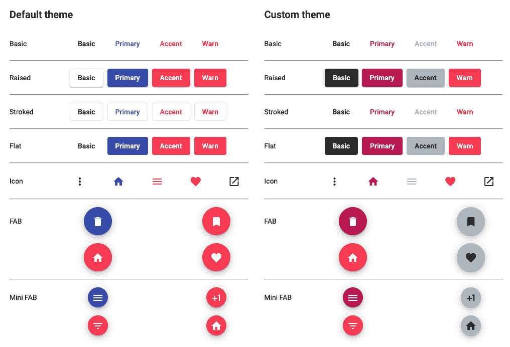

# 如何自定义有角度的材质按钮

> 原文：<https://javascript.plainenglish.io/indepth-guide-for-customizing-angular-material-button-3cf27bf5aeee?source=collection_archive---------5----------------------->

## 关于自定义角度材质按钮的深入指导。


## 介绍

几乎所有应用程序都需要修改第三方库提供的组件。这些修改通常是为了:

1.  改变风格
2.  添加缺失的特征

对于这样的库来说，提供容易实现这些修改的方法是非常重要的。

在本教程的第一部分，我们将学习如何修改样式，以便我们的更改不会与 Angular Material library 的未来更新相冲突。作为奖励，我将提供一份你在改变风格时应该遵循的经验法则清单。

在本教程的第二部分，我们将学习所有自定义有角度的材质按钮的方法，并决定哪种更好。

在本文结束时，您将对以下主题有所了解:

1.  如何创建属性指令
2.  如何创建动态组件
3.  何时创建组件，何时创建指令
4.  如何有效地修改任何第三方库的组件，以添加功能和更改样式

## 角形材料按钮

Angular Material 的按钮已经通过材料设计和油墨波纹得到了增强，并且它们也有一系列的展示选项。

您可以通过针对不同的情况和需求使用不同的属性指令来更改按钮的外观和感觉。例如，`mat-button`是一个带有文本内容的矩形按钮，`mat-raised-button`与`mat-button`相同，但带有仰角，而`mat-icon-button`是圆形的，它意味着包含一个图标。你可以在[官方网站](https://material.angular.io/components/button/overview)上查看所有变种。

并且有 3 种主题颜色提供给所有变体:`primary`、`accent`和`warn`。

现在，即使有这么多的变体和选项，我们可能需要修改默认的角形材料按钮来实现一个功能或风格的改变。让我们看看并学习如何有效地进行这两种改变。

## 如何改变风格

在讨论如何改变样式之前，让我们先了解一些规则，以避免任何冲突性的改变。这些规则整合自[定制组件样式指南](https://material.angular.io/guide/customizing-component-styles)。

## 经验法则

每当您想要更改任何有角度的材料组件的样式时，请记住以下规则。

1.  为组件的宿主元素定义自定义样式
2.  改变影响组件`margin`、`position`、`top`、`left`、`transform`、`z-index`等位置或布局的样式。
3.  通过定义一个自定义 CSS 类并将其应用于组件的宿主元素来应用上述样式修改
4.  不要改变影响组件`padding`、`height`、`width`或`overflow`的尺寸或内部布局的样式
5.  不要更改或覆盖角形材料组件的内部元素的样式，如在角形材料按钮中，有一些内部组件会产生涟漪效应，我们应该避免修改此类组件的样式
6.  为叠加组件提供自定义样式，如`MatDialog`、`MatMenu`等。通过`panelClass`属性。在包含主题混合之后，将该类添加到全局样式表中。

通过遵循上述规则，不仅仅是角形材料组件，而是任何组件库，我们可以安全地实现所需的修改，并避免导致破坏样式。

现在，记住上面的规则，我们将尝试改变有棱角的材料按钮的样式。在本教程中，我们将重点介绍以下两种风格的变化:

1.  颜色
2.  形状

在这一节的最后，我们还将简要介绍一下尺寸和排版。

## 颜色

我们可能需要对按钮的`font-color`和`background-color`进行非常基本的修改。不同的状态也是如此，如`:hover`、`:focus`和`:active`。

不久前，我写了一篇关于“角度材质主题化系统:完整指南”的文章，其中我写了一个标题为“[定制角度材质组件样式](https://indepth.dev/tutorials/angular/angular-material-theming-system-complete-guide#customizing-angular-material-component-styles)”的部分。在那一节中，我已经解释了如何修改角度材质按钮的颜色。

但是，这种方法很复杂，难以阅读，难以调试，而且未来也不安全。背后的原因是我重新创建了许多 SASS 函数和 mixins，它们应该只由按钮的内部元素使用，并使用它们来实现所需的更改。现在，如果 Angular Material 团队计划更改任何内部样式，这些修改将会中断。

因此，让我们来看看一个更容易和推荐的方法来实现颜色修改。

让我们假设你已经在你的项目中添加了[角度材质](https://material.angular.io/guide/getting-started)，并且选择了一个预建的主题来使用。

这时，你的`style.scss`如下图所示:

```
// styles.scss
html,
body {
  height: 100%;
}
body {
  margin: 0;
  font-family: Roboto, "Helvetica Neue", sans-serif;
}
```

我们将创建一个自定义主题，只有当它在`.custom-theme`类中时才会被应用。

```
@use "@angular/material" as mat;

$custom-primary: mat.define-palette(mat.$pink-palette, 700, 500, 900);
$custom-accent: mat.define-palette(mat.$blue-grey-palette, A200, A100, A400);

$custom-theme: mat.define-dark-theme(
  (
    color: (
      primary: $custom-primary,
      accent: $custom-accent,
    ),
  )
);

.custom-theme {
  @include mat.button-theme($custom-theme);
  @include mat.progress-spinner-theme($custom-theme);
}
```

请注意，我们只包括了`button-theme`和`progress-spinner-theme`，因为在我们的演示中，我们只使用这两个组件。你也可以使用`all-component-theme` mixin 来添加所有组件的主题，但是这会增加最终输出样式的大小。如需更详细的了解，请参考文章“[角度材质主题化系统:完整指南](https://indepth.dev/tutorials/angular/angular-material-theming-system-complete-guide)”。

所以，现在有了上面的代码，如果在 HTML 代码中，我们简单地用`custom-theme`类包装主容器，它将应用一个自定义主题到里面的组件。让我们看看输出:



## 形状

接下来，让我们改变形状。我们想添加一个形状的变化，使按钮有圆形边框。

现在，根据前面讨论的经验法则，我们可以更改影响组件本身布局的主机元素的样式。因此，为了实现形状的改变，我们可以简单地添加一个需要改变的类，并将其安全地应用到有角度的材料按钮:

```
.button-rounded {
  border-radius: 25% / 50%;
}
```

现在，如果你应用了类`button-rounded`，你将看不到变化。背后的原因是，所有不同的角形材质按钮都有自己的`border-radius`，如下所示:

```
.mat-raised-button {
    // rest
    border-radius: 4px;
}
```

因此，考虑到[选择器的特殊性](https://developer.mozilla.org/en-US/docs/Web/CSS/Specificity)，我们必须修改我们的代码，如下所示:

```
.button-rounded {
  &.mat-button,
  &.mat-raised-button,
  &.mat-flat-button {
    border-radius: 25% / 50%;
  }
}
```

现在，它在输出中将看起来很完美:


## 其他样式更改

除了颜色和大小，还可以有更多的变化需要。下面简单看一些，如何修改。

## 大小

不建议修改尺寸，因为这违反了我们的经验法则。大小自定义可能会导致未来更新的重大更改。

并且棱角材质团队已经按照[材质指引](https://material.io/design/layout/spacing-methods.html)做了尺寸，我们不应该改变。

## 排印

这可以很容易地改变使用标准的角度材料主题混合。

```
$custom-theme: mat.define-light-theme((
   color: (
     primary: $custom-primary,
     accent: $custom-accent,
   ),
   typography: $custom-typography,
  ));
```

更多详情，请参见“[修改排版](https://indepth.dev/tutorials/angular/angular-material-theming-system-complete-guide#modify-typography)”。

接下来，我们将研究如何添加一个微调按钮。

## 如何添加`MatProgressSpinner`

正如标题中所提到的，当`loading`被设置了角状材料的按钮时，我们将显示一个`MatProgressSpinner`。

现在，有三种方法可以实现。下面我们来看看它们，以及各自的利弊。

1.  模板插值
2.  包装组件
3.  指示的

## 模板插值

对于模板插值，您的代码可能如下所示:

```
<button mat-button [disabled]="isLoading">
    <mat-spinner *ngIf="isLoading"></mat-spinner>
    Action
</button>
```

## 赞成的意见

1.  以上代码的主要优点是快速、易读，并且在需要时易于定制。

## 骗局

1.  **重复:**上面的代码很好，但是你必须在所有你想在按钮中显示`MatProgressSpinner`的地方重复相同的行和条件。
2.  **所有地方的改变:**如果你想改变某个东西，比如`MatProgressSpinner`的大小，你就必须找出所有这样的实例并进行改变。

## 包装组件

另一种方法是克服模板插值所面临的挑战，我们可以考虑创建一个带有所需输入的包装组件，如下所示:

```
@Component({
    selector: 'app-button',
    template: `
        <button mat-button>
            <mat-spinner *ngIf="loading"></mat-spinner>
            <ng-content></ng-content>
        </button>
    `
})
export class AppButtonComponent {
    @Input() loading: boolean;
}
```

## 赞成的意见

1.  **各处改动:**有了以上，现在你可以在各处使用`app-button`得到与`mat-spinner`相同的按钮。
2.  **复用性:**如果你想改变什么，你只需要改变这个组件，它就会在各个地方体现出来。
3.  **定制:**由于我们使用组件，我们可以很容易地定制模板。

## 骗局

1.  **原生组件属性:**我们假设在不同的地方，我们要使用不同的有角材质按钮的变体。现在，对于颜色，您可以简单地再添加一个输入，并获得颜色的所有变体。但是如果你想使用不同的表达方式，比如`mat-flat-button`或`mat-icon-button`，事情会变得更加复杂。
2.  **事件:**除了变量，你还必须处理事件，就像`(click)`一样。您必须使用`@Output()`将点击事件传播到它的父组件。
3.  **其他指令支持:**角料按钮支持自带的`MatTooltip`和`MatBadge`指令开箱。在包装组件中实现对上述所有内容的支持不仅困难，而且复杂且难以维护。

## 指示的

根据该指令，我们将首先从`loading`状态的`input`开始，它将显示/隐藏`MatProgressSpinner`并禁用/启用`MatButton`。让我们从基本代码开始:

```
@Directive({
  selector: `button`,
})
export class ButtonDirective implements OnChanges {
  @Input() loading = false;

  constructor() {}

  ngOnChanges(changes: SimpleChanges): void {
    if (!changes['loading']) {
      return;
    }

    // Create/destroy spinner
  }

  private createSpinner(): void {}

  private destroySpinner(): void {}
}
```

在上面的代码中，我们创建了一个带有标签选择器的指令，这样它就可以与所有的`&lt;button>`一起工作。我们添加了一个名为`loading`的`@Input()`，它将显示/隐藏按钮内部的微调器。

现在，为了显示微调器，我们将创建 MatProgressSpinner `component dynamically and will place it inside the`按钮`when` loading `设置为 true。

```
@Directive({
  selector: `button`,
})
export class ButtonDirective implements OnChanges {

  private spinner!: ComponentRef<MatProgressSpinner> | null;

  ngOnChanges(changes: SimpleChanges): void {
    if (!changes['loading']) {
      return;
    }

    if (changes['loading'].currentValue) {
        // disable the `MatButton`
        this.createSpinner();
      } else if (!changes['loading'].firstChange) {
        // enable the `MatButton`
        this.destroySpinner();
      }
  }
}
```

上面的代码很简单，我们基于`loading`的当前值创建和销毁 spinner。

```
@Directive({
  selector: `button`,
})
export class ButtonDirective implements OnChanges {

  @Input() color: ThemePalette;

  constructor(
    private matButton: MatButton,
    private viewContainerRef: ViewContainerRef,
    private renderer: Renderer2
  ) {}

  private createSpinner(): void {
    if (!this.spinner) {
      this.spinner = this.viewContainerRef.createComponent(MatProgressSpinner);
      this.spinner.instance.color = this.color;
      this.spinner.instance.diameter = 20;
      this.spinner.instance.mode = 'indeterminate';
      this.renderer.appendChild(
        this.matButton._elementRef.nativeElement,
        this.spinner.instance._elementRef.nativeElement
      );
    }
  }

  private destroySpinner(): void {
    if (this.spinner) {
      this.spinner.destroy();
      this.spinner = null;
    }
  }
}
```

在上面的代码中，首先，我们添加了一个`@Input()`来读取当前的`color`。我们将使用这个属性来设置微调器的颜色。

然后，我们在构造函数中提供了`MatButton`、`ViewContainerRef`和`Renderer2`类。

在`createSpinner`方法中，我们简单地动态创建`MatProgressSpinner`并将它的引用存储在`spinner`中，这样我们可以在以后销毁它。请注意我们是如何动态创建它的:

```
this.spinner = this.viewContainerRef.createComponent(MatProgressSpinner);
```

创建之后，我们在`Renderer2`的帮助下，将它添加到`MatButton`的 HTML 元素中:

```
this.renderer.appendChild(
        this.matButton._elementRef.nativeElement,
        this.spinner.instance._elementRef.nativeElement
      );
```

最后，在`destroySpinner`方法中，我们通过赋值`null`来销毁`spinner`组件并清理它。

```
@Directive({
  selector: `button`,
})
export class ButtonDirective implements OnChanges {

  @Input() disabled = false;

  ngOnChanges(changes: SimpleChanges): void {

  // ...

  if (changes['loading'].currentValue) {
      this.matButton._elementRef.nativeElement.classList.add('button-loading');
      this.matButton.disabled = true;
      this.createSpinner();
    } else if (!changes['loading'].firstChange) {
      this.matButton._elementRef.nativeElement.classList.remove(
        'button-loading'
      );
      this.matButton.disabled = this.disabled;
      this.destroySpinner();
    }
  }
}
```

最后一部分是当`loading`为`true`时使`MatButtton`失效。除了禁用它，我们还用它切换了一个类`button-loading`来实现想要的样式。

下面是`button-loading`类的样式代码:

```
.button-loading {
  .mat-button-wrapper {
    visibility: hidden;
  }

  .mat-progress-spinner {
    position: absolute;
    top: calc(50% - 10px);
    left: calc(50% - 10px);
  }
}
```

该指令的最终代码如下所示:

```
@Directive({
  selector: `button`,
})
export class ButtonDirective implements OnChanges {
  private spinner!: ComponentRef<MatProgressSpinner> | null;

  @Input() loading = false;
  @Input() disabled = false;
  @Input() color: ThemePalette;

  constructor(
    private matButton: MatButton,
    private viewContainerRef: ViewContainerRef,
    private renderer: Renderer2
  ) {}

  ngOnChanges(changes: SimpleChanges): void {
    if (!changes['loading']) {
      return;
    }

    if (changes['loading'].currentValue) {
      this.matButton._elementRef.nativeElement.classList.add('button-loading');
      this.matButton.disabled = true;
      this.createSpinner();
    } else if (!changes['loading'].firstChange) {
      this.matButton._elementRef.nativeElement.classList.remove(
        'button-loading'
      );
      this.matButton.disabled = this.disabled;
      this.destroySpinner();
    }
  }

  private createSpinner(): void {
    if (!this.spinner) {
      this.spinner = this.viewContainerRef.createComponent(MatProgressSpinner);
      this.spinner.instance.color = this.color;
      this.spinner.instance.diameter = 20;
      this.spinner.instance.mode = 'indeterminate';
      this.renderer.appendChild(
        this.matButton._elementRef.nativeElement,
        this.spinner.instance._elementRef.nativeElement
      );
    }
  }

  private destroySpinner(): void {
    if (this.spinner) {
      this.spinner.destroy();
      this.spinner = null;
    }
  }
}
```

*以上代码引用自*[*Button | Angular matero . github . io)*](https://ng-matero.github.io/extensions/components/button/overview)

现在，有了有角度的材质按钮，你只需要设置`loading`来显示它里面的一个旋转器。让我们来看看输出:


让我们来看看上述方法的利弊。

## 赞成的意见

1.  **本地组件属性:**正如您在输出中看到的，该指令适用于`MatButton`的所有变体。
2.  **事件:**同样，不需要编写额外的代码来处理事件。
3.  **其他指令的支持:**由于我们使用了指令，其他库指令的支持，如`MatBadge`、`MatTooltip`仍然存在。

## 骗局

1.  **无模板控制:**与包装组件和内联模板插值相比，这种方法没有模板控制。
2.  **更多的 DOM 操作:**由于我们没有模板控制，我们必须通过 DOM 操作来做每一个模板更改。

因此，与模板内插和包装组件相比，不丢失默认特性的可重用性是这种方法的主要和最大的优点。这就是为什么人们应该尝试使用指令来实现这种定制。

## 结论

我们从了解使用任何第三方 UI 组件库时为什么需要定制以及需要哪些定制开始。然后我们了解了 Angular Material components 库特别为按钮提供了什么。

接下来，我们比较了下面提到的在有角度的材质按钮中添加微调器的所有方法:

1.  模板插值—快速且易于理解，但缺少可重用性。
2.  包装组件——实现了可重用性，但是需要更复杂的代码和设置来保持对默认功能的支持。
3.  指令——支持默认功能和可重用性，这两者都是在对模板控制较少的情况下实现的。

然后，我们理解了一些防止我们的定制样式被重大更新破坏的经验法则。接下来，我们学习了如何有效地修改颜色、大小和字体。以及为什么我们不应该修改有角材质按钮的大小。

我已经在 [GitHub](https://github.com/shhdharmen/indepth-customizing-angular-material-button) 上传了代码，你也可以在 [stackblitz](https://stackblitz.com/github/shhdharmen/indepth-customizing-angular-material-button) 上看看。

*最初发表于*[](https://indepth.dev/tutorials/angular/indepth-guide-for-customizing-angular-material-button)**。**

**更多内容看* [***说白了。报名参加我们的***](https://plainenglish.io/) **[***免费周报***](http://newsletter.plainenglish.io/) *。关注我们关于*[***Twitter***](https://twitter.com/inPlainEngHQ)*和*[***LinkedIn***](https://www.linkedin.com/company/inplainenglish/)*。查看我们的* [***社区不和谐***](https://discord.gg/GtDtUAvyhW) *加入我们的* [***人才集体***](https://inplainenglish.pallet.com/talent/welcome) *。****