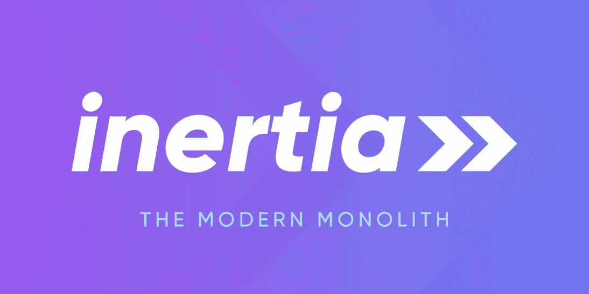
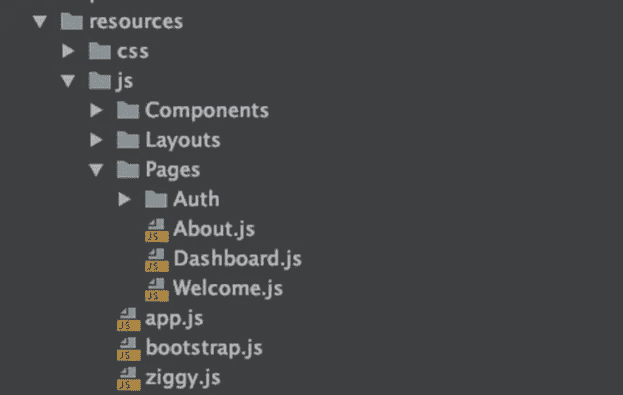
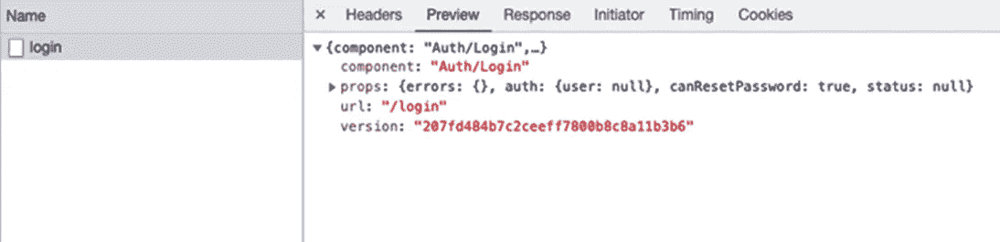

# Inertia.js —构建一个没有 API 的单页应用程序

> 原文：<https://javascript.plainenglish.io/inertiajs-build-single-page-application-without-api-8152c962c251?source=collection_archive---------11----------------------->



## **什么是 Inertia.js？**

基本上，Inertia.js 是用 javascript 编写的路由库，它允许您在不强制加载整个页面的情况下进行页面访问。Inertia.js 是前端和后端之间的粘合剂，它不是一个框架，但有助于连接前端和后端框架，它是在适配器的帮助下完成的。官方支持的，前端适配器是 React，Vue，和 Svelte，后端适配器是 Laravel 和 Rails。有许多社区支持的适配器支持大多数现代语言和框架。

## **它是如何工作的？**

js 通过提供一个包装在普通 HTML 链接周围的链接组件来完成智能工作。当点击发生时，它发出 AJAX 请求来获取页面内容，而不是进行页面加载。当 Inertia 发出请求时，它会被后端识别，而不是发送一个 HTML 响应，而是发送回一个带有页面组件名称和数据的 JSON 对象，该对象会用新的页面组件替换旧的页面组件，并且页面的历史会得到更新。最后，用户可以获得零页面刷新和即时组件加载的丰富体验。

## **安装带惯性的 Laravel . js**

```
*# setup laravel project inside folder laravel-inertia-example
 composer create-project laravel/laravel laravel-inertia-example**cd laravel-inertia-example*composer require inertiajs/inertia-laravel*# Install laravel breeze package in composer,
 # It provides a starting point for fresh applications.
 # Breeze generates views for login, registration and forget password* 
 composer require laravel/breeze — dev

 *# Install breeze with react, you can use vue if you want*

 php artisan breeze:install react

 npm install && npm run dev

 *# Setup database configuration in .env file and then run*

 php artisan migrate

 *# You can run project using*

 php artisan serve
```

## **代码结构**

在 resources/js 下，您会找到所有相关的 React 组件。该结构将如下所示:



所有 React 组件都将位于 Pages 文件夹中

## **Intertia.js 路由到组件**

视图将使用 Inertia.js 附带的链接组件，而不是使用 HTML 锚标记，如下所示:

```
*import { Link } from ‘@inertiajs/inertia-react’;**<Link href={route(‘login’)}>**Log in**</Link>*
```

由于惯性将所有链接转换为基于 XHR 的请求，所有对 Laravel routes 的请求都用 JSON 对象响应。



这个响应再次生成 Laravel 代码。

```
*return Inertia::render(‘Auth/Login’, [**‘canResetPassword’ => Route::has(‘password.request’),**‘status’ => session(‘status’),**]);*
```

## **Laravel inertia . js 中的路线**

若要在 Inertia.js 中使用 Laravel 路线，breeze 会预先安装套件 strincco/ziggy。要为注册的路由创建链接，可以使用以下代码

```
*<Link href={route(‘register’)} >**Register**</Link>*
```

## **与 LiveWire 的比较**

Inertia.js 严重依赖 JavaScript，开发者停止编写刀片组件，所有代码都迁移到 JavaScript。 [Livewire](https://docs.google.com/document/d/1G1s1AUQ2uYhsL2zunNeNsFTRpjScK-oN5TZDUuYn6wc/edit) 让你不用写任何 javascript 代码就能写组件。在使用 LiveWire 时，开发人员处理 PHP 代码和刀片语法，而 Inertia.js 为您提供了使用 Vue 或 React 作为前端框架的选项。

从性能的角度来看，LiveWire 在服务器上渲染一切，这缩短了第一个内容的绘制时间，也是 SEO 的一个巨大优势。Inertia.js 使用 javascript 加载内容，但是它的性能比其他 SPA 框架好得多，因为数据已经嵌入到响应中。Inertia.js 还支持服务器端呈现，这允许为站点做 SEO。

Inertia.js 的一个额外好处是它包含了预定义的组件(对话框和确认模式),并且它有自己的验证包，可以通过 NPM 安装。

## **结论**

Inertia.js 为构建单页面应用程序提供了一个很好的起点，无需编写单独的 API，无需调用 API 的 Axios 库，没有获取响应和解析响应的麻烦。对于开发人员来说，继续开发应用程序并对应用程序进行最小的更改是非常自然的。如果你想改变你现有的应用程序，使其看起来更现代，而不需要重写整个代码，那么 Inertia.js 是你最合适的工具。

*更多内容看* [***说白了。报名参加我们的***](http://plainenglish.io/) **[***免费周报***](http://newsletter.plainenglish.io/) *。在我们的* [***社区获得独家访问写作机会和建议***](https://discord.gg/GtDtUAvyhW) *。***