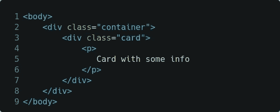
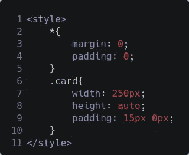
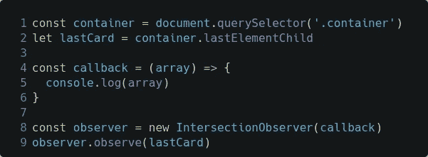
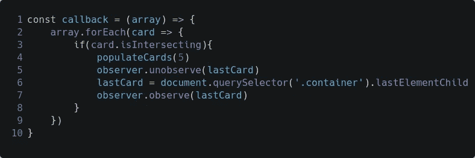
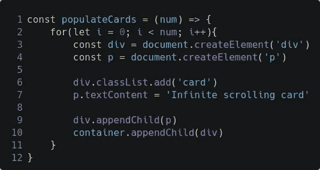

# 用普通 JavaScript 无限滚动

> 原文：<https://javascript.plainenglish.io/infinitely-scrolling-a-webpage-with-javascript-52325a415f4e?source=collection_archive---------3----------------------->

## 在没有任何第三方 JavaScript 库的情况下，在您的网站上添加无限滚动

An Easy Way to Implement Infinite Scrolling to your website with JavaScript

无限滚动有助于网站显示分页数据，而无需导航到其他页面。这也有助于网页加载更快。

在本文中，我们将使用`IntersectionObserver` API 用 JavaScript 实现无限滚动。

这个项目的现场演示是[这里](https://s0npari11.github.io/infinite-scrolling-with-js/)。

# 什么是`IntersectionObserver`

`IntersectionObserver` API 提供了一种简单的方法来确定视口中可见的元素，并对它们执行一些操作。

根据 MDN Web [文档](https://developer.mozilla.org/en-US/docs/Web/API/Intersection_Observer_API)，

> `IntersectionObserver` API 提供了一种异步观察目标元素与祖先元素或顶层文档的 viewport 的交集变化的方法。

简单地说，`IntersectionObserver`输出在文档或指定的父元素的视窗中可见的元素数组。

# 无限滚动的逻辑

使用`IntersectionObserver`无限滚动的逻辑如下:

*   抓住最后一个元素
*   观察最后一个元素
*   当最后一个元素出现在屏幕
    上时—填充数据
    — `unobserve`上一个最后一个元素
    —抓取新的最后一个元素
    —观察新的最后一个元素

现在我们熟悉了逻辑，让我们实际编码。

# 实现无限滚动

首先，在 index.html 中:

index.html

复制。多次卡类。

这些卡片也有一些内部样式。

Internal styles in the index.html

现在，在 app.js 中:

首先设置`IntersectionObserver`，

app.js

这里，我们正在抓取保存所有`.card`卡片的`.container`，抓取最后一张带有`container.lastelementChild`的卡片，该卡片返回`.container`中的最后一个 div ( `.card`)和一个用于观察`lastCard`的初始化`IntersectionObserver`。

现在我们已经设置好了，让我们一看到`lastCard`就填充更多的卡。

callback in the app.js

在这里，一旦`lastCard`可见，我们就

*   用`populateCards()`填充 5 张新卡
*   未观察到的`lastCard`
*   抓取`.container`中的新`lastCard`
*   观察新的`lastCard`

`populateCards()`的功能如下:

populateCards() in the app.js

在这个函数中，我们将新卡的数量作为参数`num`来填充。

我们运行了一个 for 循环`num`次，在这个 for 循环中，我们用一个类`.card`和一些文本创建了一个 div，然后将它追加到`.container`中。

这样，我们就实现了无限滚动！！

Infinite Scrolling result

这篇文章的代码可以在 [Github](https://github.com/S0npaRi11/infinite-scrolling-with-js) 上找到。

链接到我以前的文章:

 [## 用 JavaScript 实现滚动动画的简单方法

### 这里有一个简单快捷的方法，可以用 CSS 关键帧动画来制作 HTML 元素的滚动动画。

paragwebdev.medium.com](https://paragwebdev.medium.com/an-easy-way-to-implement-scroll-animations-with-javascript-aef9b9fdc704)  [## 用 JavaScript 在浏览器中构建自己的录音机

### 使用媒体设备用 JavaScript 录制音频

paragwebdev.medium.com](https://paragwebdev.medium.com/capture-audio-in-browser-with-javascript-27d83ec9aa67) 

*更多内容看* [***说白了。报名参加我们的***](https://plainenglish.io/) **[***免费周报***](http://newsletter.plainenglish.io/) *。关注我们关于*[***Twitter***](https://twitter.com/inPlainEngHQ)*和*[***LinkedIn***](https://www.linkedin.com/company/inplainenglish/)*。加入我们的* [***社区不和谐***](https://discord.gg/GtDtUAvyhW) *。***