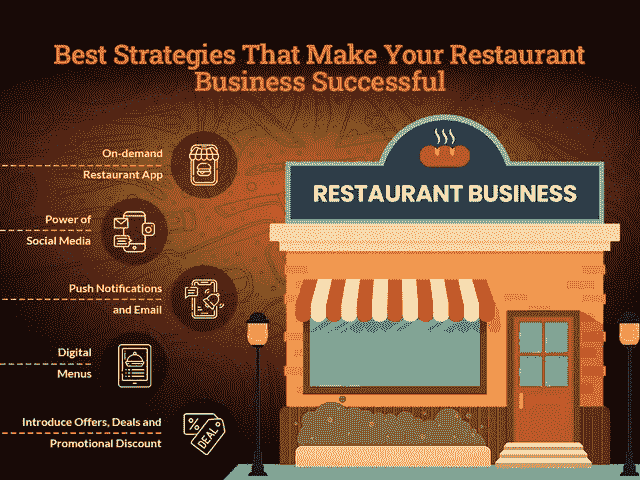

# 网上推广你的餐馆生意的创新想法

> 原文：<https://javascript.plainenglish.io/innovative-ideas-to-promote-your-restaurant-business-online-337c00049284?source=collection_archive---------16----------------------->

## 网上餐厅业务:如何增加其销售和收入

作为一个独立的餐馆老板，你总是在城市的黄金地段提供令人垂涎的食物、完美的氛围和令人愉快的用餐。

听起来很熟悉？

在某一点上，你的顾客可能会欣赏这些努力，但也有连锁餐厅也以同样的方式想取得成功。但事实是，餐饮市场永远不会一成不变，它一直在变化，从来没有机会通过提供新的惊喜来吸引顾客。了解这些市场动向，并将其正确地运用到你的业务中，会让你在人群中脱颖而出。

在疫情时期，餐饮业正努力在这个行业中生存。一方面，网上餐饮业发展迅速。然而，另一方面，这些天他们甚至在努力满足每月的开支。对于餐饮创业公司来说，脱颖而出比以往任何时候都更具挑战性。

因此，核心问题是如何发展你的业务？如何为你的网上餐厅业务获得更多的客户？

*这些问题的简单答案就是寻找有效的营销策略！*

无论你现在经营的是什么级别的业务，你都可以通过实施正确的营销策略来提高销售额。

> *让我们把重点放在营销策略上，帮助你持续实现每日销售额，并使你的业务发展到下一个水平。*

## **1。创建在线点播餐厅应用程序**

事实上，到 2024 年 ，在线食品订购细分市场的市场容量将达到[**132.33 亿美元，毫无疑问，餐厅到消费者细分市场正在崛起。**](https://www.restroapp.com/blog/online-food-ordering-statistics/)

所以，无论你是一家独立餐厅，还是一家小型食品连锁店，如果你还在用传统的商业模式工作，那么就有希望错过在线市场的潜在用户细分市场。启动你在线业务的最佳方式是雇佣一家移动应用开发公司，它可以帮助你创建一个餐厅应用。现在，你们中的许多人想知道它将如何工作，并帮助你在市场中脱颖而出。的确，市场上已经存在过多的餐厅预订应用程序。但是，你只需要在你的 app 创意中加入一个独特的主张，就能取得成功。

一个体贴的餐厅应用程序将帮助你迎合在线顾客的需求。此外，它还提供了提前预订、预购等选项。

## **2。为你的餐馆生意增添社交媒体的力量**

当你计划扩大你的业务范围，为你的网上餐馆业务寻找新时代的营销技巧时，你不能忽视社交媒体渠道。

除非你一直住在山洞里，否则你一定知道社交媒体平台是多么迷人和迷人。 ***事实上，根据最近的调查报告，2020 年平均每天花在社交媒体上的*** [***时间为 2 小时 25 分钟***](https://backlinko.com/social-media-users#:~:text=In%202020%2C%20the%20average%20time,less%20than%20the%20global%20average.) ***。*** 以及智能手机用户对社交媒体平台上瘾的方式，值得使用此类技术通过社交媒体渠道吸引潜在受众。

为了让它成功工作，你可以使用数百万个食物标签。有数不清的标签可以让你的帖子像病毒一样传播。你所需要的是理解接近你的顾客的技巧。无论你选择脸书、Instagram 还是 Twitter，你都需要追踪用户参与度。任何人都可以开设社交媒体账户，但关键在于你如何管理它。m

如果顾客开始关注你的帖子，这意味着他们信任你的企业。此外，为了提高他们的参与度，你可以考虑张贴基于位置的广告。这将进一步帮助您吸引当地客户。

## **3。通过忠诚度计划留住您的客户**

大部分业务是由现有客户推动的。为了让你的生意成功发展，大多数人会寻找帮助你吸引新客户的策略。但是，将忠诚度计划整合到你的餐厅应用程序中，将真正为你的餐厅带来成功。因此，你可以雇佣一个 [**手机应用开发公司**](https://www.xicom.ae/services/mobile-app-development/) 来让这个策略为你的企业服务。基本上，忠诚度计划是双向的。帮助餐厅与顾客建立更深层次的关系，并让他们与你的应用保持互动。你需要确切地了解是什么促使你的顾客比其他人更多地光顾一家特定的餐馆。

为此，你需要跟踪用户行为并收集数据，比如他们最有可能去哪家餐馆。除此之外，他们在点餐时还能获得哪些优惠呢？它可以是获得奖励积分，膳食计划，食谱或关于你的餐馆的最新交易。

使用忠诚度计划来进一步吸引你的客户是一个非常有效的营销理念。

## **4。午睡优化可以改变游戏规则**

现在，午睡到底是什么，为什么它对你的餐馆生意很重要？嗯，它是 SEO 的一部分，缩写代表姓名、地址和电话号码。实施这一战略将有助于提高你的企业在搜索引擎上的知名度，并使你能够吸引新客户。

当谈到 SEO 和它的营销技巧时，我知道你们大多数人更喜欢付费广告。然而，如果你的访问者在搜索引擎上找不到任何信息呢？

为了让它正常工作，请确保在本地有机搜索结果中排名良好。例如，如果您的客户在搜索引擎上找到了该网站，但无法看到您的位置和联系方式。所以在这里我们建议你在你的网站顶部提到 NAP。因此，当涉及到 Google 时，您网站上的这些信息将帮助您的网站弹出地理定位搜索。

## **5。推送通知和电子邮件活动**

推广你的餐馆业务而不谈论客户关系管理策略，实际上听起来是不完整的！

如今，随着机器学习、数据科学、人工智能或深度学习等技术的出现，获取客户信息变得比以往任何时候都容易。此外，你可以 [**雇佣一个移动应用开发者**](https://www.xicom.ae/services/mobile-app-developers/) 在你的应用中拥抱这些技术的丰富性。一旦您收集了用户信息，在您的自动化工具上管理短信通知和电子邮件活动将是吸引您的品牌受众的一个很好的方式。

你仍然不知道从 CRM 开始你需要什么类型的信息吗？这里有一些你需要遵循的提示:

*   **为活动设定时间:**时间是管理电子邮件活动和推送通知的关键。理想情况下，饭前一两个小时是分享“立即订购”信息的最佳时间。事实上，用户在那个时候是最活跃和最自由的，并且对寻找这样的优惠非常感兴趣。
*   **个性化通知:**您可以尝试将您的客户分成几个类别，而不是发送标准通知。例如高订单价值客户、最活跃的客户等等。
*   **热门优惠:**别忘了根据即将到来的特定场合、事件和节日定制优惠。这些优惠可以极大地推动你的生意。
*   **用文字吸引注意力:**为了让你的优惠或电子邮件通知引人注目，请为活动使用有吸引力的标题。

## **6。将您的现有客户转变为促销员**

一旦你成功地把你的访客变成了顾客，那么一定要确保给他们提供优质的服务。因为你企业的现有客户可以成为你真正的品牌推广者。善待他们，作为回报，他们只会根据他们在你餐馆的经历来传播信息。

毕竟，72%的顾客说正面评价让他们信任当地商家。61%的顾客更喜欢在去餐馆前阅读网上对餐馆的评论。

此外，90%的客人在用餐前会在网上搜索餐厅。此外，33%的顾客从不在低于 4 星级的餐厅用餐。

所以总而言之，为了确保你的客户总是留下积极的评价或评级，使用客户数据库是值得的。顾客的评价和评论真的可以帮助你提高餐馆的销售额。否则你可以 [**雇佣一个软件开发者**](https://www.xicom.ae/services/hire-software-developers/) 将这个功能集成到你的应用中。这将有助于您跟踪信息，例如顾客何时喜欢预订餐桌。他们可能会尝试以前点过什么菜？他们给出了什么样的评论，以及你如何去做。如果他们正确处理这个数据库，那么餐馆可以通过他们的老顾客创造比新顾客更多的销售额。

## **7。与美食博主建立联系**

随着在线食品业务需求的激增，大量专业厨师加入了这个市场。事实上，随着越来越多的顾客要求更好的服务，这个行业竞争非常激烈。

因此，将用户吸引到你的餐厅，并鼓励他们尝试用餐，是现代餐厅面临的最大挑战之一。

然而，如果你正在努力为你的生意创造更多的销售额，那么就开始和美食博客建立关系吧。他们不仅会帮助你在市场上建立一个强大的存在，而且会增加你的企业的访客数量。

如果你想知道，那么你应该知道，通过与两个最著名的美食博主建立联系，你可以让你的餐厅网站每月有多达 30 万的访客。

如今，博客已经成为赢得客户并给客户留下深刻印象的一种好方法。

## **8。进入数字菜单**

*调查报告显示，93%的人在外出就餐前会在网上查看菜单。*

人们去餐馆吃饭时决定吃什么的日子已经一去不复返了。随着顾客心理的变化，他们预先决定他们想吃什么，并据此对附近最好的餐馆进行排序。因此，无论你是通过网站还是手机应用来管理你的餐馆业务，确保你雇佣了一个 [**软件开发公司**](https://www.xicom.ae/) 来整合更新的在线菜单。这就是现在顾客的方式。如果你在餐馆里提供的服务和菜单上的内容不一致，会对顾客产生负面影响。

**因此，确保你保持这三样东西:**

*   *菜单应该设计良好，易于访问*
*   *要经常更新新菜*
*   *它必须在所有数字平台上自动推送。*

这三种做法将减轻手动管理菜单和每次进行更改的痛苦。当您做出任何更改时，自动设置可以立即更改您的实时菜单。将你的菜单作为一种营销工具，可以让你的企业将最重要的信息呈现在你的目标受众面前。

## **9。介绍优惠、交易和促销折扣**

提供有吸引力的交易和折扣是吸引顾客关注你的品牌的好方法。事实上，你们中的许多人都想知道提供折扣是否重要？答案是肯定的。在竞争激烈的市场中，吸引新客户或留住忠诚客户是唯一的招数。你所需要的是战略性地使用它。万一你没有充分利用这个技巧，那么你可以在重大节日和场合使用它。

有多少餐厅初创企业会问，什么时候是提供优惠和折扣的理想时机？虽然你可以利用很多场景来提供交易，并能够促进你的销售。此外，如果你在与一家特定的餐厅竞争，而你的餐厅相对来说并不拥挤，那该怎么办？在这种情况下，你可以推出特殊的午餐优惠或创建一个社交媒体活动来促进你的当地社区。

交易和促销是商业促销最有力的工具。然而，你需要有足够的战略眼光，这将帮助你提高销售额，而不是造成损失。

## **10。本地搜索引擎优化很重要**

如果你正在寻找最好的市场策略来促进你的业务销售，那么你需要关注的第一件事就是本地搜索引擎优化。因此，大多数公司通过付费或免费活动来争取在 SERP 上排名更高。

想知道它为什么如此重要吗？

根据这些研究，90%的购买发生在实体店，美国 80%的销售发生在离家 20 英里以内。

因此，如果你在搜索引擎上找不到你的存在，那么你已经远离了你的目标受众。

这是大多数餐馆犯的主要错误，因为他们把主要精力放在全球或国家层面的促销上。这种做法实际上造成了当地市场的空白，并未开发当地的商业机会。

让我们更容易理解。例如，如果顾客正在搜索“我附近最好的大陆餐馆”。你的企业名称会出现在搜索引擎的第一页吗？如果你的答案是否定的，那么你需要咨询专家来帮助你提供营销服务。在通过本地搜索引擎优化推广你的业务时，确保你从人口统计学、消费习惯和痛点方面了解你的客户，以带来最佳效果。一旦你开始在本地排名上有所提高，企业销售额就会开始飙升。

# **结论**

在当今不确定的世界中，经济正在快速下滑，管理你的餐馆业务销售变得非常具有挑战性。然而，随着大部分用户倾向于在线服务，采取这样的在线营销策略有助于提高你的业务销售是有意义的。你可以选择雇佣一家 [**移动应用程序开发公司**](https://www.xicom.ae/services/mobile-app-development/) 帮助你创建一个餐厅管理应用程序，或者你可以使用这些营销策略在竞争激烈的市场中脱颖而出。希望这些营销技巧能帮助你在网上推广餐馆，并在网上创造全面的用户参与度。

如果您仍然不确定从哪里开始以及如何利用您企业的数字存在，或者期待创建一个应用程序，那么您可以 [**联系我们**](https://www.xicom.ae/contact/) 或在下面提出疑问！

=======================================

*更多内容请看*[*plain English . io*](https://plainenglish.io/)*。报名参加我们的* [*免费每周简讯*](http://newsletter.plainenglish.io/) *。关注我们*[*Twitter*](https://twitter.com/inPlainEngHQ)*和*[*LinkedIn*](https://www.linkedin.com/company/inplainenglish/)*。加入我们的* [*社区不和谐*](https://discord.gg/GtDtUAvyhW) *。*