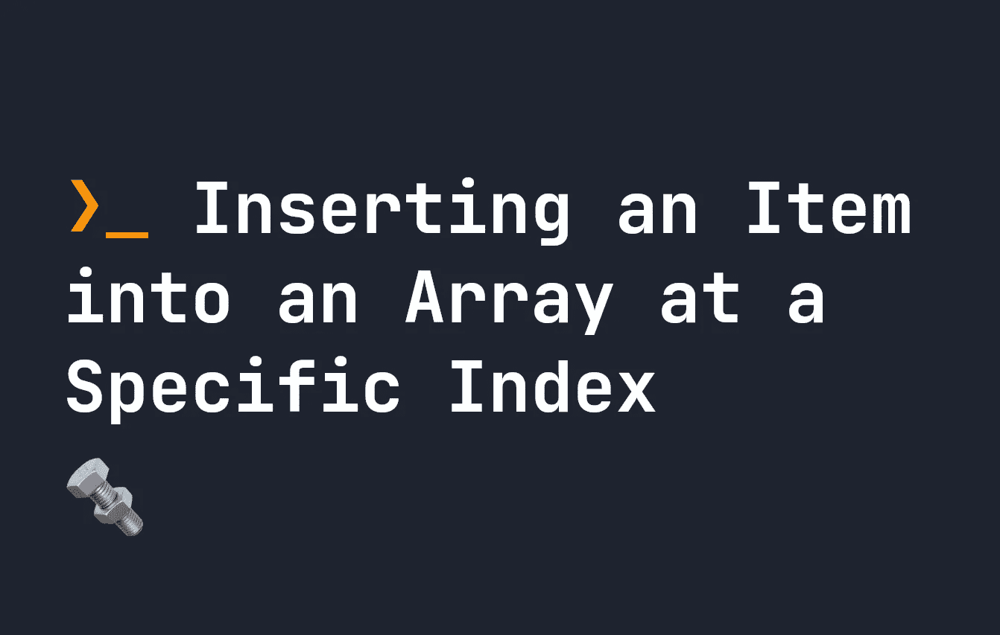

# 在数组中的特定索引处插入一个项

> 原文：<https://javascript.plainenglish.io/insert-an-item-into-an-array-at-a-specific-index-68105a484662?source=collection_archive---------15----------------------->

## 关于如何在数组中的特定索引处插入一个项的简短指南。



[数组是 Javascript](https://fjolt.com/article/javascript-arrays-introduction) 中常见的数据结构，通常看起来有点像这样:

```
let myArray = [ 'some', 'data', 'here' ]
```

它们的行为很像其他语言中的数组，并且相对容易定义。上面，我们有一个由三个条目组成的数组，我们将它们存储在我们的数组中，这个数组方便地称为`myArray`。

但是，有时我们希望在数组中的特定点插入一个新项。例如，也许我们想在`some`后面插入`new`这个词。这就是所谓的将一个条目插入到一个特定索引的条目中，今天我们来看看在 Javascript 中是如何做到的。

# 在数组中的特定索引处插入一个项

在 Javascript 中，这是一个非常容易执行的操作。我们使用`splice`方法，这是一个带 3 个参数的简单函数——它也允许我们删除项目。如果要从数组中删除项目，Splice 接受 2 个参数，如果要添加项目，splice 接受 3+个参数。

```
splice(startIndex, deleteCount, newItem1, newItem2, newItem3...)
```

**只有第一个选项是必需的**——其余都是可选的。因此拼接可以采用以下格式:

```
let myArray = [ 'some', 'data', 'here' ]myArray.splice(0); // does nothing
myArray.splice(0, 2); // Deletes two items, starting at index 0\. So 'some' and 'data' are deleted
myArray.splice(1, 0, 'new'); // Deletes zero items. Adds 'new' at index 1\. 
myArray.splice(2, 0, 'is', 'cool') // Deletes zero items. Adds 'is', and 'cool' at index 2.
```

如您所见，您可以使用这种方法向数组中添加无限数量的新项。它操作一个数组——所以这个函数改变了原始数组。您不必使用`splice`删除任何项目，但是如果您愿意，您可以这样做。将删除计数保留为 0 或空，将意味着不会从数组中删除任何项目。第三个参数(或第三个参数后的任何参数)中插入的任何数据都被添加到数组中的指定索引处。

这里是另一个例子，我们将“花椰菜”插入到一个数组的索引`2`处:

```
let arr1 = [ 'potato', 'banana', 'ravioli', 'carrot' ];// Inserts broccoli at position 2, after deleting 0 items
arr1.splice(2, 0, 'broccoli');// Returns [ 'potato', 'banana', 'ravioli', 'brccoli', 'carrot' ]
console.log(arr1);
```

这个题目到此为止。感谢您的阅读。

*更多内容请看*[***plain English . io***](https://plainenglish.io/)*。报名参加我们的* [***免费周报***](http://newsletter.plainenglish.io/) *。关注我们关于*[***Twitter***](https://twitter.com/inPlainEngHQ)[***LinkedIn***](https://www.linkedin.com/company/inplainenglish/)*[***YouTube***](https://www.youtube.com/channel/UCtipWUghju290NWcn8jhyAw)*[***不和***](https://discord.gg/GtDtUAvyhW) *。对增长黑客感兴趣？检查* [***电路***](https://circuit.ooo/) *。***