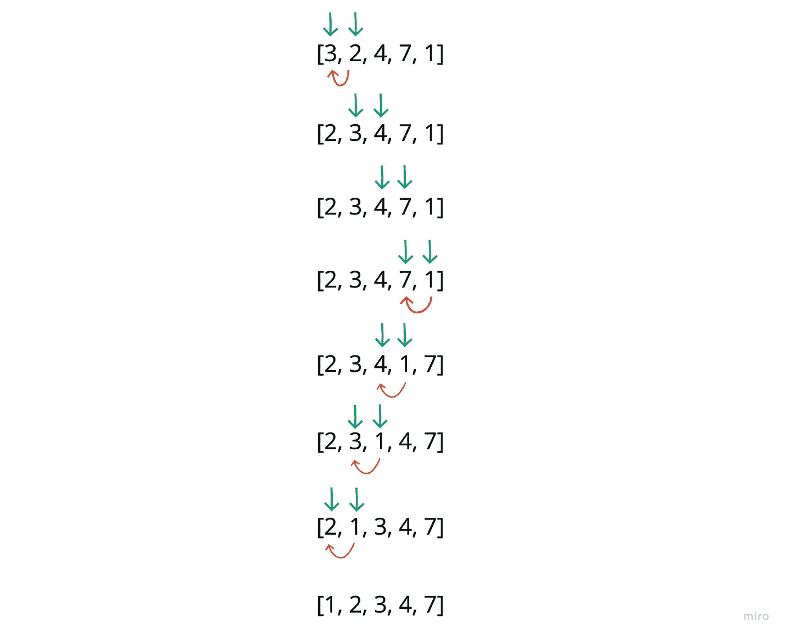

# 使用 JavaScript 进行插入排序

> 原文：<https://javascript.plainenglish.io/insertion-sort-8c8e0c398486?source=collection_archive---------16----------------------->

## 如何用 JavaScript 执行插入排序

欢迎回来！

今天，我将从我目前正在做的分类套件中离开的地方开始。

# **插入排序**

插入排序经常被比作一副卡片的排序。

我可能会从左边开始，这样做:

向右移动一张卡片，然后根据第一张卡片进行排序(如果第一张卡片较低，则交换两张)。

现在，我可以把我的第一张牌看作是我的牌中的“排序”部分。从这里开始，我将移动整副牌(到右边)，每次我都将当前的牌与左边的牌进行比较。每次，如果它比左边的牌少，我就交换两张，直到它到达正确的位置。

让我们用图表来看看这个过程:

我将从左向右移动，然后尽可能向左排序…

## 不要太快进入代码，但是…

我的外部循环允许我检查输入数组中的所有值。

内部循环允许我向后移动，按升序将较低的值放在适当的位置。

就是这样！

保重。

*更多内容看* [***说白了就是***](https://plainenglish.io/) *。报名参加我们的* [***免费周报***](http://newsletter.plainenglish.io/) *。关注我们关于* [***推特***](https://twitter.com/inPlainEngHQ) ， [***领英***](https://www.linkedin.com/company/inplainenglish/) *，*[***YouTube***](https://www.youtube.com/channel/UCtipWUghju290NWcn8jhyAw)*，以及* [***不和***](https://discord.gg/GtDtUAvyhW) *。*