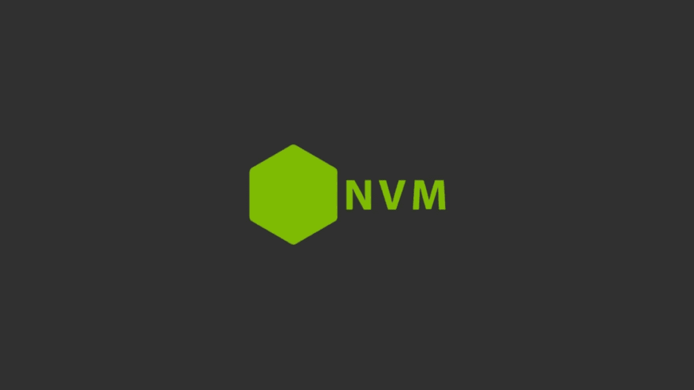
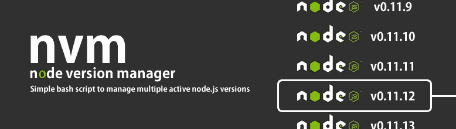

# 将 Node.js 安装到装有 NVM 的计算机上(在节点版本之间轻松切换)

> 原文：<https://javascript.plainenglish.io/install-node-js-to-your-computer-with-nvm-effortlessly-switch-between-node-versions-529d75c1850?source=collection_archive---------12----------------------->



管理 Node.js 从未像使用节点版本管理器(NVM)那样简单。如果您在开发过程中使用 Node.js，最好使用 NVM。

## NVM 是什么？

NVM 是节点版本管理器。它管理您的节点版本，并使用户能够在几秒钟内选择不同的节点版本。

您可以使用 NVMM 非常轻松地管理您的节点环境。

## 安装 NVM

带卷曲

```
curl -o- https://raw.githubusercontent.com/nvm-sh/nvm/v0.39.1/install.sh | bash
```

使用 Wget

```
wget -qO- https://raw.githubusercontent.com/nvm-sh/nvm/v0.39.1/install.sh | bash
```

这些命令下载并运行脚本。

该脚本将 nvm 存储库克隆到`~/.nvm`目录，并将下面的源代码行添加到您的 bash 配置文件中，使您能够使用 nvm。如果它不能自动为您做到这一点，您可能需要将下面这些源代码行添加到您的 bash 概要文件中。

```
export NVM_DIR="$([ -z "${XDG_CONFIG_HOME-}" ] && printf %s "${HOME}/.nvm" || printf %s "${XDG_CONFIG_HOME}/nvm")"
[ -s "$NVM_DIR/nvm.sh" ] && \. "$NVM_DIR/nvm.sh" # This loads nvm
```

成功安装后，您可以使用代码检查 nvm 是否已正确设置到您的设备。下面的代码将提示您在您的机器上安装了哪个版本的 NVM。

```
nvm -v
```



## 使用 NVM 并安装 Node.js

将 NVM 成功安装到您的设备或服务器后，您可以使用以下命令直接安装 Node.js:

```
nvm install node 
```

这将安装 Node.js 的当前版本。**#“node”**是最新版本的别名。

您可以从 [Node.js 网站](https://nodejs.org/)查看哪个版本是当前版本，哪个版本是 LTS(长期支持)

如果您想安装 Node.js 的特定版本，可以使用下面的代码来完成:

```
# To install node version 16 
nvm install 16# To install node version 14
nvm install 14
```

**列出可用的节点版本**

下面的代码显示了您已经安装在机器上的节点版本列表。

```
nvm list
```

示例提示如下:

```
v16.4.0
v17.1.0
v17.8.0
default -> node (-> v17.8.0)
iojs -> N/A (default)
unstable -> N/A (default)
node -> stable (-> v17.8.0) (default)
stable -> 17.8 (-> v17.8.0) (default)
lts/* -> lts/gallium (-> N/A)
lts/argon -> v4.9.1 (-> N/A)
lts/boron -> v6.17.1 (-> N/A)
lts/carbon -> v8.17.0 (-> N/A)
lts/dubnium -> v10.24.1 (-> N/A)
lts/erbium -> v12.22.12 (-> N/A)
lts/fermium -> v14.19.1 (-> N/A)
lts/gallium -> v16.14.2 (-> N/A)
```

**选择您想要使用的节点版本**

如您所见，从可用的版本来看，我已经在我的机器上安装了 3 个版本的 Node。如果我想使用版本`17.1.0`，可以如下图所示。

```
nvm use 17.1.0
Now using node v17.1.0 (npm v8.1.2)
```

## 如何卸载节点版本

如果您决定不使用其中任何一个版本，而想卸载其中一个版本，您可以使用下面的代码来实现:

```
nvm uninstall 16
Uninstalled node v16.4.0
```

我希望你喜欢你的新工具。现在，您可以轻松地在节点版本之间切换。🎉

请在下面的评论中告诉我您在开发过程中是否使用了 nvm 以及您对它的印象！

*如果你觉得这篇文章很有帮助，你可以通过注册一个* [***中级会员使用我的推荐链接***](https://melihyumak.medium.com/membership) **[***访问类似的***](https://medium.com/@melihyumak) *。***

***跟我上*** [**推特**](https://twitter.com/hadnazzar)


Subscribe for more on [Youtube](https://www.youtube.com/c/TechnologyandSoftware?sub_confirmation=1)

# 编码快乐！

梅利赫

*更内容于* [***普通英语***](https://plainenglish.io/) *。报名参加我们的* [***免费周报***](http://newsletter.plainenglish.io/) *。* [***推特***](https://twitter.com/inPlainEngHQ) *和*[***LinkedIn***](https://www.linkedin.com/company/inplainenglish/)*追随我们。加入我们的* [***社群不和***](https://discord.gg/GtDtUAvyhW) *。*