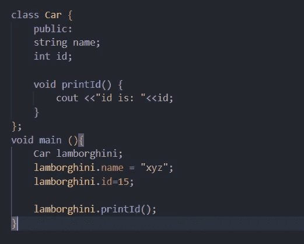
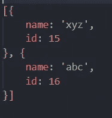
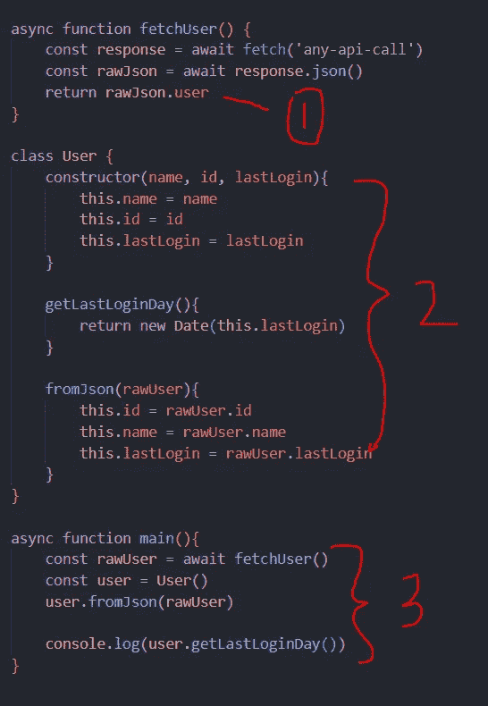

# 实例与原始对象

> 原文：<https://javascript.plainenglish.io/instance-vs-raw-object-c9f23b17748d?source=collection_archive---------3----------------------->


Photo by [Mateusz Wacławek](https://unsplash.com/@wacalke?utm_source=medium&utm_medium=referral) on [Unsplash](https://unsplash.com?utm_source=medium&utm_medium=referral)

# 对象实例与原始对象

软件项目是另一种由排列好的组件组成的复杂结构。即使是简单的软件也要使用很多组件，如服务器、数据库、代理等。另一方面，软件可能会变得复杂，并且会集成大量不同的组件并一起工作，但核心和最重要的部分之一是任何项目的代码库/源代码，因为每个结构都取决于我们如何构建代码。

今天，我们将讨论在进行代码开发时，当我们进行数百次 API 调用时，我们是否需要将数据转换为某种形式的实例，或者我们可以直接使用原始形式的数据

## 什么是实例和原始对象？

实例是从某个实体派生出来的抽象对象。例如，如果我们用任何语言创建一个类或函数，当我们用一个新的关键字创建它们的对象时，就叫做实例

下面是一个典型的类的例子，我们定义了一些属性，并向有效负载添加了一些包装方法



Class instance example

另一方面，原始对象看起来像这样。原始对象可以在应用程序中定义，也可以从一些外部资源中获取。我将 JSON 用于原始响应，但是您也可以将其与 XML 进行比较



Example of raw object

## 如何从原始对象创建实例？

假设您有一个外部 API，您需要调用它来获取最新的用户信息，但是现在您有两个选择，要么将它存储在用户类实例中，要么直接将其作为原始数据使用。现在，我们将了解如何将响应转换为某个实例

为了证明这一点，

*   首先，从任何现有的 API 获取用户信息，并从该函数返回原始对象
*   创建一个具有一些属性和方法的用户类，我们将在其中更新从 API 返回的原始用户的字段[可以在此之前添加验证]
*   从类中创建一个实例，并使用原始 JSON 来更新属性和使用 helper 方法



Example of converting instance from JSON

## 什么时候应该使用实例和原始对象？

现在，我们知道了在将原始对象转换为实例时可以采用什么方法，但是主要的问题是我们什么时候应该使用这种方法，什么时候使用原始对象会更好

再举两个用例，我们可以理解为什么这个概念非常重要

## 使用 ORM / ODM

当你使用任何 ORM 或 ODM 时，我们拥有类和实例的力量。例如

```
User.find() // return all user instances of defined class
```

但是 ORM 并不返回原始值，而是返回实例，在这个实例中，它只有很少的助手方法和虚拟的 getters 和 setters，可以在执行的后期使用

现在，在这个例子中，我们强调，每当我们必须进行任何需要属性相关更新或操作的处理时，将原始值转换成实例将是一个更好的主意

```
const users = User.find() // return User instnaces
for (user of users) {
  user.name = "test"
  user.save() // update database with new values
}
```

在原始对象的帮助下完成上述操作将是一项艰巨的任务，因此在这样的例子中实例是更好的选择

## 组块处理

让我们再举一个例子，我们有大量的数据，但目标不是存储和以后使用它们，而是获取一些统计数据，在这种情况下，原始对象将是更好的选择

```
let count = 0
api.on('data', function(chunk){
  count += chunk.length // assuming chunk is array of object
})
```

在一些例子中，我们不用担心响应中的单个条目的属性，而是用一些公共属性来处理其他实体，那么直接使用原始对象将是一个好的选择

## 还有其他选择吗？

你可能会想，我们是只有两个选择，还是有更多的选择，所以为了回答这个问题，我举了一个例子:React hooks，hooks 为自定义数据提供了 hood 解决方案，它们的处理程序在内部有 raw 对象，但在返回时也附加了 helper 属性

在每一种语言、框架或库中，都有一些您应该尽可能看到并应用的好的实践

## 结论

使用实例和原始对象都符合它们的目的，但是数据传输只发生在原始对象上，而不是实例上，所以我们需要将对象转换为实例，这需要一些额外的处理。对于系统繁重的应用程序，哪种方法更好是有争议的，因为少量的计算也将占用大量的处理能力

希望你今天学到好东西，快乐编码！

*更多内容看* [***说白了。报名参加我们的***](https://plainenglish.io/) **[***免费周报***](http://newsletter.plainenglish.io/) *。关注我们关于* [***推特***](https://twitter.com/inPlainEngHQ)[***LinkedIn***](https://www.linkedin.com/company/inplainenglish/)*[***YouTube***](https://www.youtube.com/channel/UCtipWUghju290NWcn8jhyAw)*[***不和***](https://discord.gg/GtDtUAvyhW) *。对增长黑客感兴趣？检查* [***电路***](https://circuit.ooo/) *。*****