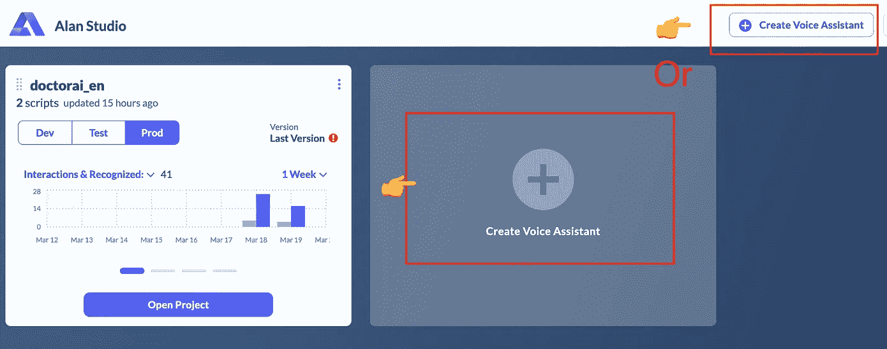

# 如何将艾伦的语音转文本引擎集成到 Doctor.ai 中

> 原文：<https://javascript.plainenglish.io/integrate-alan-speech-to-text-to-doctor-ai-5f0b2f479cca?source=collection_archive---------0----------------------->

## 通过高度精确的 Alan AI 改善 Doctor.ai 的语音识别

*黄四兴*[梁丽 ](https://github.com/herosql)

Photo by [Gritte](https://unsplash.com/@gritte?utm_source=unsplash&utm_medium=referral&utm_content=creditCopyText) on [Unsplash](https://unsplash.com/s/photos/speak?utm_source=unsplash&utm_medium=referral&utm_content=creditCopyText)

对于一个语音聊天机器人来说，它准确捕捉说话者话语的能力可以决定用户体验的成败。和一个聪明的转录者交谈总是很有趣。这是一种生产力的提升，因为说话比打字快两到三倍。

相比之下，像 Chrome 这样起伏不定的语音转文本引擎会很快让用户感到沮丧。在这种情况下，用户将很快意识到花在纠正上的时间比从听写中获得的时间要多。结果他就一直打字不说话。这就违背了语音聊天机器人的全部目的。

在我们开发医疗聊天机器人 Doctor.ai ( [1](https://medium.com/p/8c09af65aabb) 、 [2](https://neo4j.com/blog/doctor-ai-a-voice-chatbot-for-healthcare-powered-by-neo4j-and-aws/) 、 [3](https://towardsdatascience.com/transfer-knowledge-graphs-to-doctor-ai-cc21765fa8a6) 、 [4](https://dgg32.medium.com/from-symptoms-and-mutations-to-diagnoses-doctor-ai-as-a-diagnosis-tool-5b31ac7a16c3) 、 [5](https://towardsdatascience.com/gpt-3-for-doctor-ai-1396d1cd6fa5) 和 [6](https://dgg32.medium.com/can-doctor-ai-understand-german-chinese-and-japanese-gpt-3-answers-ja-%E5%8F%AF%E4%BB%A5-and-%E3%81%84%E3%81%84%E3%82%88-b63b10d67bf4) )的过程中，我们很早就注意到 Chrome 中的语音转文本引擎并不出色。它丢弃并曲解了单词。它形成了毫无意义的不连贯的句子。它在 ai 医生最需要的医学对话中的表现糟糕透顶。

我们一直在寻找更好的发动机。这个新的引擎不仅应该在正常对话中表现出色，还应该理解常见的医学术语，如疾病、药物和病原体的名称。我们的搜索得到了艾伦·艾的奖励。

Figure 1\. Doctor.ai with Alan button in action. Image by the author.

Figure 2\. Alan captures medical jargon, such as frontal sinus and Doxepin. Image by the author.

据其网站介绍，Alan 是一个对话式语音 AI 平台。它的口语理解(SLU)旨在处理自动语音识别(ASR)的易错输出。它有一个所谓的领域语言模型，可以更好地识别专业语言，动态适应用户的对话风格。

Alan 高度准确的声音捕捉给我们留下了深刻的印象(图 1)。在普通和技术对话中，它完全胜过 Chrome。它航行通过许多生物医学术语，如“光合作用”、“额窦”、“多塞平”和“牛痘”(图 2)。最让我们惊讶的是，正如你在图 1 中看到的，即使 Alan 在这里和那里有一些错误的单词，它也能够纠正错误，并最终形成连贯的句子。

Figure 3\. The architecture of Doctor.ai with Alan. Image by author.

在本文中，我们将向您展示如何将 Alan 按钮集成到 Doctor.ai 的前端，以改善用户体验(图 3)。它懂英语。如果你有艾伦的企业版，你也可以做一个德国版。该项目不需要花费艾伦的开发商计划的资金。这个项目的代码存放在 GitHub 仓库中。

 [## GitHub - dgg32/doctorai_alan

### 这是面向 Doctor.ai 和 Alan 的 React 前端应用程序，将 Alan 语音转文本集成到 Doctor.ai。在中运行该应用程序…

github.com](https://github.com/dgg32/doctorai_alan) 

# 1.获取艾伦的 SDK 密钥

去[艾伦的网站](https://studio.alan.app/register)报名。并按照[说明](https://studio.alan.app/plans)获取“开发者计划”。这个计划给你超过一万次的自由互动。一旦你进入艾伦工作室，点击`Create Voice Assistant`并将其命名为`doctorai_en`。

Figure 4\. How to create an Alan project. Image by author.

进入工作室后，创建一个“Alan Integrations”项目。删除左侧面板上的所有原始脚本，并创建一个新脚本。将代码 1 复制并粘贴到内容中。这个脚本捕获用户的讲话并使 Alan 的语音响应静音。最后，点击`</> Integrations`按钮。

Figure 5\. How to edit the Alan script. Image by author.

Code 1\. The content for the Alan script.

进入`Integration`页面后，将`Microphone timeout`更改为`3 sec`，这样艾伦就不会捕捉到来自 Doctor.ai 的语音响应。您也可以更改语言。最后，复制 SDK 密钥。

Figure 6\. Configure the Integration parameters in Alan. Image by the author.

# 2.改变 Doctor.ai 的前端

我们已经更新了 Doctor.ai 前端的代码，以容纳 Alan 按钮。您可以在资源库中找到这些新代码。以下是这些变化的简要概述。

Figure 7\. Changes in Doctor.ai’s app.js. Image by the author.

除了一个新的`ref`之外，聊天机器人的初始化和以前的文章一样。接下来，我们使用 Alan 的`parsed`事件来捕获讲话，并将脚本传输到聊天机器人的输入字段。最后，我们将 Alan 按钮添加到 DOM 中。

# 3.启动放大前端

现在，我们来设置放大器前端并测试 Alan。将我们的存储库转到您自己的 GitHub 帐户。按照本文中[的描述设置 Doctor.ai。在安装过程中添加以下环境变量:](https://medium.com/p/1396d1cd6fa5)

因此，在您的`Configure build settings`页面中应该是这样的:

Figure 8\. Setting the environment variables in Amplify. Image by the author.

一旦 Amplify 完成设置，前往您的聊天机器人的网址，玩得开心！请注意，在 Alan 捕捉到您的发言后，文本将出现在输入字段中。您可以在将抄本发送到聊天机器人之前检查或更正抄本。

Figure 9\. Doctor.ai with Alan button in English. Image by the author.

# 4.德语版

如果你有艾伦的企业版，也可以轻松设置德语版。在 Alan Studio 中创建一个新项目，并将语言更改为`de`(图 10)。复制并保存 SDK 密钥。

Figure 10\. Change the language in Alan to German. Image by the author.

在 Amplify 中设置期间，不要忘记将`REACT_APP_LANGUAGE`改为德语。

Figure 11\. Change the language to German in Amplify. Image by the author.

现在，你也可以用德语聊天。

# 结论

在本文中，我们将向您展示如何将 Alan 的语音转文本引擎集成到 Doctor.ai 中，该引擎可以捕获我们的语音，成功率远高于 Chrome。即使 Alan 有时会曲解一些单词，我们也可以在输入栏轻松纠正。这一增加提高了我们与 Doctor.ai 交互的效率。

这个项目还显示了扩展 Doctor.ai 有多容易。Doctor.ai 是模块化的，通过 API 进行通信。开发人员可以相应地切换各个组件。我们可以轻松地向其放大器前端添加元素，以增强用户体验。因此，我们鼓励您尝试 Doctor.ai，并告诉我们您的使用体验。

*本文中文版为* [*此处为*](https://blog.csdn.net/qq_39576261/article/details/125688918?spm=1001.2014.3001.5502) *。*

 [## 加入媒介与我的介绍链接-黄思兴

### 作为一个媒体会员，你的会员费的一部分会给你阅读的作家，你可以完全接触到每一个故事…

dgg32.medium.com](https://dgg32.medium.com/membership) 

*更多内容请看*[***plain English . io***](https://plainenglish.io/)*。报名参加我们的* [***免费周报***](http://newsletter.plainenglish.io/) *。关注我们关于*[***Twitter***](https://twitter.com/inPlainEngHQ)*和**[***LinkedIn***](https://www.linkedin.com/company/inplainenglish/)*。加入我们的* [***社区***](https://discord.gg/GtDtUAvyhW) *。**