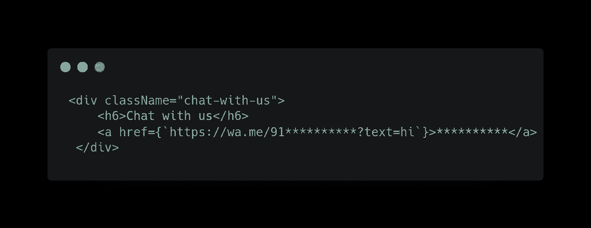

# 如何将 WhatsApp 整合到你的应用中？

> 原文：<https://javascript.plainenglish.io/integrate-whatsapp-on-your-application-2d1acc7b5882?source=collection_archive---------3----------------------->

## 如何从您的 web 应用程序链接/重定向到 WhatsApp？


Photo by [Daniel Tanase](https://unsplash.com/@danielvtanase?utm_source=medium&utm_medium=referral) on [Unsplash](https://unsplash.com?utm_source=medium&utm_medium=referral)

如今，几乎所有与业务相关的查询、客户支持讨论、订单状态和促销都是通过 Whatsapp 进行的。市场上有一些大玩家通过 WhatsApp 集成了各种人工智能聊天机器人，帮助我们提高业务销售。

当然，每个企业都有自己的网站或应用程序，我们希望将用户重定向到 WhatsApp 进行一些查询等。从我们的应用程序。

那么，如何才能把 WhatsApp 和我们的应用联系起来呢？

**第一步:找出你希望用户重定向到的手机号码** 以这种格式创建一个链接:-

```
https://wa.me/<number>
```

其中<number>是国际格式的完整电话号码。以国际格式添加电话号码时，请省略任何括号、破折号、加号和前导零。</number>

**举例**:

用途:[https://wa.me/15551234567](https://wa.me/15551234567)

不要用:[https://wa . me/+001-(555)1234567](https://wa.me/+001-(555)1234567)

**注意:-这被称为通用链接，是根据 WhatsApp 帐户的文档链接到 WhatsApp 帐户的首选方法。**

**第二步:将这个链接附加到你的事件处理程序** 有不同的方法可以将这个链接附加到你的应用程序上，比如你网站上的一个粘性的 WhatsApp 图标，一个页面上的按钮，等等。

**示例**:



Redirects to WhatsApp on button click

正如你在上面的代码中看到的，我们将我们的通用`WhatsApp`链接附加到这个锚标签上，当用户点击它时，它会将用户重定向到`WhatsApp`。

但是，你注意到数字后面的东西了吗？
——`?text=hi`

你知道这意味着什么吗？

**第三步:在聊天的文本字段中添加预先填写的消息**

WhatsApp 为我们提供了一种方法，可以在聊天的文本字段中自动显示预填充的消息。
以此格式创建链接-

```
https://wa.me/whatsappphonenumber/?text=urlencodedtext
```

其中 WhatsApp 电话号码是国际格式的完整电话号码，URL 编码文本是 URL 编码的预填充消息。

例子:[https://wa.me/15551234567?我对你的汽车感兴趣](https://wa.me/15551234567?text=I'm%20interested%20in%20your%20car%20for%20sale)

## 就是这样！

```
“This is the final URL, you can use to redirect users from your application to WhatsApp”.
```

**注意**:请注意，当你发送一条预填信息时，应该是`encoded`。

**举例**:
[https://wa.me/15551234567?](https://wa.me/15551234567?text=I'm%20interested%20in%20your%20car%20for%20sale)text = hi

这种类型的消息不需要编码就可以工作，但是如果您的消息包含任何独特的字符，如`&`、`@`等，那么它将在该特殊字符之前截断该消息。

【https://wa.me/15551234567?】例:
T5 正文=黄油&正文

它只会将 butter 作为预填充的消息发送，因为它没有被编码。

**在 JavaScript** 中，您可以使用编码的 URI 组件对消息进行编码。

**例子**:[https://wa.me/91**********?text = $ { encodeURIComponent(](https://wa.me/917400097974?text=${encodeURIComponent()whatsapp text)}

是的，现在就这些。

*请在评论区分享您的观点，欢迎反馈。
希望你会喜欢并分享这篇文章，以便更好地达成目标
查看我的其他文章—*[***https://medium.com/@aayushtibra1997***](https://medium.com/@aayushtibra1997) ***感谢阅读:)***

*更多内容请看*[***plain English . io***](https://plainenglish.io/)*。报名参加我们的* [***免费每周简讯***](http://newsletter.plainenglish.io/) *。关注我们*[***Twitter***](https://twitter.com/inPlainEngHQ)*和*[***LinkedIn***](https://www.linkedin.com/company/inplainenglish/)*。查看我们的* [***社区不和谐***](https://discord.gg/GtDtUAvyhW) *加入我们的* [***人才集体***](https://inplainenglish.pallet.com/talent/welcome) *。*