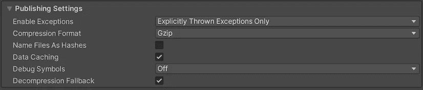
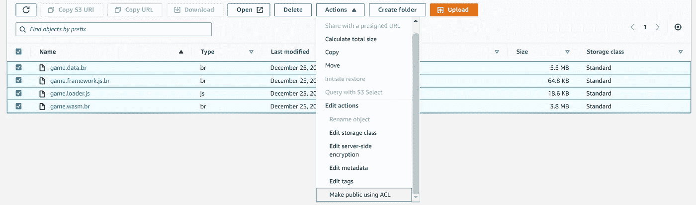
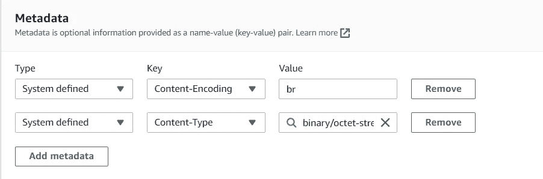

# 通过 AWS S3 将压缩的 Unity WebGL 版本集成到 Angular 中

> 原文：<https://javascript.plainenglish.io/integration-of-compressed-unity-webgl-build-into-angular-with-aws-s3-367a1add501b?source=collection_archive---------1----------------------->

继八月份我在博客中谈到在 Angular 中集成 3D-Vista[之后，我决定写这篇博客，因为我在那里找不到集成 Brotli 压缩 Unity 游戏和 Angular 的最佳方式。希望对你有帮助。](https://medium.com/javascript-in-plain-english/how-to-integrate-interact-3d-vista-into-angular-component-9a8519af280b)

假设您有一个 Angular 应用程序，并从项目资产中集成了 Unity WebGL 构建。以下是如何整合压缩游戏的方法。

首先，我们需要建立统一的游戏。使用发布设置配置我们的 WebGL 应用程序。选择 Gzip 或者 Brotli，我用的是 Brotli 压缩格式。在数据缓存(可选)中，该选项自动在用户机器上缓存资产数据，因此不必每次都重新下载。缓存是使用浏览器提供的 IndexedDB API 实现的。



打开 AWS S3(简单存储服务)选择一个存储桶并上传输出构建资产。对资产的许可应该是公开的。选择资产，然后单击操作，然后单击使用 ACL 公开。



> 现在我们需要配置内容编码，以便正确无误地使用上传的内容。如果未完成，它将引发类型错误:无法对“WebAssembly”执行“compile”:HTTP 状态代码不正常

要配置标题，请选择资产，单击操作，然后选择编辑元数据。添加下面的元数据，对于 Brotli 压缩，br 是值，而对于 gzip，使用 Gzip。内容类型是默认的二进制/八进制流。



现在，在配置元数据之后，我们的资产可以直接在我们的应用程序中使用。使用来自 S3 的公共资源 url，并在您的 component.ts 中替换加载游戏功能的位置。

如果您遇到 CORS 错误，请转到 bucket settings 并通过放置以下 JSON 来配置 CORS，这将解决问题。

```
[
    {
        "AllowedHeaders": [
            "*"
        ],
        "AllowedMethods": [
            "GET",
            "HEAD"
        ],
        "AllowedOrigins": [
            "*"
        ],
        "ExposeHeaders": [
            "ETag"
        ],
        "MaxAgeSeconds": 3000
    }
]
```

运行应用程序集成已经完成。现在我们完成了，我们已经成功地整合了压缩的游戏。

***那是个包裹。我希望这对你有所帮助。***

## 更多内容请访问 [PlainEnglish.io](https://plainenglish.io/) 。

*报名参加我们的* [***免费周报***](http://newsletter.plainenglish.io/) *。关注我们上* [***推特***](https://twitter.com/inPlainEngHQ) ， [***领英***](https://www.linkedin.com/company/inplainenglish/) ***，***[***YouTube***](https://www.youtube.com/channel/UCtipWUghju290NWcn8jhyAw)***，以及****[***不和***](https://discord.gg/GtDtUAvyhW) *

## *想扩大你的软件创业规模吗？检查[电路](https://circuit.ooo/?utm=publication-post-cta)。*