# Keycloak 在 TYK 网关中间件中的集成

> 原文：<https://javascript.plainenglish.io/integration-of-keycloak-in-tyk-gateway-middleware-26f8e5b760e3?source=collection_archive---------2----------------------->

## 如何使用 Tyk Gateway(开源)中间件将 Keycloak 与 REST API(多租户应用)集成，并为现有请求发送自定义头。


Photo by [Clément Hélardot](https://unsplash.com/@clemhlrdt?utm_source=medium&utm_medium=referral) on [Unsplash](https://unsplash.com?utm_source=medium&utm_medium=referral)

# 介绍

在本文中，我们的目的是了解如何使用 [Tyk](https://tyk.io/) [网关中间件](https://tyk.io/docs/plugins/supported-languages/javascript-middleware/middleware-scripting-guide/)来保护我们自己的 [Node.js API](https://github.com/santoshshinde2012/node-boilerplate) 并从客户端发送当前请求的定制请求头。为了获得访问令牌，我们将使用 [Keycloak](https://www.keycloak.org/) 。

那些不熟悉 Tyk 网关并希望了解该网关的基本特性的人可以参考我以前的文章，请参见下面的链接。

[](/getting-started-with-tyk-open-source-on-your-local-machine-6468d1c4f7b) [## 在本地机器上开始使用 Tyk API Gateway

### 用 Node.js 和 Express 创建一个简单的 API 端点，然后创建一个本地 TYK 网关(开源)。

javascript.plainenglish.io](/getting-started-with-tyk-open-source-on-your-local-machine-6468d1c4f7b) 

此外，我们已经在下面的文章中介绍了如何使用 Keycloak 开始使用 Tyk api gateway。

[](/getting-started-to-tyk-api-gateway-with-keycloak-16307435584a) [## 使用 Keycloak 开始使用 Tyk API 网关

### 如何使用 Tyk Gateway(开源)来保护 Node.js API，拒绝来自

javascript.plainenglish.io](/getting-started-to-tyk-api-gateway-with-keycloak-16307435584a) 

我们将在本文和 POC 中使用以下技术堆栈。

1.  [TYK 门户](https://tyk.io/)
2.  [TYK Javascript 中间件](https://tyk.io/docs/plugins/supported-languages/javascript-middleware/middleware-scripting-guide/)
3.  [钥匙锁](https://www.keycloak.org/)
4.  [Docker](https://www.docker.com/)&[Docker-Compose](https://docs.docker.com/compose/)
5.  [Node.js](https://github.com/santoshshinde2012/node-boilerplate)

# 什么是 TYK 网关中间件？

Tyk 提供了添加定制中间件或插件来扩展其功能的能力，下面是 Tyk 提供的两种定制类型。

1.  中间件组件——基本上有两类，第一类是**前**，第二类是**后**。通常，预中间件组件将在任何令牌或会话验证发生之前执行。后中间件组件将在执行完所有检查并且请求准备好被代理后运行。
2.  动态事件处理程序——这些组件在 API 事件上触发，或者你可以简单地称它们为 [webhooks](https://tyk.io/docs/basic-config-and-security/report-monitor-trigger-events/webhooks/#setup-with-api) 。

查看以下 TYK 官方文章，了解更多关于定制 JS 中间件概述的信息。

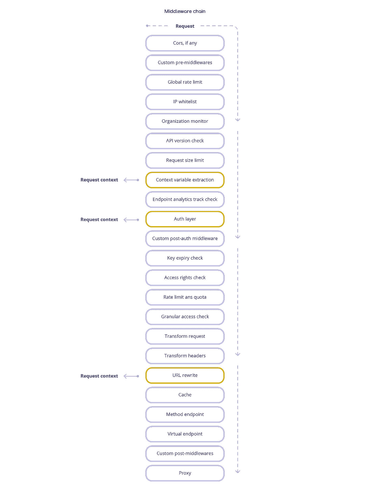

Request Middleware Chain (Source — [https://tyk.io/docs/concepts/middleware-execution-order/](https://tyk.io/docs/concepts/middleware-execution-order/))

# 假设

本文假设您已经安装了 TYK 网关和带有 docker-compose 的 Keycloak，如果您需要任何帮助，请参考下一篇文章中概述的步骤。

[](/getting-started-to-tyk-api-gateway-with-keycloak-16307435584a) [## 使用 Keycloak 开始使用 Tyk API 网关

### 如何使用 Tyk Gateway(开源)来保护 Node.js API，拒绝来自

javascript.plainenglish.io](/getting-started-to-tyk-api-gateway-with-keycloak-16307435584a) 

# TYK 中间件中的 Keycloak 集成—工作流

让我们以一个多租户应用程序和您向 Tyk Gateway 注册的 API 为例。如果您需要基于基于租户的请求发送您自己的定制头，并且您已经将 OAuth 2.0 与不同的租户集成，那么您可以使用 TYK 网关中间件来实现这一点。

我们将基于图像中显示的以下流程实现我们的实现。

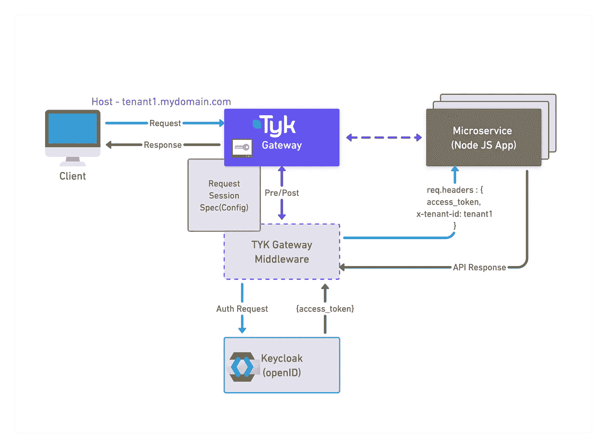

Keycloak Integration in TYK Middleware — Workflow

# 开始安装

我们将使用 docker-compose 在本地安装 TYK & Keycloak，这是最快的方法。

## **步骤 1 —克隆 docker-compose 存储库**

[](https://github.com/santoshshinde2012/tyk-keycloak-middleware) [## GitHub-Santosh shinde 2012/tyk-keycloak-middleware:这是 key cloak 和 tyk 的入门版…

### 这是使用 Javascript - GitHub 的 keycloak 和 tyk 中间件的入门版…

github.com](https://github.com/santoshshinde2012/tyk-keycloak-middleware) 

```
git clone [https://github.com/santoshshinde2012/tyk-keycloak-demo.git](https://github.com/santoshshinde2012/tyk-keycloak-middleware.git)
cd [tyk-keycloak-demo](https://github.com/santoshshinde2012/tyk-keycloak-middleware.git)// Run the application using docker-compose
docker-compose up
```

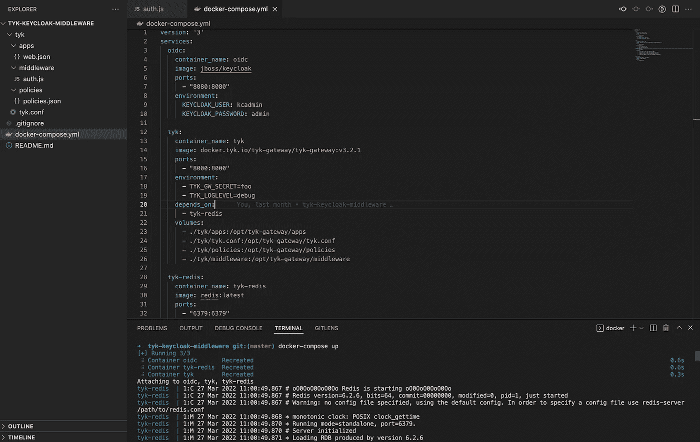

Run the Tyk & Keycloak application

## **第 2 步—** [**创建 TYK 认证中间件**](https://tyk.io/docs/plugins/supported-languages/javascript-middleware/middleware-scripting-guide/)

中间件的对象是通过调用`TykJS.TykMiddleware.NewMiddleware({})`构造函数，然后使用`NewProcessRequest()`闭包语法用您的函数初始化它来创建的。查看这篇[文章](https://tyk.io/docs/plugins/supported-languages/javascript-middleware/middleware-scripting-guide/)了解更多详情。

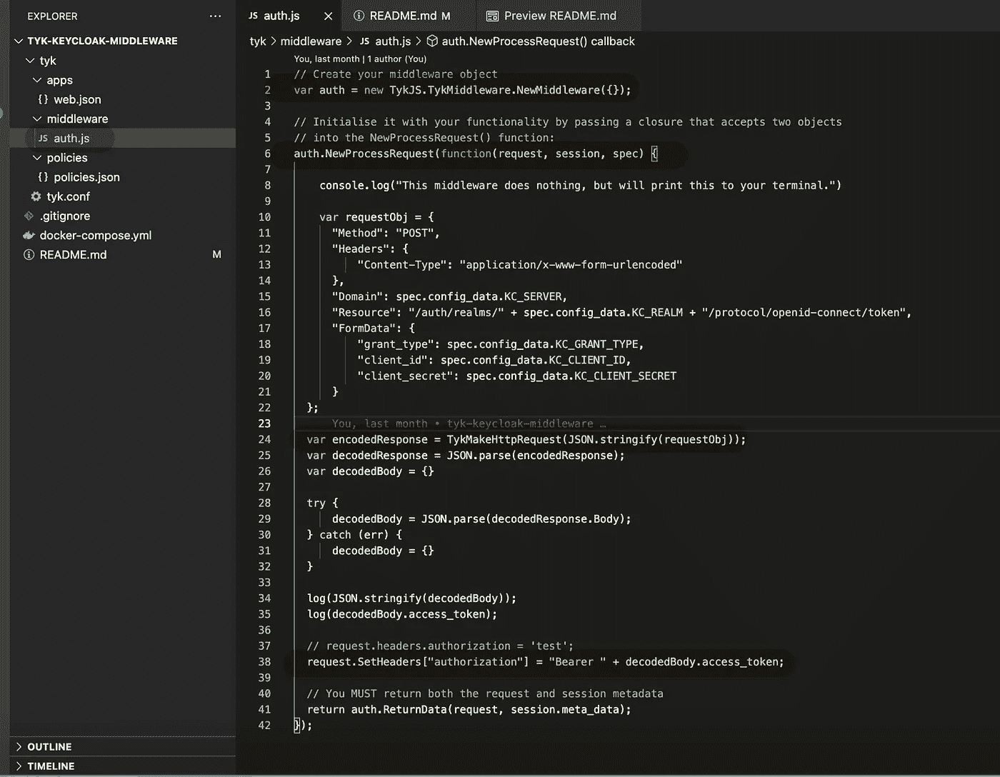

[Create TYK Auth Middleware](https://github.com/santoshshinde2012/tyk-keycloak-middleware/blob/master/tyk/middleware/auth.js)

## **步骤 3——理解请求、会话和规范的用法**

**请求**—`request`对象提供了一组可以操作的数组，当这些数组发生变化时，将会影响请求通过中间件管道的过程。

**会话** — Tyk 使用内部会话表示来处理特定密钥的配额、速率限制和访问权限。这些数据可用于后处理中间件进行处理。会话对象本身不可编辑，因为它对 Tyk 的正确运行至关重要。

Spec(Config) —您可以在 API 定义中使用`config_data`特殊字段，通过 JSVM 将定制属性传递给中间件。示例— `spec.config_data.{Keyname}`

## **步骤 4—创建演示 Node.js 应用程序**

对于本文，我们将使用已经使用 TypeScript 和 Express 创建的 [Node.js 样板](https://github.com/santoshshinde2012/node-boilerplate)代码。

[](https://github.com/santoshshinde2012/node-boilerplate) [## GitHub-Santosh shinde 2012/Node-Boilerplate:用于微服务的节点类型脚本样板…

### 微服务的节点类型脚本样板。用 TypeScript 编写的 Node.js 应用程序的框架(带有安装说明…

github.com](https://github.com/santoshshinde2012/node-boilerplate) 

```
// clone the application
git clone [https://github.com/santoshshinde2012/node-boilerplate.git](https://github.com/santoshshinde2012/node-boilerplate.git)// change to the new directory
cd node-boilerplate// Run the application using docker-compose
docker-compose up
```

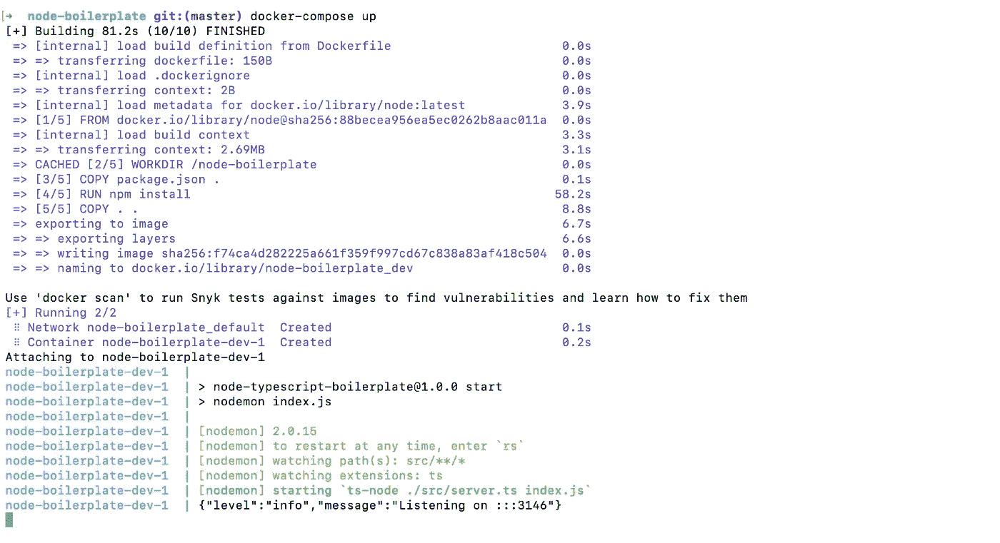

Run the Node JS Application

## **步骤 5—为我们的租户设置 Keycloak 领域和客户端**

如果您不熟悉 [Keycloak](https://www.keycloak.org/documentation) ，请浏览以下文章了解更多详情。

[](https://blog.santoshshinde.com/introduction-to-building-an-effective-identity-and-access-management-architecture-with-keycloak-4c1645124d83) [## 使用 Keycloak 构建有效的身份和访问管理架构简介

### Keycloak 是一个开源软件产品，允许使用身份和访问管理进行单点登录，旨在为现代…

blog.santoshshinde.com](https://blog.santoshshinde.com/introduction-to-building-an-effective-identity-and-access-management-architecture-with-keycloak-4c1645124d83) 

我们需要创建一个领域，并在该领域中创建一个具有 client_credentials 授权类型的客户机。在 Tyk 网关内创建 API 时，将使用以下参数。

1.  创建领域

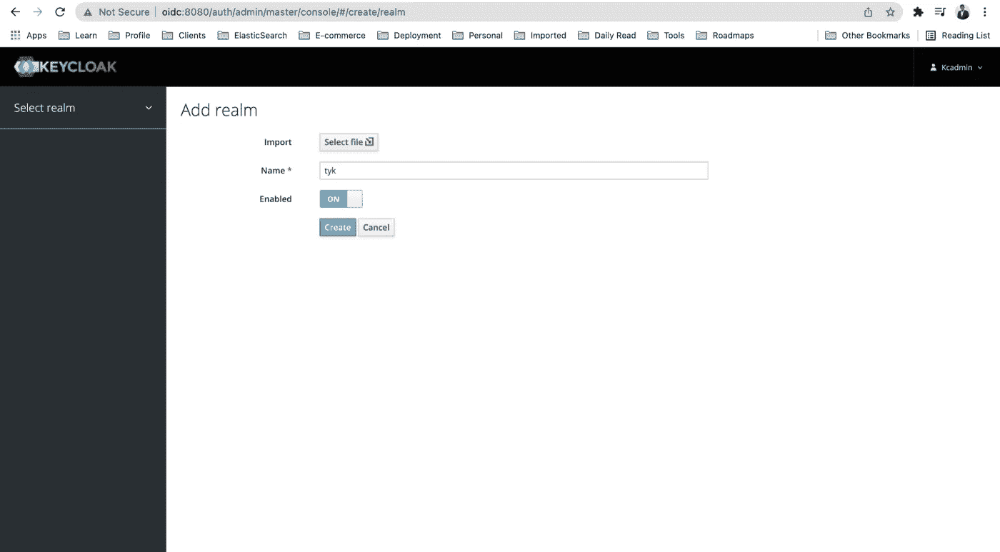

Create Realm

2.创建客户端

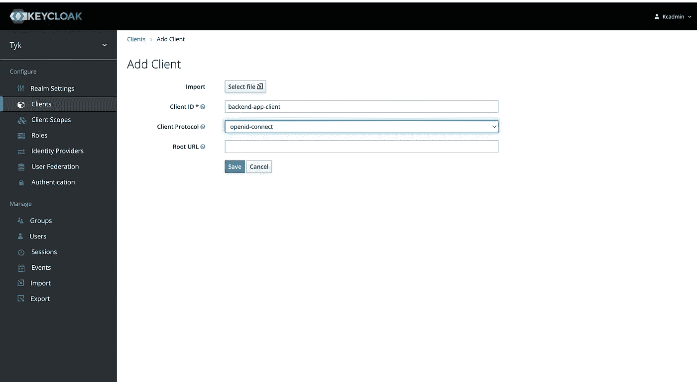

create client

3.启用客户端凭证授予类型(如何在钥匙锁身份与访问管理系统中使用客户端凭证授予类型)

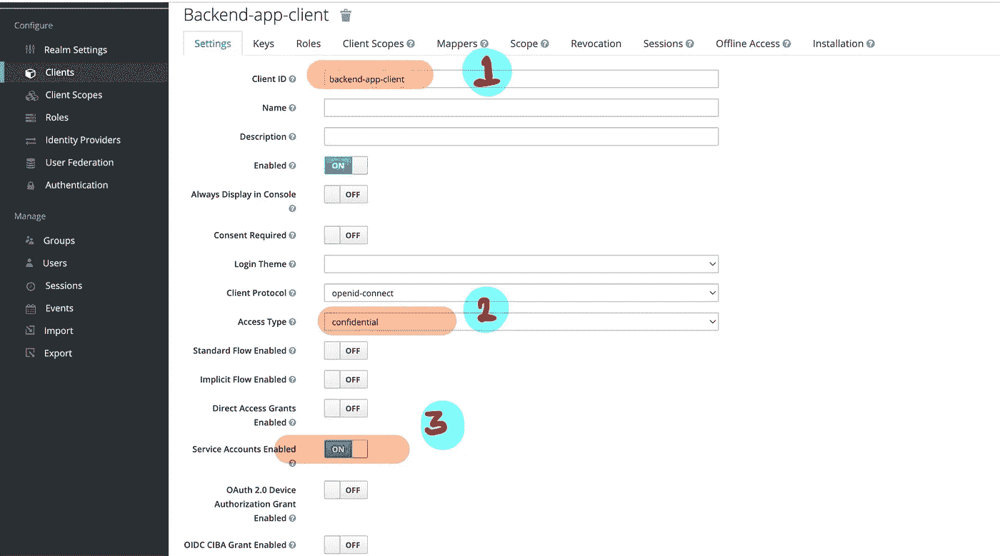

Enable for client credentials grant type

4.获取客户端的客户端机密

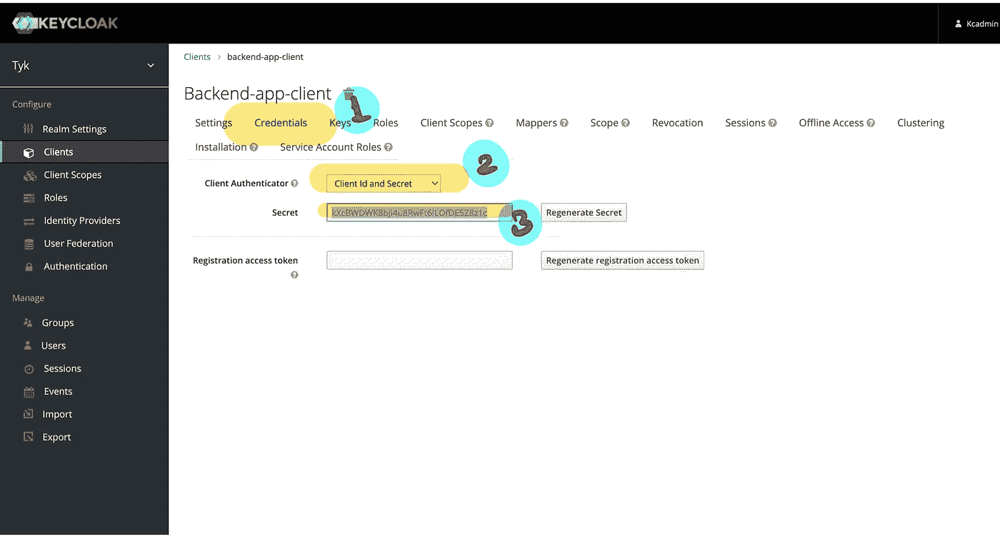

Get client secrete for client

```
"KC_CLIENT_ID": "backend-app-client","KC_GRANT_TYPE": "client_credentials","KC_REALM": "tyk","KC_CLIENT_SECRET": "iimAz1Pnq9zbzVvLVbbTlc5qJLJ46OLh","KC_SERVER": "http://oidc:8080"
```

## **步骤 6—添加/创建新的 API**

请在下面找到我们将要使用的示例

[https://github . com/Santosh shinde 2012/tyk-key cloak-middleware/blob/master/tyk/apps/web . JSON](https://github.com/santoshshinde2012/tyk-keycloak-middleware/blob/master/tyk/apps/web.json)

```
{
    "name": "web",
    "slug": "web",
    "api_id": "web",
    "org_id": "web",
    "definition": {
        "location": "header",
        "key": "version"
    },
    "use_keyless": true,
    "version_data": {
        "not_versioned": true,
        "versions": {
            "Default": {
                "name": "Default"
            }
        }
    },
    "config_data": {
        "KC_CLIENT_ID": "backend-app-client",
        "KC_REALM": "tyk",
        "KC_GRANT_TYPE": "client_credentials",
        "KC_SECRET": "iimAz1Pnq9zbzVvLVbbTlc5qJLJ46OLh",
        "KC_SERVER": "http://oidc:8080"
    },
    "custom_middleware": {
        "pre": [
            {
                "name": "auth",
                "path": "/opt/tyk-gateway/middleware/auth.js",
                "require_session": false,
                "raw_body_only": false
            }
        ]
    },
    "driver": "otto",
    "proxy": {
        "listen_path": "/web",
        "target_url": "http://host.docker.internal:3146/web",
        "strip_listen_path": true
    }
}
```

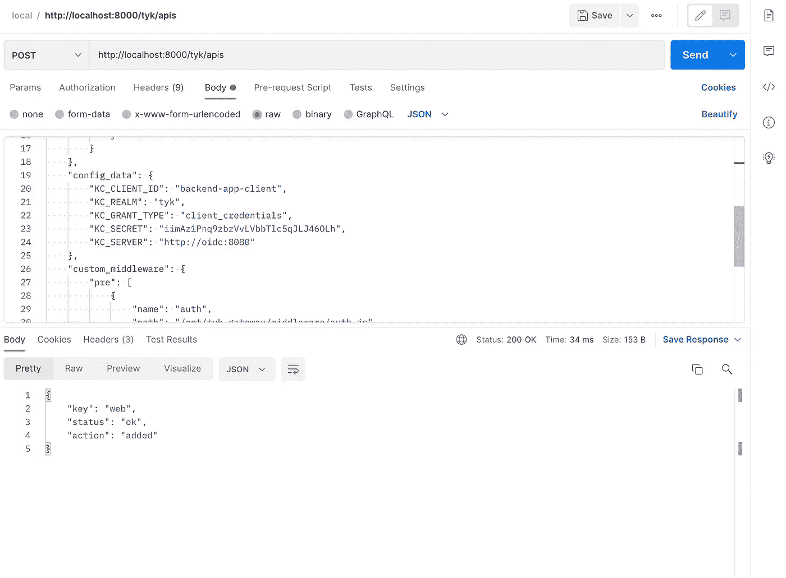

Create API

## **步骤 7—通过网关访问 API**

我们现在可以通过 Tyk 网关访问 REST API 端点。

1.  请求

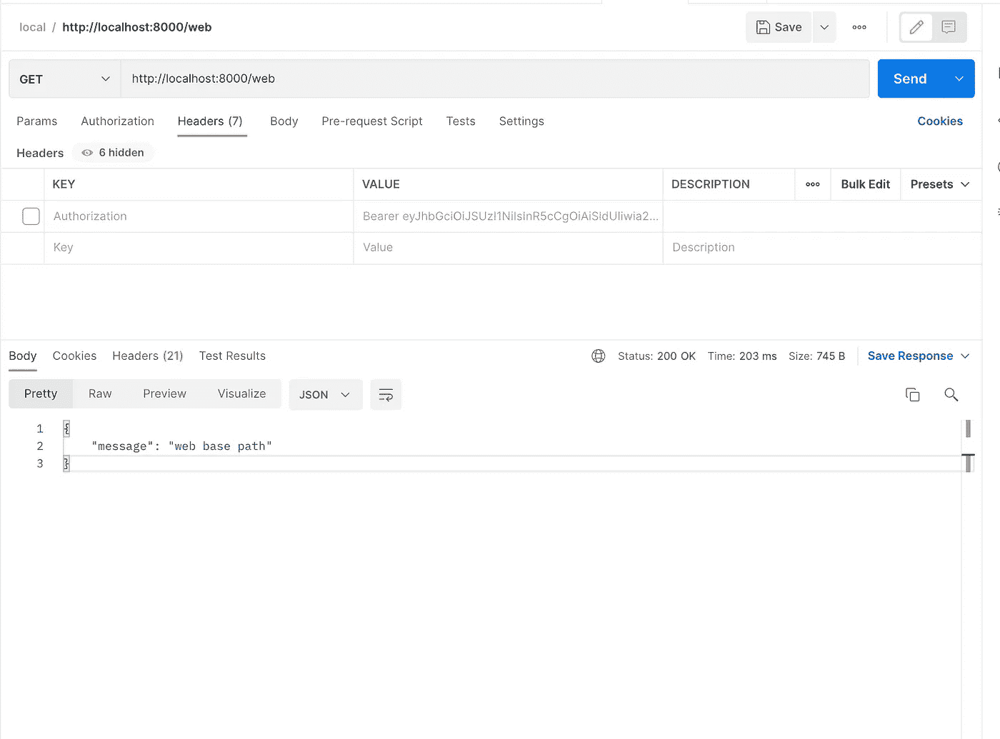

Request

2.反应

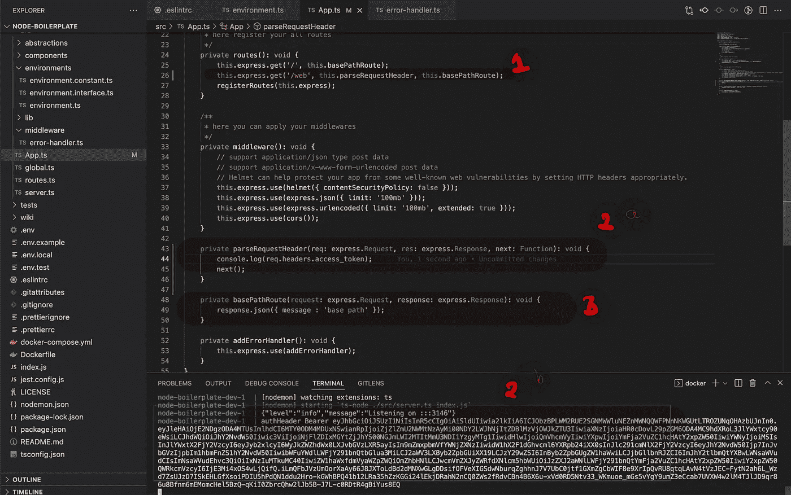

Response

感谢阅读，请分享你的评论，如果这个博客增加了你的学习价值，请鼓掌。

*更多内容请看*[***plain English . io***](https://plainenglish.io/)*。报名参加我们的* [***免费周报***](http://newsletter.plainenglish.io/) *。关注我们关于*[***Twitter***](https://twitter.com/inPlainEngHQ)*和*[***LinkedIn***](https://www.linkedin.com/company/inplainenglish/)*。加入我们的* [***社区不和谐***](https://discord.gg/GtDtUAvyhW) *。*