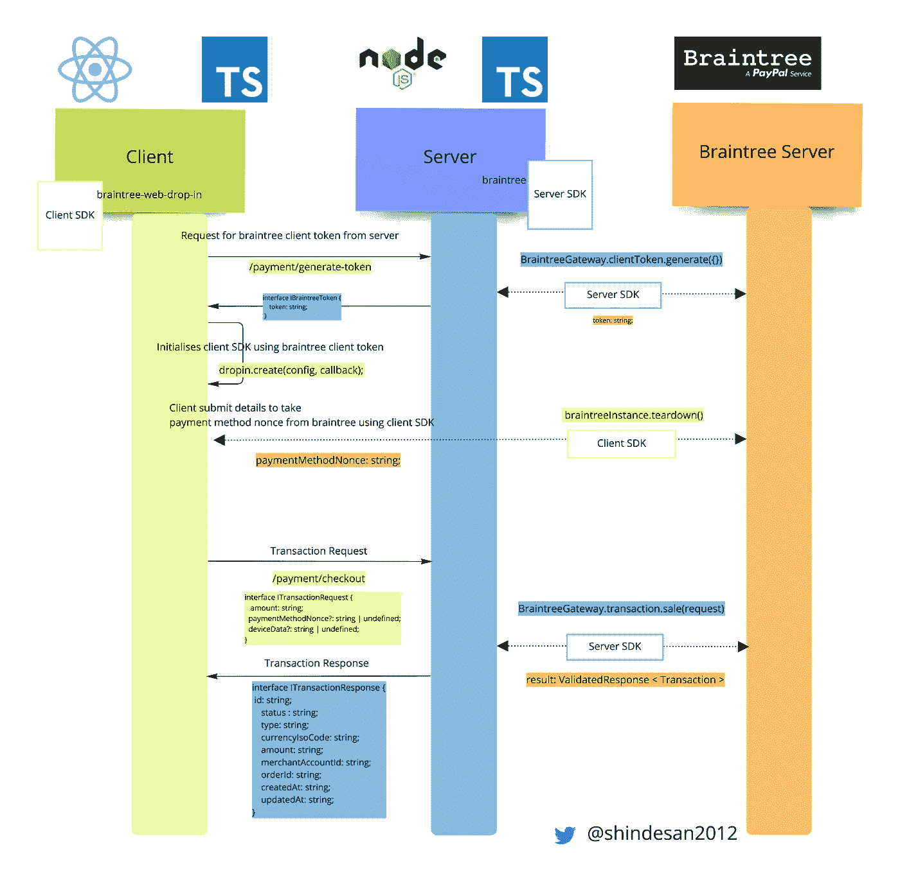
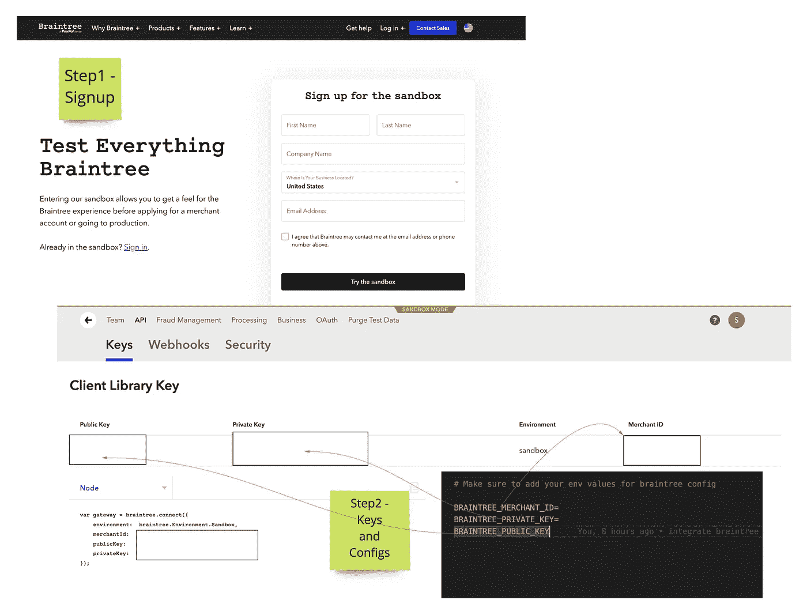
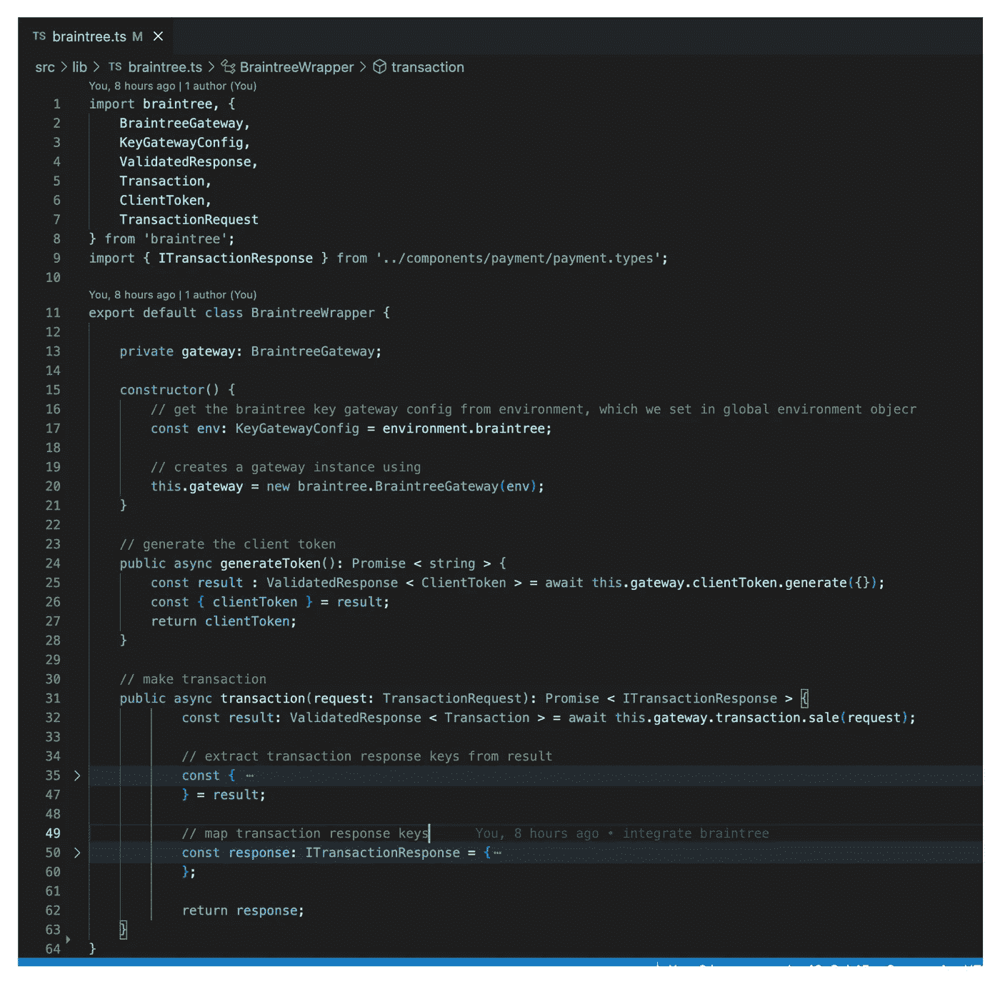
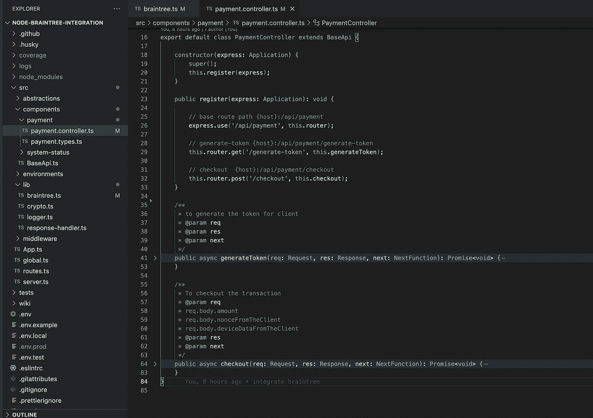
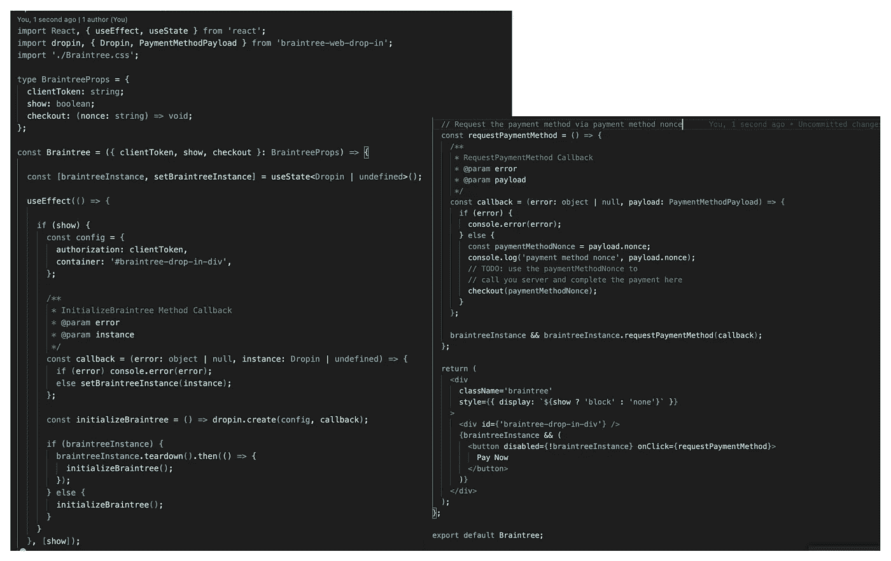
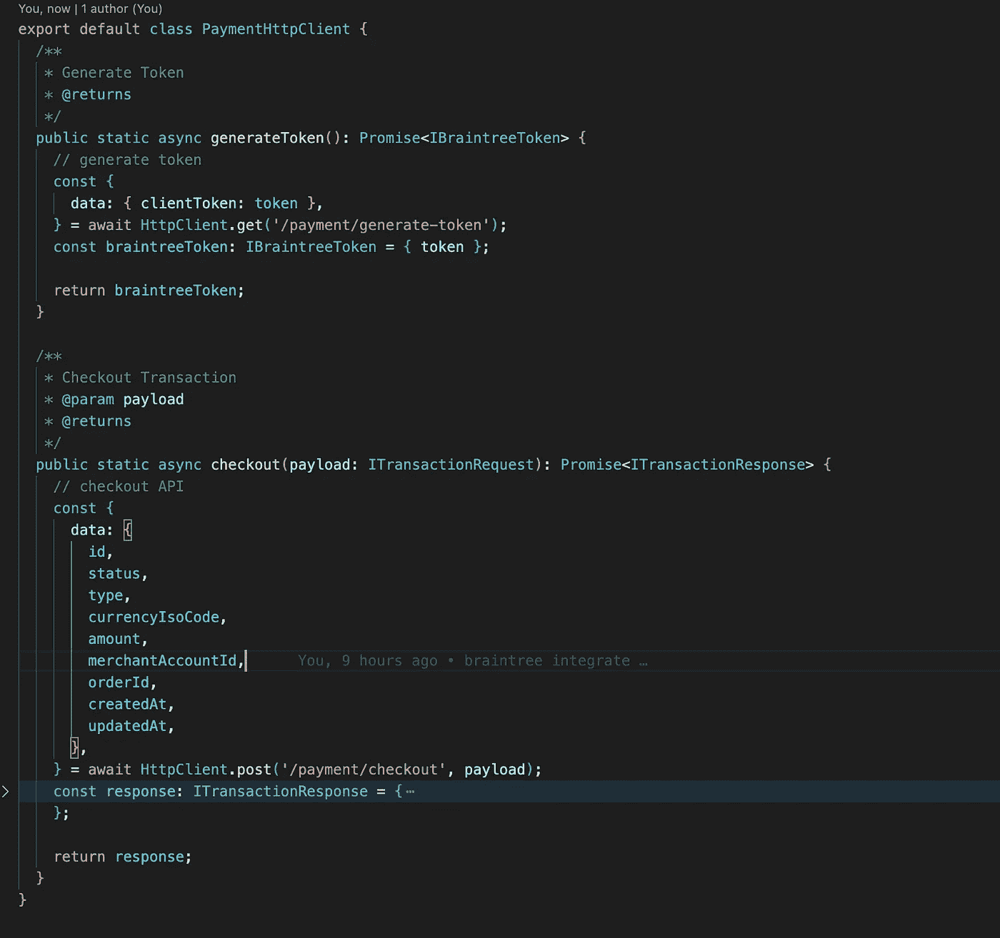
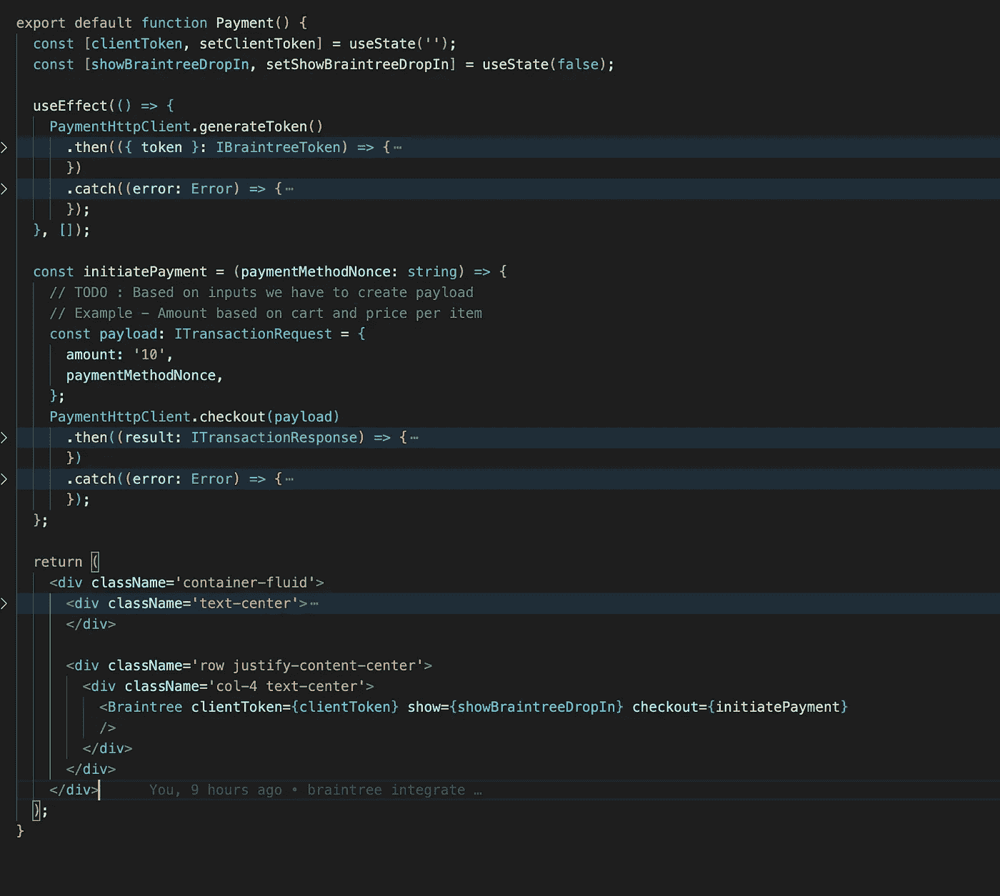
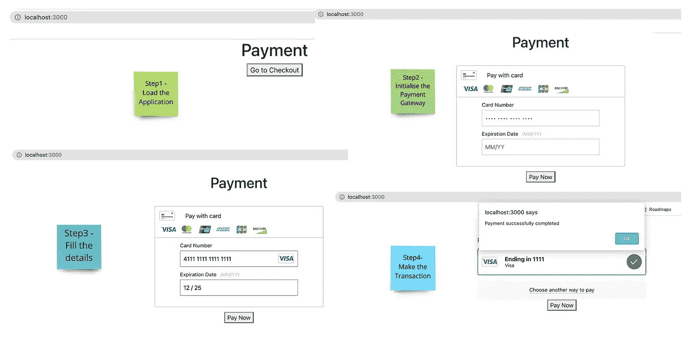

# 在 Node.js 中集成 Braintree 支付网关 SDK 和 React

> 原文：<https://javascript.plainenglish.io/integration-of-the-braintree-payment-gateway-sdk-in-node-js-and-react-js-ba64bd48177f?source=collection_archive---------0----------------------->

## 在基于 Typescript 的应用程序中集成 Braintree 支付网关的入门指南(Node.js & React)


Source — [https://www.braintreepayments.com/features](https://www.braintreepayments.com/features)

# **简介**

在本文中，我们将集成 Braintree API Gateway SDK 以及 Typescript Node.js 和 Express，然后我们将使用 React 和 Typescript 创建一个前端应用程序。

在本文的帮助下，您可以使用 Braintree Direct 的插件用户界面和 Braintree 节点模块在沙盒中设置一个接受信用卡/借记卡支付的集成。

*   `[braintree-web-drop-in](https://www.npmjs.com/package/braintree-web-drop-in)`
*   `[braintree](https://www.npmjs.com/package/braintree)`

# 它是如何工作的？

下图显示了您的客户端、服务器和 Braintree 的交互方式:

*   步骤 1:从服务器请求 Braintree 客户端令牌。
*   步骤 2:使用 Braintree 客户端令牌初始化客户端 SDK。
*   步骤 3:客户端提交详细信息，以使用客户端 SDK 从 Braintree 获取支付方法 nonce。
*   步骤 4:交易请求(通过在交易请求中添加支付方法 nonce，请求服务器使用交易请求进行交易)。
*   步骤 5:通过传递事务请求，使用服务器端 SDK 在服务器上进行事务。
*   第 6 步:处理事务响应，并使用必需的字段将其发送回服务器。



Braintree — How It works

## 重要的关键词和定义

*   布伦特里令牌
*   付款方式现时
*   交易请求
*   交易响应

```
interface IBraintreeToken {     
    token: string; 
}paymentMethodNonce: string;interface ITransactionRequest {     
  amount: string;     
  paymentMethodNonce?: string | undefined;     
  deviceData?: string | undefined; 
}interface ITransactionResponse {     
   id: string;    
   status: string;     
   type: string;     
   currencyIsoCode: string;     
   amount: string;     
   merchantAccountId: string;     
   orderId: string;     
   createdAt: string;     
   updatedAt: string; 
}
```

## 设置基于 JS、Express JS 和 Typescript 的服务器节点

对于本文，我们将使用已经使用 TypeScript 和 Express 创建的 [Node.js 样板](https://github.com/santoshshinde2012/node-boilerplate)代码。

[](https://github.com/santoshshinde2012/node-boilerplate) [## GitHub-Santosh shinde 2012/Node-Boilerplate:用于微服务的节点类型脚本样板…

### 微服务的节点类型脚本样板。用 TypeScript 编写的 Node.js 应用程序的框架(带有安装说明…

github.com](https://github.com/santoshshinde2012/node-boilerplate) 

```
// clone the application
git clone https://github.com/santoshshinde2012/node-boilerplate.git

// change to the new directory
cd node-boilerplate

// install the all modules
npm install

// start the application
npm start
```

## 步骤 1-安装 NPM 模块并设置 Braintree 沙盒



Setup Environment for backend

```
npm install braintree --savenpm install @types/braintree --save-dev
```

## 步骤 2—创建布伦特里包装器

使用环境和 API 凭据配置 Braintree 网关。



Braintree Wrapper

## 步骤 3-设置支付控制器

设置支付控制器，以处理客户通过 Braintree 网关生成令牌和进行交易的请求。



Setup Payment Controller

下面是指向包含 Node.js Braintree 网关处理程序源代码的存储库的链接。

[](https://github.com/santoshshinde2012/node-braintree-integration) [## GitHub-Santosh shinde 2012/Node-brain tree-Integration:Node-Typescript-brain tree-Integration

### 节点类型脚本 Braintree 集成克隆应用程序 git 克隆…

github.com](https://github.com/santoshshinde2012/node-braintree-integration) 

## 设置基于 React 和 TypeScript 的客户端

Braintree JavaScript SDK 为您提供了几种收集客户付款信息的方法。启动和运行的最简单方式是通过嵌入式 UI。其他集成请参见 [JS SDK 概述](https://developer.paypal.com/braintree/docs/guides/client-sdk/setup/javascript/v3)。

```
// clone the application
git clone [https://github.com/santoshshinde2012/braintree-react-typescript.git](https://github.com/santoshshinde2012/braintree-react-typescript.git)

// change to the new directory
cd node-boilerplate

// install the all modules
npm install

// start the application
npm start
```

## 步骤 1 —安装 NPM 模块

```
npm install braintree-web-drop-in --savenpm install @types/braintree-web-drop-in --save-dev
```

## 步骤 2-创建决策树组件

这里，我们将创建 Braintree 组件，它将初始化 Braintree web 客户端 SDK 并获取支付方式 nonce。



Create Braintree Component

## 步骤 3-创建支付 HTTP 客户端服务

为了使用 Axios HTTP 客户端处理我们的服务器 API 调用，我们将创建支付 HTTP 客户端服务。



Payment HTTP Client Service

## 步骤 4-创建付款处理程序页面组件

基本上，这个页面组件负责处理付款，我们必须使用 Braintree web 组件包装器。



Payment Handler Page Component

## 步骤 5—运行应用程序



Web Application Interface

这里是 React brain tree gateway web handler 源代码的存储库链接。

[](https://github.com/santoshshinde2012/braintree-react-typescript) [## GitHub-Santosh shinde 2012/brain tree-react-typescript:brain tree-react-typescript

### 这个项目是用 Create React App 引导的。在项目目录中，您可以运行:在…中运行应用程序

github.com](https://github.com/santoshshinde2012/braintree-react-typescript) 

感谢阅读。如果这个博客为你的学习增加了价值，请分享你的评论并鼓掌。

*更多内容看* [***说白了。报名参加我们的***](https://plainenglish.io/) **[***免费周报***](http://newsletter.plainenglish.io/) *。关注我们关于*[***Twitter***](https://twitter.com/inPlainEngHQ)*和*[***LinkedIn***](https://www.linkedin.com/company/inplainenglish/)*。查看我们的* [***社区不和谐***](https://discord.gg/GtDtUAvyhW) *，加入我们的* [***人才集体***](https://inplainenglish.pallet.com/talent/welcome) *。***