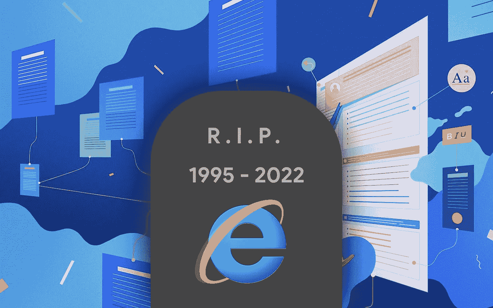

# Internet Explorer 已死:微软臭名昭著的浏览器的下一步是什么

> 原文：<https://javascript.plainenglish.io/internet-explorer-is-dead-whats-next-with-microsofts-infamous-browser-3cc908b796c8?source=collection_archive---------15----------------------->

## 微软在 2022 年 6 月 15 日扼杀了 Internet Explorer。以下是对浏览器和微软未来计划的反思。

我记得以前我会在 Internet Explorer 上玩电脑游戏。我们巨大的台式电脑安装了两种浏览器:Firefox 和 Internet Explorer。

这是在我接触网络开发之前很久的事了，所以我喜欢我在 IE 的经历。2022 年 6 月 15 日，微软扼杀了 Internet Explorer。作为一名 web 开发人员，我很高兴我再也不用担心支持 IE 了；但作为一个曾经的 IE 用户，我感到怀旧。

差不多 27 年后，微软终于让 IE 退役了。随着对 IE 11 的支持在本月正式终止，过时的网络浏览器正在被淘汰，取而代之的是[微软 Edge](https://www.microsoft.com/en-us/edge) 。微软最初在 2015 年推出 Windows 10 时与 Internet Explorer 拉开了距离，微软 Edge 成为了它的继任者。

对消费者来说，情况没有什么变化。近年来，Internet Explorer 的使用率急剧下降，因为它在所有浏览器中的市场份额不到 5%。微软将 IE 作为“兼容性解决方案”而非标准浏览器，供个人和组织积极使用。多年来，微软一直不鼓励用户使用它。

在接下来的几个月里，微软将开始推出一个新的提示，将 Internet Explorer 的用户引导到 Microsoft Edge。作为即将到来的 Windows 升级的一部分，Internet Explorer 最终将被完全停用。

运行 Internet Explorer 的 [MSHTML 引擎(也称为 Trident)](https://www.wikiwand.com/en/Trident_(software)) 仍然是 Windows 11 的一个组件，即使微软已经转向其 Edge 浏览器——基于 [Chromium](https://www.wikiwand.com/en/Chromium_(web_browser)) 。Windows 11 中包含 MSHTML 是因为 Edge 有一个 IE 模式的功能，这个功能会支持到 2029 年(甚至更久)。

对于过时的在线程序和网站，他们仍然需要 Internet Explorer，企业大多已经切换到 Edge 的 IE 模式。微软在 2019 年为 Edge 开发了这种 IE 模式，它支持更老的 [ActiveX](https://www.wikiwand.com/en/ActiveX) 控件。虽然不会再有 Internet Explorer 的功能，但由于这种模式，Internet Explorer 将在精神上继续存在。

Internet Explorer 的消亡对一些公司来说仍然是一个惊喜，或者他们可能没有足够的时间来完全淘汰它。多年来，微软一直对 ie 浏览器的退休发出警告，在未来几个月浏览器完全淘汰之前，对其警告和重定向保持谨慎。

因为 Internet Explorer 甚至没有作为标准软件包含在 Windows 11 中，所以客户不需要为此烦恼。这是 20 多年来微软第一次没有在新版 Windows 中包含 IE。由于捆绑销售行为，欧盟委员会对微软采取了行动，这导致了臭名昭著的美国诉微软反垄断纠纷，并在某些版本的 Windows 中包含了浏览器投票。

Internet Explorer 背后的悠久历史和我的个人经历无疑将是值得珍惜的。然而，作为 2022 年的 web 开发者，我不得不说我很高兴我们不再需要支持这样一个蹩脚的浏览器。

*更多内容请看*[***plain English . io***](https://plainenglish.io/)*。报名参加我们的* [***免费周报***](http://newsletter.plainenglish.io/) *。关注我们关于*[***Twitter***](https://twitter.com/inPlainEngHQ)*和*[***LinkedIn***](https://www.linkedin.com/company/inplainenglish/)*。查看我们的* [***社区不和谐***](https://discord.gg/GtDtUAvyhW) *加入我们的* [***人才集体***](https://inplainenglish.pallet.com/talent/welcome) *。*