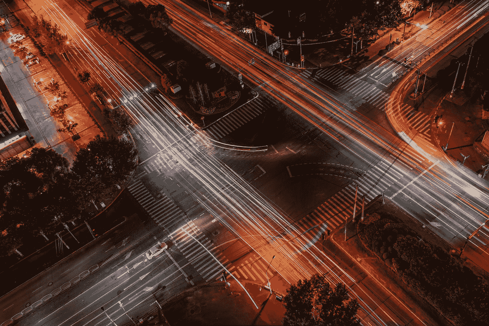

# 掌握 JavaScript 中的交叉点观察器所需的唯一指南

> 原文：<https://javascript.plainenglish.io/intersection-observer-a-comprehensive-guide-for-web-developers-dd05aa6a3c62?source=collection_archive---------16----------------------->



Photo by [Siyuan](https://unsplash.com/@jsycra?utm_source=medium&utm_medium=referral) on [Unsplash](https://unsplash.com?utm_source=medium&utm_medium=referral)

作为一名 web 开发人员，您经常需要实现依赖于在视口中可见的元素的特性，比如延迟加载图像或无限滚动。然而，使用像`**getBoundingClientRect**`这样的传统方法来检查元素的交集可能会很慢并且需要大量资源，特别是如果您有大量的元素要监控的话。

这就是交叉点观察器的用武之地。Intersection Observer 是一个 JavaScript API，它允许您有效地监视元素与其祖先元素或视口之间的交集的变化。它被设计成高性能的，可以用来监控大量的元素，而不会导致性能问题。

在本文中，我们将深入研究交叉点观察器，并了解它是如何工作的。您将学习如何创建一个交叉点观察器实例，观察元素，并使用 API 来实现像延迟加载和无限滚动这样的特性。到本文结束时，您将对 Intersection Observer 如何帮助您提高 web 应用程序的性能和功能有一个坚实的理解。

**创建交叉点观察点实例**

要创建交叉点观察点实例，可以使用以下代码:

```
const observer = new IntersectionObserver(callback, options);
```

当一个元素的交集改变时，调用`**callback**`函数。它接收一个由`**IntersectionObserverEntry**`对象组成的数组作为参数，其中包含元素交集的信息。

`**options**`对象允许您为交叉点观察器指定额外的设置，比如用于交叉点计算的根元素和调用回调函数的阈值。

例如，您可以使用`**root**`选项来指定应该根据特定的祖先元素而不是视口来计算交集:

```
const observer = new IntersectionObserver(callback, { root: document.querySelector('#scrollable-area') });
```

您还可以使用`**threshold**`选项来指定元素在回调函数被调用之前应该可见的百分比。`**threshold**`选项可以是单个值或一组值。如果它是一个数组，回调函数将为每个被越过的阈值被调用。

例如，当元素的 50%可见时，下面的代码将调用回调函数:

```
const observer = new IntersectionObserver(callback, { threshold: 0.5 });
```

**观察元素**

一旦创建了交叉点观察器实例，就可以通过调用`**observe**`方法开始观察元素:

```
observer.observe(element);
```

`**observe**`方法将一个元素作为参数，并开始监视它与 viewport 或根元素的交集。每当交集改变时，回调函数将被调用。

你也可以通过调用`**unobserve**`方法来停止观察一个元素:

```
observer.unobserve(element);
```

如果您不再需要监视元素的交集，例如，如果您已经使用 Intersection Observer 加载了延迟加载的资源，这将非常有用。

**断开交叉点观察器**

最后，您可以通过调用`**disconnect**`方法来阻止交叉点观察器监视任何元素:

```
observer.disconnect();
```

如果您不再需要交叉点观察器并希望释放资源，这将非常有用。

**延迟加载图像**

虽然现在您可以仅使用 HTML 来延迟加载您的图像，但是在 IntersectionObserver 之前，通常使用它来解决这个问题。在这个例子中，您将看到如何在 React 组件中实现延迟加载。

首先，我们创建一个交叉点观察器实例，并传递给它一个回调函数，当图像元素在视口中可见时，该函数设置图像元素的`**src**`属性。我们还使用`**useEffect**`钩子在组件安装时开始观察图像元素。

```
import React, { useRef, useEffect } from 'react';

function LazyImage({ src, alt }) {
  const imageRef = useRef();

  useEffect(() => {
    const observer = new IntersectionObserver((entries) => {
      entries.forEach((entry) => {
        if (entry.isIntersecting) {
          const img = entry.target;
          img.src = src;
          observer.unobserve(img);
        }
      });
    });
    observer.observe(imageRef.current);
  }, [src]);

  return ;
}
```

**无限卷轴**

每当你浏览一个网站时，如果你不点击任何按钮，内容就会不知从哪里冒出来，这种机制就会被使用。

让我们从创建一个交叉点观察器实例开始，并向它传递一个回调函数，当列表的底部在视口中可见时，该函数调用`**loadMore**`函数。我们还使用`**useEffect**`钩子在组件挂载时开始观察列表元素。

当调用`**loadMore**`函数时，它可以从服务器或数据库获取更多的条目，并将它们添加到列表中。这允许列表在用户向下滚动时加载额外的项目，创造出无限滚动的假象。

```
import React, { useRef, useEffect } from 'react';

function InfiniteScrollList({ items, loadMore }) {
  const listRef = useRef();

  useEffect(() => {
    const observer = new IntersectionObserver((entries) => {
      entries.forEach((entry) => {
        if (entry.isIntersecting) {
          loadMore();
        }
      });
    });
    observer.observe(listRef.current);
  }, [loadMore]);

  return (
    <ul ref={listRef}>
      {items.map((item) => (
        <li key={item.id}>{item.text}</li>
      ))}
    </ul>
  );
}
```

我希望这篇文章能够帮助您理解 Intersection Observer 是如何工作的，以及如何在 web 应用程序中使用它。如果你有任何问题或需要进一步澄清，不要犹豫，请提出来！

## 更多内容请访问 [PlainEnglish.io](https://plainenglish.io/) 。

*报名参加我们的* [***免费周报***](http://newsletter.plainenglish.io/) *。关注我们上* [***推特***](https://twitter.com/inPlainEngHQ) ， [***领英***](https://www.linkedin.com/company/inplainenglish/) ***，***[*YouTube****，以及***](https://www.youtube.com/channel/UCtipWUghju290NWcn8jhyAw)*[***不和***](https://discord.gg/GtDtUAvyhW) *

## *想扩大你的软件创业规模吗？检查[电路](https://circuit.ooo/?utm=publication-post-cta)。*