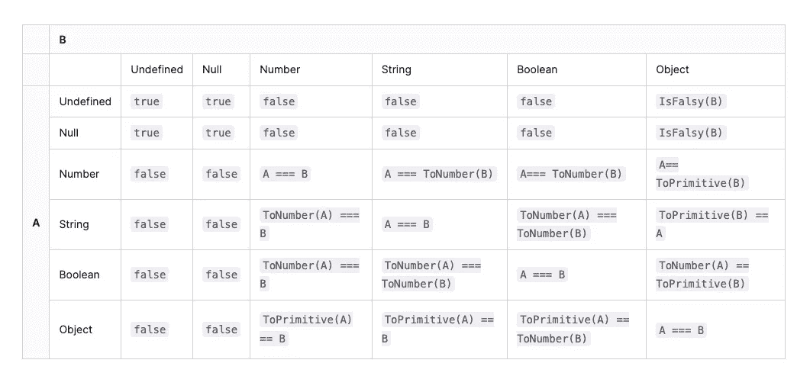
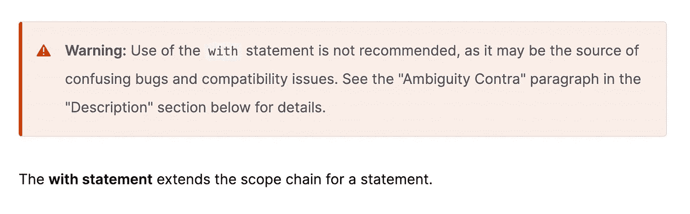

# 记者:在 JavaScript 中,( a==1 && a==2 && a==3)能计算为“真”吗？

> 原文：<https://javascript.plainenglish.io/interviewer-can-a-1-a-2-a-3-ever-evaluate-to-true-in-javascript-d2329e693cde?source=collection_archive---------0----------------------->

## 是的，这可能是真的，而且有 6 种方式——太神奇了！

Photo by [Mikhail Vasilyev](https://unsplash.com/@miklevasilyev?utm_source=medium&utm_medium=referral) on [Unsplash](https://unsplash.com?utm_source=medium&utm_medium=referral)

最近被问到一个很有意思的面试问题:**在 JavaScript 中(a = = 1&&a = = 2&&a = = 3)是否可以求值为 true？。**因为答不上来差点失去工作机会。

那一刻，我被问题惊呆了，以为面试官在开玩笑。

但当我看到他的“微笑”时，一种**“你一定不知道答案”**的感觉闪过我的脑海。这绝对不是一个容易解决的问题。

文章将给出 6 个**专业解答**。让我们马上开始。

# 解决方案 1: valueOf && toString

第一个解决方案非常简单，我相信一旦您阅读了这段代码，您就会有一个想法。

**太神奇了，这是怎么回事？别担心，我的朋友，我会试着解释原因。**

# 解释部分隐式转换规则

当在 JavaScript 中使用`==`比较两个值时，执行以下操作:

1.  将两个比较值转换为同一类型。
2.  转换后(等式的一侧或两侧可能被转换)，比较这些值。

比较规则如下表所示:

从表中可以获得一些信息。为了使(`a == 1`)，a 只能是这几种情况:

1.  `a`的类型是字符串，可以转换成数字 1 ( `'1' == 1 => true`)。
2.  `a`的类型为布尔型，可以转换为数字 1 ( `true == 1 => true`)。
3.  `a`的类型是 Object，可以通过“转换机制”转换成数字 1。

# 对象到原始类型的“转换机制”

规则 1 和规则 2 没有什么特别之处。让我们来看看 3:

当对象转换为原始类型时，将调用内置的[top primitive]函数。逻辑大致如下:

1.  如果有`Symbol.toPrimitive`方法，先调用它，否则 2。
2.  调用`valueOf`，如果可以转换成原来的类型，返回，否则
3.  调用`toString`，如果能转换成原来的类型，返回，否则，4。
4.  如果没有返回原始类型，将会报告一个错误。

我的朋友，感谢你非常耐心地阅读了很长时间，我相信你心中已经有了答案。

# 解决方案 2:数组和连接

数组对象的隐式转换也符合规则 3，但是“join”方法会在“toString”之前调用。所以你可以从这里开始。

# 解决方案 3:使用“with”运算符

[MDN](https://developer.mozilla.org/en-US/docs/Web/JavaScript/Reference/Statements/with) 有一个关于`with`使用的警告，仿佛它的存在就是一个错误。我在工作中没有用过，但是可以用来解决这个问题。

你太聪明了，甚至不需要我解释代码的意思。

# 解决方案 4: Symbol.toPrimitive

我们可以用隐式转换规则 3 来完成问题(看完答案你就知道为什么了！).

# 数据劫持也是一种出路

通过隐式转换，我们做出了 3 个使`a == 1 && a == 2 && a == 3`返回 true 的答案，你一定想到了另一个答案，`data hijacking`，伟大的 Vue 我们用它赢得了百万开发者的心，我们也试图用它来解决这个面试问题。

# 解决方案 5: Object.defineProperty

通过劫持“窗口”对象，每次读取“a”属性时，a 都会加 1。

# 解决方案 6:代理

还有一种劫持数据的方式，Vue3 也用`Proxy`取代了`Object.defineProperty`。

# 最后

**感谢阅读。**我期待着您的关注和阅读更多高质量的文章。

 [## “我失去了一个工作机会，只是因为承诺。所有”

### 一次让我好难过的面试经历。

javascript.plainenglish.io](/i-lost-a-job-opportunity-just-because-of-promise-all-be396f6efe87)  [## 采访者:“npm 跑 xxx”怎么了？

### 一个大多数人都不知道的秘密。

javascript.plainenglish.io](/interviewer-what-happened-to-npm-run-xxx-cdcb37dbaf44)  [## 面试官:可以“x！== x "在 JavaScript 中返回 True？

### 你可能不知道的五个神奇的 JavaScript 知识点！

javascript.plainenglish.io](/interviewer-can-x-x-return-true-in-javascript-7e1d1fa7b5cd)  [## 现在是 2022 年，不要再滥用箭头功能了

### 不应该使用箭头函数的 4 种情况。

javascript.plainenglish.io](/its-2022-don-t-abuse-the-arrow-function-anymore-905862a9c668) 

*更多内容请看*[***plain English . io***](https://plainenglish.io/)*。报名参加我们的* [***免费周报***](http://newsletter.plainenglish.io/) *。关注我们关于*[***Twitter***](https://twitter.com/inPlainEngHQ)[***LinkedIn***](https://www.linkedin.com/company/inplainenglish/)*[***YouTube***](https://www.youtube.com/channel/UCtipWUghju290NWcn8jhyAw)*[***不和***](https://discord.gg/GtDtUAvyhW) *。对增长黑客感兴趣？检查* [***电路***](https://circuit.ooo/) *。***