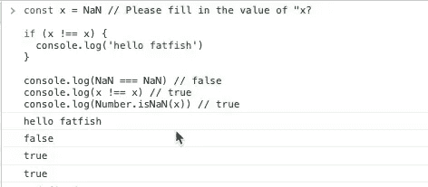
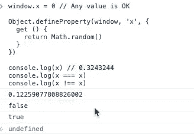
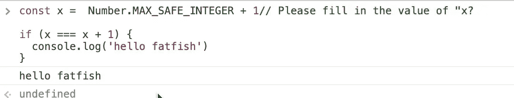
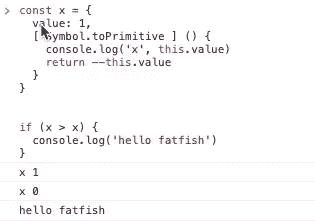

# 面试官:可以“x！== x "在 JavaScript 中返回 True？

> 原文：<https://javascript.plainenglish.io/interviewer-can-x-x-return-true-in-javascript-4128fe11a92d?source=collection_archive---------0----------------------->

## 你可能不知道的 5 个神奇的 JavaScript 知识点！

最近有人问了我几个奇怪的面试问题。它们不同于常规问题:这些面试问题看起来非常简单，但它们测试你对 JavaScript 的透彻理解。你能正确回答几个？

# 1.能“x！== x "还真？

输出“hello fatfish”的“x”值应该是多少？

**太神奇了。有没有不等于自身的价值？**然而 JavaScript 中有一个值`NaN`，它不等于任何值，甚至不等于它本身。

# 2.可以(！伊斯南(x) && x！== x)返回真？

好了，当我们过滤掉“南”的时候，还有什么值可以让一个值不等于它本身呢？

也许你知道“对象。Defineproperty”，可以帮助我们解决这个问题。

# 3.如何使“x === x + 1”？

这个问题可能不容易，但是只要你懂 JavaScript，你就知道“数。MAX_SAFE_INTEGER 常量代表 JavaScript 中的最大安全整数(⁵ — 1)。”(来自 [MDN](https://developer.mozilla.org/en-US/docs/Web/JavaScript/Reference/Global_Objects/Number/MAX_SAFE_INTEGER) )

所以我们可以给“x”赋值任何大于“Number”的值。MAX_SAFE_INTEGER "。

# 4.“x > x”能为真吗？

我不想再看了，这是什么垃圾问题？

虽然看起来不太可能，但是价值怎么可能大于自身呢？但是，我们可以使用“Symbol.toPrimitive”功能来完成问题。

**哇，太神奇了！**

# 5.type of x = = = ' undefined ' & & x . length > 0？

不得不承认 JavaScript 是一门很神奇的语言。除了`undefined`本身，还有什么价值可以让`typeof x === undefined”`成真？

答案是`document. All`一个包含文档中每个元素的 HTMLAllCollection(来自 [MDN](https://developer.mozilla.org/en-US/docs/Web/API/Document/all) )。

# 最后

**感谢阅读。**我期待着您的关注和阅读更多高质量的文章。

 [## 记者:在 JavaScript 中(a==1 && a==2 && a==3)能计算为真吗？

### 是的，这可能是真的，而且有 6 种方式——太神奇了！

javascript.plainenglish.io](/interviewer-can-a-1-a-2-a-3-ever-evaluate-to-true-in-javascript-d2329e693cde)  [## “我失去了一个工作机会，只是因为承诺。所有”

### 一次让我好难过的面试经历。

javascript.plainenglish.io](/i-lost-a-job-opportunity-just-because-of-promise-all-be396f6efe87)  [## 采访者:“npm 跑 xxx”怎么了？

### 一个大多数人都不知道的秘密。

javascript.plainenglish.io](/interviewer-what-happened-to-npm-run-xxx-cdcb37dbaf44)  [## 现在是 2022 年，不要再滥用箭头功能了

### 不应该使用箭头函数的 4 种情况。

javascript.plainenglish.io](/its-2022-don-t-abuse-the-arrow-function-anymore-905862a9c668) 

*更多内容请看*[***plain English . io***](https://plainenglish.io/)*。报名参加我们的* [***免费周报***](http://newsletter.plainenglish.io/) *。关注我们关于*[***Twitter***](https://twitter.com/inPlainEngHQ)[***LinkedIn***](https://www.linkedin.com/company/inplainenglish/)*[***YouTube***](https://www.youtube.com/channel/UCtipWUghju290NWcn8jhyAw)*[***不和***](https://discord.gg/GtDtUAvyhW) *。对增长黑客感兴趣？检查* [***电路***](https://circuit.ooo/) *。***