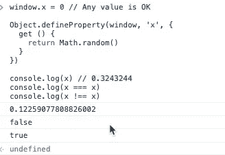

# 面试官:可以“x！== x "在 JavaScript 中返回 True？

> 原文：<https://javascript.plainenglish.io/interviewer-can-x-x-return-true-in-javascript-7e1d1fa7b5cd?source=collection_archive---------0----------------------->

## 你可能不知道的 5 个神奇的 JavaScript 知识点！

# 前言

最近有人问了我几个奇怪的面试问题。它们不同于常规问题:这些面试问题看起来非常简单，但它们测试你对 JavaScript 的透彻理解。你能正确回答几个？

# 1.能“x！== x "还真？

输出“hello fatfish”的“x”值应该是多少？

**太神奇了。有没有不等于自身的价值？**然而 JavaScript 中有一个值`NaN`，它不等于任何值，甚至不等于它本身。

# 2.可以(！伊斯南(x) && x！== x)返回真？

好了，当我们过滤掉“南”的时候，还有什么值可以让一个值不等于它本身呢？

也许你知道“对象。Defineproperty”，可以帮助我们解决这个问题。

# 3.如何使“x === x + 1”？

这个问题可能不容易，但是只要你懂 JavaScript，你就知道“数。MAX_SAFE_INTEGER 常量代表 JavaScript 中的最大安全整数(2⁵ — 1)。”(来自 [MDN](https://developer.mozilla.org/en-US/docs/Web/JavaScript/Reference/Global_Objects/Number/MAX_SAFE_INTEGER) )

所以我们可以给“x”赋值任何大于“Number”的值。MAX_SAFE_INTEGER "。

# 4.“x > x”能为真吗？

我不想再看了，这是什么垃圾问题？

虽然看起来不太可能，但是价值怎么可能大于自身呢？但是，我们可以使用“Symbol.toPrimitive”功能来完成问题。

**哇，太神奇了！**

# 5.type of x = = = ' undefined ' & & x . length > 0？

不得不承认 JavaScript 是一门很神奇的语言。除了`undefined`本身，还有什么价值可以让`typeof x === undefined”`成真？

答案是`document. All`一个包含文档中每个元素的 HTMLAllCollection(来自 [MDN](https://developer.mozilla.org/en-US/docs/Web/API/Document/all) )。

# 最后

**感谢阅读。**期待期待您的关注，阅读更多高质量的文章。

 [## 123['toString']。length + 123)用 JavaScript 打印出来？

### 95%的前端开发者回答错误的问题。

javascript.plainenglish.io](/what-does-123-tostring-length-123-print-out-in-javascript-2c804a414325)  [## 帮助你成为高级前端开发人员的 11 个技巧

### 如果你选择 Chrome 作为开发工具，你必须知道的 11 个技巧

javascript.plainenglish.io](/11-chrome-devtools-tricks-to-help-make-you-a-senior-front-end-developer-67b4ae3e6562)  [## 大多数开发人员不知道的 6 个很酷的现代 JavaScript 特性

### 编写简明 JavaScript 代码的技巧

javascript.plainenglish.io](/6-cool-modern-javascript-features-most-developers-dont-know-about-432f7652dd4c)  [## 在 JavaScript 中实现(a==1 && a==2 && a==3) === true 的 9 种方法

### 是的，这可能是真的，而且有 9 种方式——太神奇了！

javascript.plainenglish.io](/9-ways-to-make-a-1-a-2-a-3-true-in-javascript-c2e1903b24b)  [## 面试官:你工作 3 年了，这种算法题你都不会答？

### 一个女生的面试经历

javascript.plainenglish.io](/interviewer-you-have-been-working-for-3-years-and-you-cant-answer-this-algorithm-question-5f79cba18e06)  [## 让你成为更好的程序员的 8 个 JavaScript 技巧

### 使用这些代码提示，让您的 JavaScript 更具可读性和可扩展性。

javascript.plainenglish.io](/8-javascript-tricks-to-make-you-a-better-programmer-948b5a3c35b4)  [## 我老板:你知道 ES6，为什么不用？😠

### 老板的 10 条抱怨让我受益匪浅。

javascript.plainenglish.io](/my-boss-you-know-es6-but-why-dont-you-use-it-5e0316f14c67)  [## 面向网络开发人员的 15 个黑仔网站

### 99.9%的开发者都不知道。

javascript.plainenglish.io](/15-killer-websites-for-web-developers-35a4c007942a) 

*更多内容请看*[***plain English . io***](https://plainenglish.io/)*。报名参加我们的* [***免费周报***](http://newsletter.plainenglish.io/) *。关注我们关于*[***Twitter***](https://twitter.com/inPlainEngHQ)*和*[***LinkedIn***](https://www.linkedin.com/company/inplainenglish/)*。加入我们的* [***社区不和谐***](https://discord.gg/GtDtUAvyhW) *。*