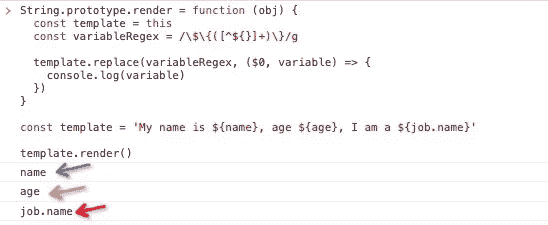
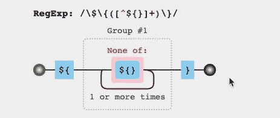
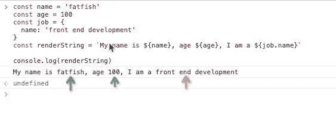
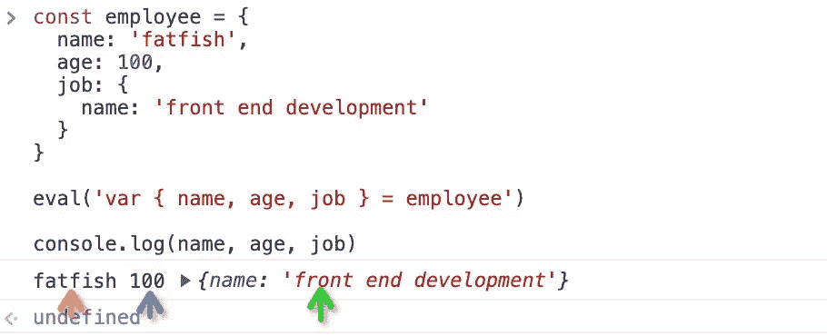
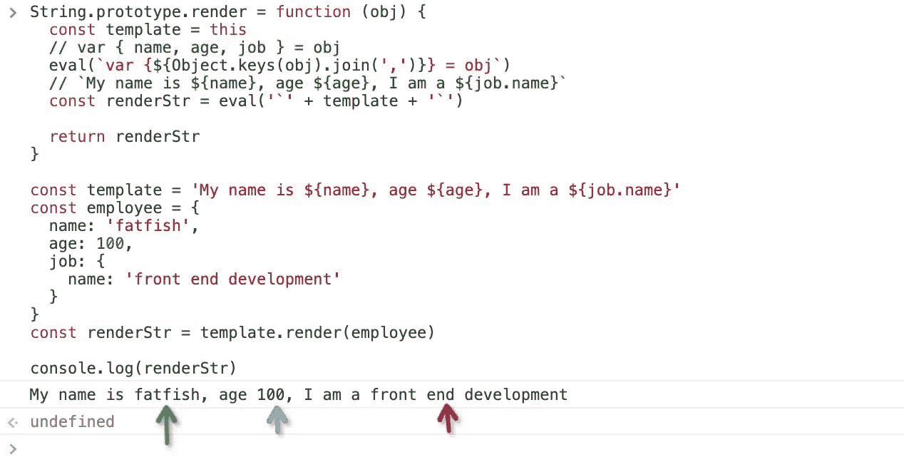
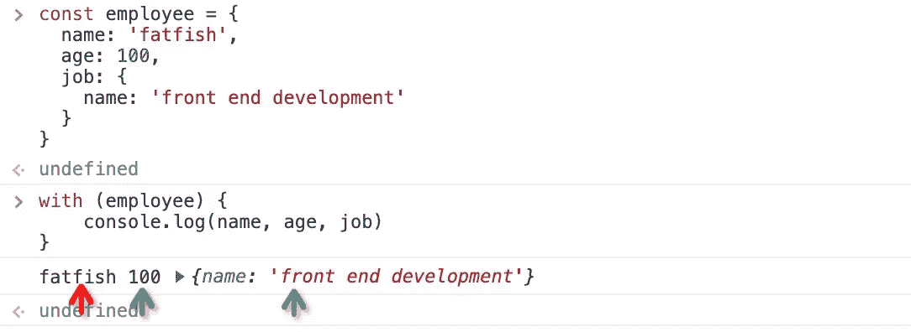

# 面试官:你能实现一个 JavaScript 模板引擎吗？我:废话……

> 原文：<https://javascript.plainenglish.io/interviewer-can-you-implement-a-javascript-template-engine-me-crap-fcd1dd6a3889?source=collection_archive---------0----------------------->

## 实现 JavaScript 模板引擎的 3 种方法

Photo by [Larm Rmah](https://unsplash.com/@larm?utm_source=medium&utm_medium=referral) on [Unsplash](https://unsplash.com?utm_source=medium&utm_medium=referral)

朋友们，我相信即使你是一个有经验的开发者，也不一定能很快解决这个面试问题。如果你想挑战这种说法，请跟我一起读下去。

最近，我的好朋友南希遇到了一个让她抓狂的问题。面试官让她现场实现一个 JavaScript 模板引擎。

令人难过的是，我的朋友刚开始找工作，但面试官让她去造一架飞机。

# 问题信息

请向`String`对象添加一个`render(obj)`方法。其作用是将字符串中的特定字符替换为`obj`的相应属性。

# 什么是模板引擎？

你一定用过类似 [nunjucks](https://mozilla.github.io/nunjucks/getting-started.html) 这样的模板引擎，问题很像它的功能。请跟着我举个例子。

我可怜的朋友被要求实现这样的东西，它只是用`{{name}}`代替了`${name}`，几乎没有其他东西。

# 解决方案 1:正则表达式

看到这个面试问题，我的第一反应是用正则表达式解决。只要能提取出字符串中的特定字符(`name`、`age`、`job.name`)，问题就好解决了。

**第一步:提取变量**

太好了，我们得到了`name`、`age`、`job.name`变量。我们来看看这个正则表达式是什么意思，可以[点击这里](https://jex.im/regulex/#!flags=&re=%5C%24%5C%7B(%5B%5E%24%7B%7D%5D%2B)%5C%7D)查看。

我们要把重点放在`([^${}]+)`上，它是指除了`$`、`{`、`}`之外的至少一个角色。

**第二步:获取 obj** 的具体值

当我们得到`name`、`age`、`job.name`时，如何将其与`employee`关联起来？

**我们通过正则表达式实现了一个简单的模板引擎，朋友们请为自己加油。**

# 解决方案 2:评估

朋友们，我们来复习一下`es6`中模板字符串的基本用法。

模板字符串非常有用，它们允许我们在字符串中嵌入表达式。

**让我们再次学习如何使用 eval】。**

很神奇，就好像我们声明了三个变量`name`、`age`、`job`，可以随意打印出它们的值。

有了这两个知识点，我们的第二个解决方案就有了。

再给自己一点掌声，因为您已经用两种方式实现了一个 lite 模板引擎。

# 3.随着

虽然我们很少使用`with`关键字，但是可以用来解决这个问题。

这段代码的输出是什么？

这和上面的代码效果差不多，但是更简洁易懂。

嗯，我想你已经猜到答案了。

# 最后

**感谢阅读。**我期待期待您的关注和阅读更多高质量的文章。

 [## 采访者:“npm 跑 xxx”怎么了？

### 一个大多数人都不知道的秘密。

javascript.plainenglish.io](/interviewer-what-happened-to-npm-run-xxx-cdcb37dbaf44)  [## 我老板:你根本不知道反应！😠

### 你必须知道的 React 的 3 种错误用法。

javascript.plainenglish.io](/my-boss-you-dont-know-react-at-all-f493970f1807)  [## 让你看起来像高级开发人员的 8 个很酷的 GitHub 技巧

### 使用 GitHub 可以做的 8 件很酷的事情

javascript.plainenglish.io](/8-cool-github-tricks-to-make-you-look-like-a-senior-developer-ab8fe9ae9b14)  [## 面试官:可以“x！== x "在 JavaScript 中返回 True？

### 你可能不知道的五个神奇的 JavaScript 知识点！

javascript.plainenglish.io](/interviewer-can-x-x-return-true-in-javascript-7e1d1fa7b5cd)  [## 123['toString']。length + 123)用 JavaScript 打印出来？

### 95%的前端开发者回答错误的问题。

javascript.plainenglish.io](/what-does-123-tostring-length-123-print-out-in-javascript-2c804a414325) 

*更多内容请看*[***plain English . io***](https://plainenglish.io/)*。报名参加我们的* [***免费周报***](http://newsletter.plainenglish.io/) *。关注我们关于*[***Twitter***](https://twitter.com/inPlainEngHQ)[***LinkedIn***](https://www.linkedin.com/company/inplainenglish/)*[***YouTube***](https://www.youtube.com/channel/UCtipWUghju290NWcn8jhyAw)*[***不和***](https://discord.gg/GtDtUAvyhW) *。对增长黑客感兴趣？检查* [***电路***](https://circuit.ooo/) *。***