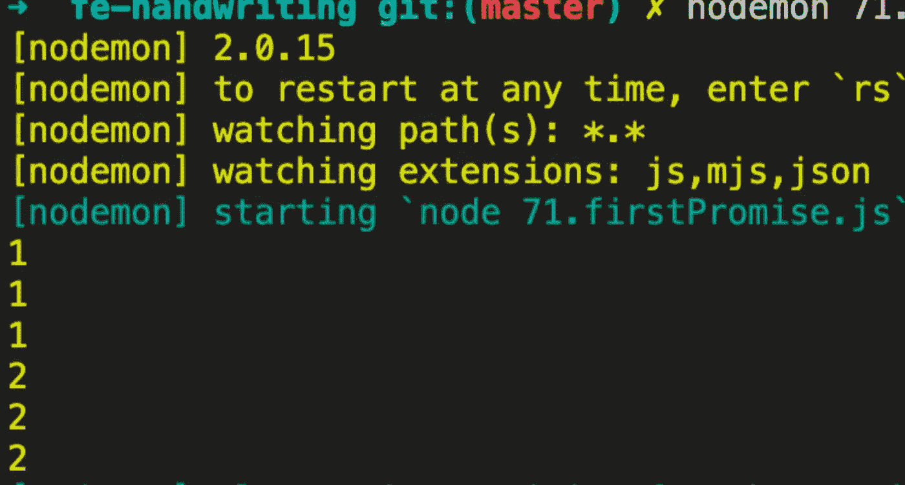
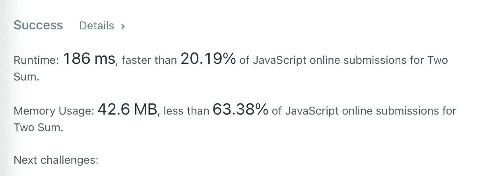
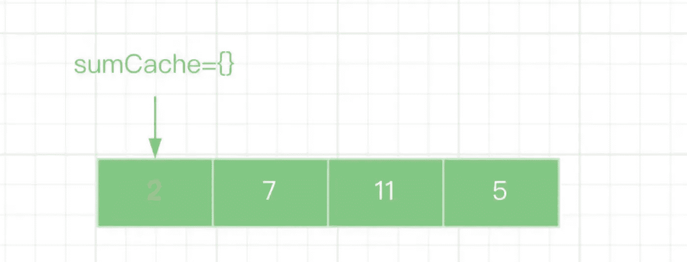
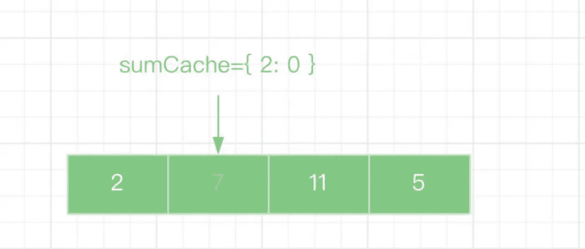
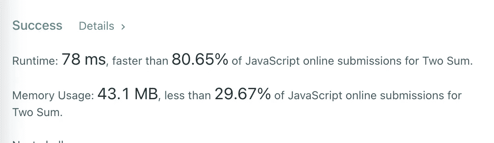

# 面试官:你不能回答这两个简单的问题吗？

> 原文：<https://javascript.plainenglish.io/interviewer-cant-you-answer-these-2-easy-questions-66eed93391f?source=collection_archive---------2----------------------->

## 2 个你回答不了的简单面试问题。

# 前言

这是我的朋友在最近的一次采访中被问到的两个问题。坦率地说，我不喜欢在面试中被问到算法问题，因为那根本不是测试候选人能力的有效方法。

# 1.如何防止多次请求被重复发送？

# 1.1 问题信息

在我们的工作中，经常需要只发送一次请求，以防止用户重复点击。

请传入请求方法(执行后返回承诺)并返回一个新方法。连续触发时，只会发送一个请求。

**例子**

# 1.2 问题分析

与算法问题相比，这个问题相对容易，我们只需要利用闭包和“Promise”的特性来完成。

**测试一下**

# 2.两个总和

> *温馨提示:这是 LeetCode 上的一个原创问题，点击* [*此处*](https://leetcode.com/problems/two-sum/) *查看。*

给定一个整数数组 num 和一个整数目标，返回这两个数字的索引，使它们加起来等于目标。

您可以假设每个输入只有一个解决方案，并且不能两次使用同一个元素。

可以任意顺序返回答案。

示例 1:

示例 2:

示例 3:

**约束:**

2 <= nums.length <= 104

-109 <= nums[i] <= 109

-109 <= target <= 109

Only one valid answer exists.

# 2.1 Use two “for” loops to solve the problem

When my friend saw this question she thought she was lucky because it seemed so easy. So she wrote the answer right away and waited for the interviewer to ask the next question.

**这是她的回答**

面试官夸她回答得快，但他对结果并不满意，他认为还有进一步优化的可能。

# 2.2 利用“地图”解决问题

通常情况下，当使用两个“for”循环来解决一个问题时，我们需要意识到算法的时间复杂度( **o(n2)** )可能会得到优化。

其实我们可以用一个“for”循环来做，只要上瘾变成减法，遍历的值存储在一个对象`sumCache`中。

**例如:**

输入:[2，7，11，15]

**第一步**

**第二步**

是不是觉得使用“Map”的方式简单明了，比 for 循环简单多了？

太好了。我们得到了更好的结果。我们只多使用了 150 万的空间，并将时间减少了将近一半。

# 最后

感谢阅读。期待期待您的关注和阅读更多高质量的文章。

 [## 面试官:可以“x！== x "在 JavaScript 中返回 True？

### 你可能不知道的五个神奇的 JavaScript 知识点！

javascript.plainenglish.io](/interviewer-can-x-x-return-true-in-javascript-7e1d1fa7b5cd)  [## 123['toString']。length + 123)用 JavaScript 打印出来？

### 95%的前端开发者回答错误的问题。

javascript.plainenglish.io](/what-does-123-tostring-length-123-print-out-in-javascript-2c804a414325)  [## 面试官:你工作 3 年了，这种算法题你都不会答？

### 一个女生的面试经历

javascript.plainenglish.io](/interviewer-you-have-been-working-for-3-years-and-you-cant-answer-this-algorithm-question-5f79cba18e06)  [## 我老板:你知道 ES6，为什么不用？😠

### 老板的 10 条抱怨让我受益匪浅。

javascript.plainenglish.io](/my-boss-you-know-es6-but-why-dont-you-use-it-5e0316f14c67) 

*更多内容请看*[***plain English . io***](https://plainenglish.io/)*。报名参加我们的* [***免费周报***](http://newsletter.plainenglish.io/) *。关注我们关于*[***Twitter***](https://twitter.com/inPlainEngHQ)*和*[***LinkedIn***](https://www.linkedin.com/company/inplainenglish/)*。加入我们的* [***社区不和谐***](https://discord.gg/GtDtUAvyhW) *。*