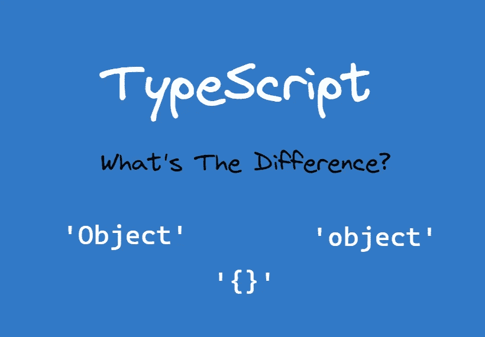
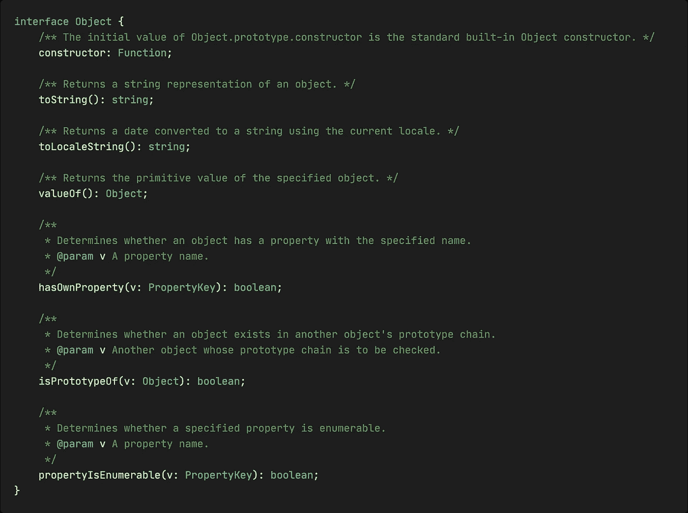

# 面试官:请说出打字稿中“object”、“{}”和“Object”的区别

> 原文：<https://javascript.plainenglish.io/interviewer-please-tell-the-difference-between-object-and-object-in-typescript-5817b7810f61?source=collection_archive---------1----------------------->

## 你打算怎么回应他？



面试时面对这个问题，你打算怎么回答？

# 对象(大写)

Object(大写)描述所有 JavaScipt 对象共有的属性。它在 TypeScript 库附带的 [*lib.es5.d.ts*](https://github.com/microsoft/TypeScript/blob/main/lib/lib.es5.d.ts#L120) 文件中定义。



如您所见，它包括一些常见的属性，如`toString()`、`valueOf()`等等。

结束了吗？当然不是。

因为它只强调 JavaScript 对象共有的那些属性。所以你可以把像`string`、`boolean`、`number`、`bigint`、`symbol`这样的可装箱对象分配给它，而不是反过来。

# {}

`{}`描述一个没有自己成员的对象，这意味着如果您试图访问它的属性成员，TypeScript 将会报错:

从上面的代码示例中，我们可以看到`{}`和`Object`(大写)具有相同的特性。也就是说，它只能访问那些通用的属性(即使 JavaScript 代码逻辑是正确的)，所有可装箱的对象都可以分配给它，等等。

这是因为`{}`类型可以通过原型链访问那些公共属性，而且它也没有自己的属性。因此它的行为与`Object`(大写)类型相同。但它们代表了不同的概念。

# 对象(小写)

object(小写)表示任何非原始类型，用如下代码表示:

```
type PrimitiveType =
  | undefined
  | null
  | string
  | number
  | boolean
  | bigint
  | symbol;type NonPrimitiveType = object;
```

这意味着所有非基元类型都不能赋给它，反之亦然。

# 小吃:记录

在很多常用库的源代码中，我们可能会看到`Record<string, any>`来表示非原语类型。它与 object(小写)有相同的效果，但它更具语义性。

对于更高级的实用程序类型，请查看我以前的文章:

[](/7-typescript-built-in-utility-types-you-must-know-d7a73a489d7) [## 您必须知道的 7 种 TypeScript 内置实用程序类型

### 提高对内置类型的理解。

javascript.plainenglish.io](/7-typescript-built-in-utility-types-you-must-know-d7a73a489d7) 

*感谢阅读。如果你喜欢这样的故事，想支持我，请考虑成为* [*中等会员*](https://medium.com/@islizeqiang/membership) *。每月 5 美元，你可以无限制地访问媒体内容。如果你通过* [*我的链接*](https://medium.com/@islizeqiang/membership) *报名，我会得到一点佣金。*

你的支持对我来说非常重要——谢谢。