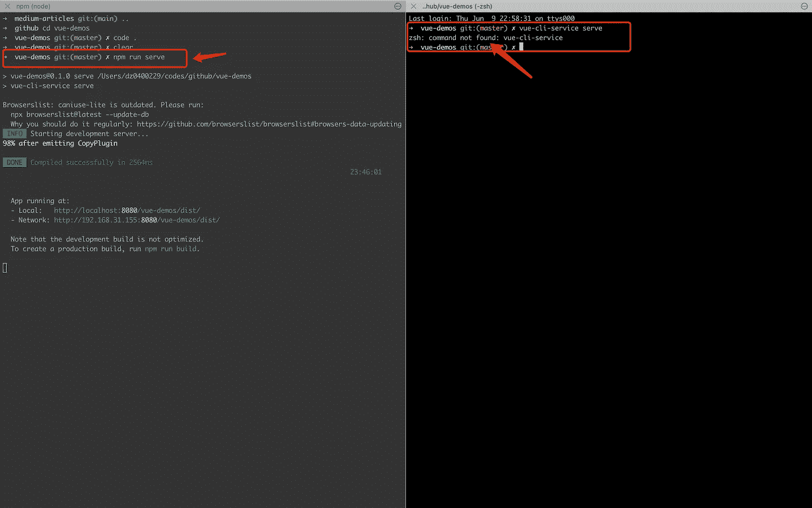
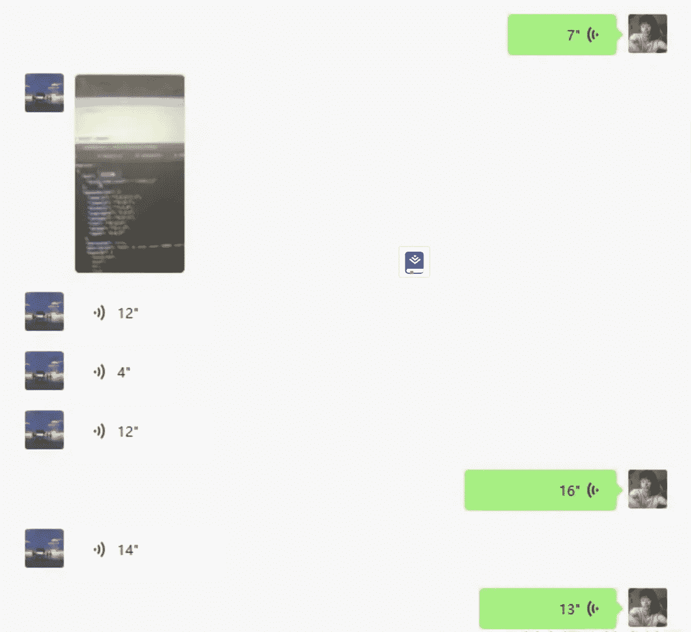
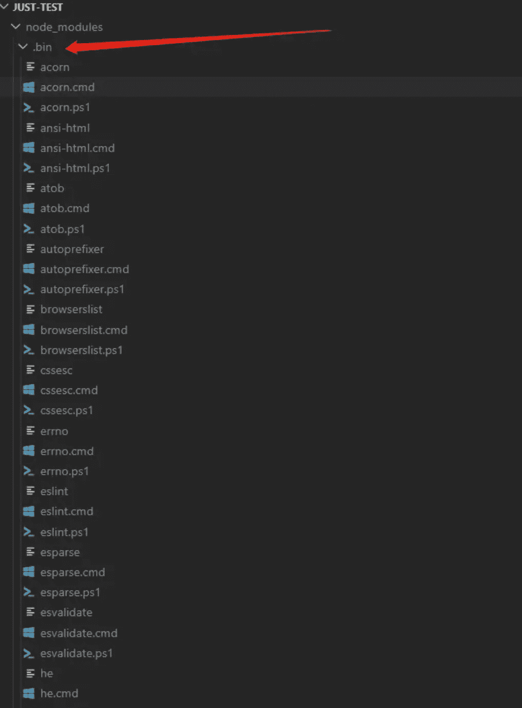
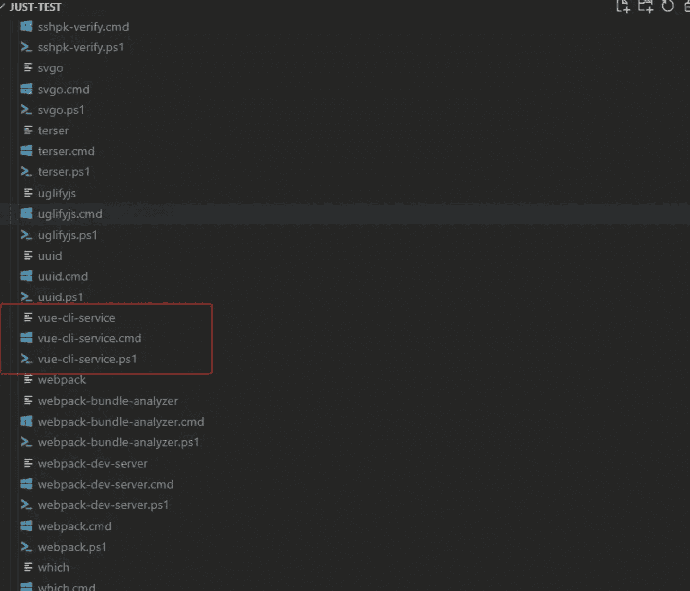
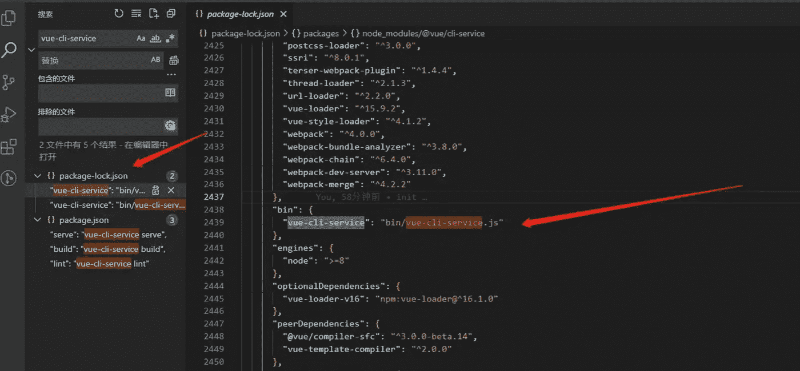

# 采访者:“npm 跑 xxx”怎么了？

> 原文：<https://javascript.plainenglish.io/interviewer-what-happened-to-npm-run-xxx-cdcb37dbaf44?source=collection_archive---------0----------------------->

## 一个大多数人都不知道的秘密。

# 前言

最近参加了一个让我印象深刻的面试。几经周折，终于拿到了 offer。你无法想象我经历了什么。

# 1.我的面试过程

**面试官:**

请告诉我“npm 运行 xxx”时发生了什么？越详细越好。

**我:**

我心想:“我很惭愧。作为前端开发人员，我每天都在使用 **npm run xxx** 命令，比如 **npm run dev** 、 **npm run build、**等等。但我还没有真正明白这背后发生了什么。

幸运的是，我至少记得以下几点:

**当我们执行“npm run xxx”命令时，它会先去项目的 package.json 文件中找到脚本中的 xxx，然后执行 xxx 命令。**

**举个例子，当你启动一个 Vue.js 项目，执行** `**npm run serve**` **时，实际上执行的是** `**vue-cli-service serve**` **命令。**

面试官:

嗯，为什么不直接执行`vue-cli-service serve`而不是`npm run serve`？

**我:**

我受不了了，因为我根本不知道答案，所以我只能说因为`npm run serve`更短更容易记住。

**面试官:**

哈哈，你能考虑一下吗？

**我:**

呜呜，这真的不对，我挠着头想了一会儿，最后，我想起来了。因为如果直接执行`vue-cli-service serve`会报错，因为操作系统里没有`vue-cli-service`指令。

面试官:

面试官笑着说:“太好了，这个回答不错。”

**我:**

听到面试官的夸奖，我终于放心了。看来我能通过面试。我心想:**“他们应该付我多少钱？哈哈"**

**面试官:**

我还有一个疑问，命令`vue-cli-service serve`在操作系统中是不存在的，为什么可以成功执行`npm run serve`(相当于执行`vue-cli-service serve`)却不报错？

**我:**

我真的很想哭，请不要再问我这个问题了，？我真的很想结束这次采访。

最后只能对面试官说:“不好意思，这个我还没看懂。”

**面试官:**

嗯，没关系，那我们今天的面试就到这里吧！我们将在一周内回复您，感谢您参与我们的面试。

# 2.补充学习知识

在回家的路上，我试图思考:“为什么 **npm run serve** 命令成功执行而没有报告错误？”

然后我在网上查了很多资料，问了一个有经验的朋友这个问题。

经过一番讨论，我们终于找到了答案。

# 3.我又给面试官打了电话

我不想认输，把面试官叫了回来。

**我:**

你好，我已经找到答案了。你能再听一遍吗？

**面试官:**

是的，我想听你说。所以让我们开始吧！

**我:**

首先我们通过`npm i xxx`安装项目依赖，比如`npm i @vue/cli-service`。当 npm 安装这个依赖项时，它会在`node_modules/.bin/`目录下创建`vue-cli-service`，作为几个可执行文件的名称。

`.bin`目录不是存储`npm`包的地方。这个目录中的文件代表软链接。打开文件，可以看到文件顶部写着`#!/bin/sh`，说明这是一个脚本。

因此，当使用`npm run serve`执行`vue-cli-service serve`时，虽然没有安装`vue-cli-service`全局命令，但是‘NPM’会在`./node_modules/.bin`文件目录中找到‘vue-CLI-service’可执行文件，并作为脚本执行(相当于执行【T11’)

面试官:

很好，但是我想继续问，你说的那个文件在。bin 目录代表软链接，这些软链接文件从哪里来？

这个软连接在哪里执行？

**我:**

我(太幸运了，我们刚才讨论过这个):可以直接在项目里搜索`vue-cli-service`。

看这个图，`vue-cli-service`存在于`package-lock.json`文件中。

所以当我们使用`npm i`安装依赖项时，npm 将`bin/vue-cli-service.js`声明为 bin。

npm 读取配置后会将其软链接到`./node_modules/.bin`目录，npm 会自动将`node_modules/.bin`添加到`$PATH`，这样你就可以直接作为命令运行依赖程序，不需要全局安装。

**面试官:**

所以当我们执行`npm i`时，它已经帮助我们配置了软连接。实际上，这种软连接相当于一种映射。执行`npm run xxx`时会转到`node_modules/bin``找到对应的映射文件，然后找到对应的 js 文件执行代码。

**我:**

我(胡乱点头):对，就是这样。你完全正确。

**面试官:**

孩子，你太棒了。你在短时间内就掌握了。看来你学习能力很强。我很看好你。我会督促 HR 尽快回复你。就这样，再见

**我:**

我太高兴了，好的，下次见，再见。

# 4.我收到邀请了

三十分钟后…

**人力资源:**

你好，我是 xxx 公司的 hr。根据你在面试中的出色表现，祝贺你获得了我们公司的录用。经过我最大的努力，我为你争取到了最高工资。工资是每月 1500 美元。你满意吗？

**我:**

# 最后

感谢阅读。我期待着期待您的关注和阅读更多高质量的文章。

*本文翻译已获原作者授权(* sunny *)。*

*原地址为*[https://juejin.cn/post/7078924628525056007](https://juejin.cn/post/7078924628525056007)

 [## 我老板:你根本不知道反应！😠

### 你必须知道的 React 的 3 种错误用法。

javascript.plainenglish.io](/my-boss-you-dont-know-react-at-all-f493970f1807)  [## 让你看起来像高级开发人员的 8 个很酷的 GitHub 技巧

### 使用 GitHub 可以做的 8 件很酷的事情

javascript.plainenglish.io](/8-cool-github-tricks-to-make-you-look-like-a-senior-developer-ab8fe9ae9b14)  [## 面试官:可以“x！== x "在 JavaScript 中返回 True？

### 你可能不知道的五个神奇的 JavaScript 知识点！

javascript.plainenglish.io](/interviewer-can-x-x-return-true-in-javascript-7e1d1fa7b5cd)  [## 123['toString']。length + 123)用 JavaScript 打印出来？

### 95%的前端开发者回答错误的问题。

javascript.plainenglish.io](/what-does-123-tostring-length-123-print-out-in-javascript-2c804a414325) 

*更多内容请看*[***plain English . io***](https://plainenglish.io/)*。报名参加我们的* [***免费周报***](http://newsletter.plainenglish.io/) *。关注我们关于*[***Twitter***](https://twitter.com/inPlainEngHQ)*和*[***LinkedIn***](https://www.linkedin.com/company/inplainenglish/)*。查看我们的* [***社区不和谐***](https://discord.gg/GtDtUAvyhW) *加入我们的* [***人才集体***](https://inplainenglish.pallet.com/talent/welcome) *。*