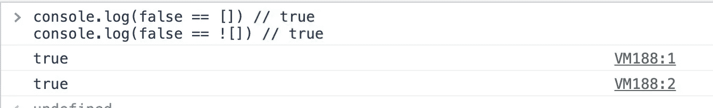

# 面试官:为什么“假== []”和“假==！[]“两者还真有？

> 原文：<https://javascript.plainenglish.io/interviewer-why-do-false-and-false-both-return-true-6e7944220337?source=collection_archive---------5----------------------->

## 5 个诡异的面试问题。

Photo by [Mikhail Vasilyev](https://unsplash.com/@miklevasilyev?utm_source=medium&utm_medium=referral) on [Unsplash](https://unsplash.com?utm_source=medium&utm_medium=referral)

JavaScript 是一种非常好的编程语言，但同时，它也经常让我感到困惑。

可能是我对它了解不够吧！有时候真的想不通这是怎么回事。

你知道这些古怪问题的正确答案吗？

# 1.为什么“false == []”和“false ==！[]“两者还真有？

朋友们，请不要惊讶这确实是正确的答案。

只要我们有[相等比较和](https://developer.mozilla.org/en-US/docs/Web/JavaScript/Equality_comparisons_and_sameness)相同的知识，我们就能完全理解这是怎么回事。

我来简单解释一下它的工作原理。

当我们遇到一个布尔值和一个对象进行比较时，这两个值会被转换成数字进行最终比较。

**所以它会经过这些步骤。**

# 2.为什么“] ==！[]“还真有？

“1 ==”的结果是什么！1"?“fatfish”是什么==！肥鱼的回归？

**为什么空数组如此特殊？**

**朋友们，请用“===”代替“==”，这样会让你的工作轻松很多，否则你可能会经历噩梦。**

祝你好运！

# 3.关于奇怪的“试抓”

请思考几秒钟，`getName`处决并归还的是你的好朋友`fatfish`还是我们的好朋友`medium`？

**我想你猜到了，答案是‘fat fish’。不，不是的！答案是‘中等’。**

这是因为在“尝试…接住…finally "语句中，无论 finally 子句是否引发异常，都会执行该子句。此外，如果抛出异常，即使没有处理异常的 catch 子句，也会执行 finally 子句中的语句。

# 4.关于箭头功能？

是的，问题很简单，你会看到`fatfish`被打印出来。

但是我想请你试着回答一下这段代码会输出什么？

**请问' { 0 } '是最终结果吗？**

不幸的是，它不是我们想象的那样。`undefined`是最后的赢家。

由于“{ 0 }”是 fn 函数的包含块，因此它等效于下面的代码。

# 5.为什么 JSON.stringify('fatfish ')！== 'fatfish '？

`name1`会等于`name2`吗？

我真的很困惑，为什么`name1`不等于`name2`？

请小心使用`JSON.stringify`来比较字符串，它会让你陷入困境。

# 最后

**感谢阅读。**我期待期待您的关注和阅读更多高质量的文章。

 [## “我失去了一个工作机会，只是因为承诺。所有”

### 一次让我好难过的面试经历。

javascript.plainenglish.io](/i-lost-a-job-opportunity-just-because-of-promise-all-be396f6efe87)  [## 采访者:“npm 跑 xxx”怎么了？

### 一个大多数人都不知道的秘密。

javascript.plainenglish.io](/interviewer-what-happened-to-npm-run-xxx-cdcb37dbaf44)  [## 面试官:可以“x！== x "在 JavaScript 中返回 True？

### 你可能不知道的五个神奇的 JavaScript 知识点！

javascript.plainenglish.io](/interviewer-can-x-x-return-true-in-javascript-7e1d1fa7b5cd)  [## 现在是 2022 年，不要再滥用箭头功能了

### 不应该使用箭头函数的 4 种情况。

javascript.plainenglish.io](/its-2022-don-t-abuse-the-arrow-function-anymore-905862a9c668) 

*更多内容看* [***说白了就是***](https://plainenglish.io/) *。报名参加我们的* [***免费周报***](http://newsletter.plainenglish.io/) *。关注我们关于* [***推特***](https://twitter.com/inPlainEngHQ) ，[***LinkedIn***](https://www.linkedin.com/company/inplainenglish/)*，*[***YouTube***](https://www.youtube.com/channel/UCtipWUghju290NWcn8jhyAw)*，以及* [***不和***](https://discord.gg/GtDtUAvyhW) ***。***

***对缩放您的软件启动感兴趣*** *？检查出* [***电路***](https://circuit.ooo?utm=publication-post-cta) *。*