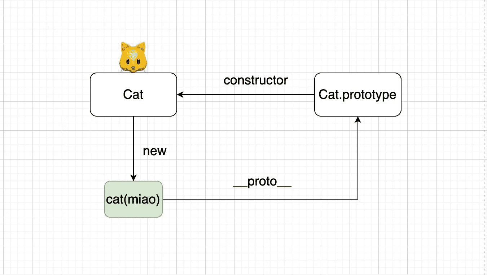
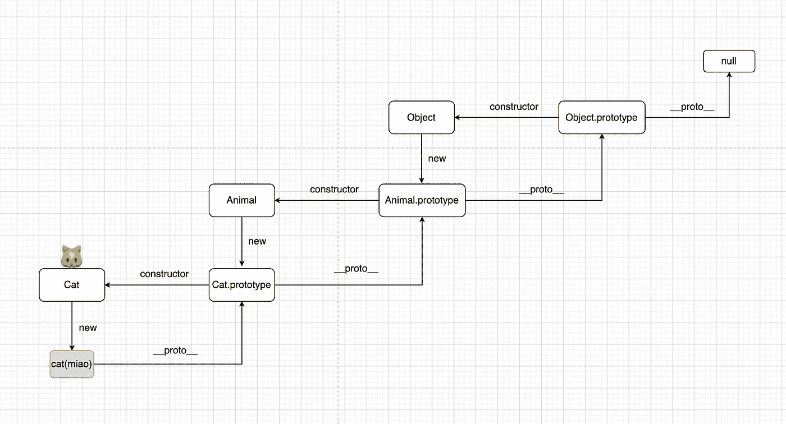
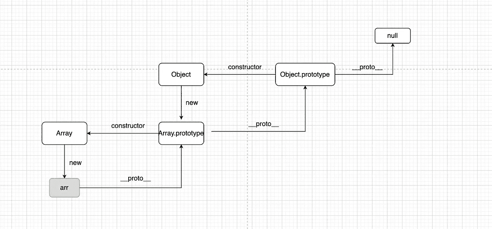

# 采访者:为什么'[] instanceof Object '返回' true '？

> 原文：<https://javascript.plainenglish.io/interviewer-why-does-instanceof-object-return-true-6b5ee5325bcb?source=collection_archive---------1----------------------->

## 这是所有开发人员都应该知道的。

Photo by [Eric Ward](https://unsplash.com/@ericjamesward?utm_source=medium&utm_medium=referral) on [Unsplash](https://unsplash.com?utm_source=medium&utm_medium=referral)

我们都知道`[] instanceof Array`返回`true`，但是为什么`[] instanceof Object`也返回`true`？

朋友们，如果你在面试中被问到这个问题，你会怎么回答？

# instanceof 是什么？

我们来看看 [MDN](https://developer.mozilla.org/en-US/docs/Web/JavaScript/Reference/Operators/instanceof) 上的解释:

*"*`*instanceof*`*操作符测试一个构造函数的原型属性是否出现在一个对象的原型链中。返回值是一个布尔值。它的行为可以用* `*Symbol.hasInstance*` *定制*

那么，为什么`cat instanceof Cat`会返回`true`？很简单，画个图会更好理解。

由于`Cat.prototype`出现在`cat`的原型链上，所以返回`true`是正确的。

让我们看一个更复杂的例子:

从这张图我们可以清楚的解释为什么三个表达式都返回`true`，因为`Cat.prototype`、`Animal.prototype`、`Object.prototype`都出现在`cat`的原型上，所以结果是`true`。

1.  `cat instanceof Cat`
2.  `cat instanceof Animal`
3.  `at instanceof Object`

# 为什么“[] instanceof Object”返回 true

我们回到问题本身，一起画个简单的图看看答案。

# 如何实现一个 instanceof 运算符？

经过上面的讲解，当面试官问我们如何实现一个`instanceof`时，掌握这些知识点就足够了。

1.  构造函数的原型
2.  对象的原型链

# 解决方案 1

# 解决方案 2

# 解决方案 3

# 最后

感谢阅读。我期待着您的关注和阅读更多高质量的文章。

 [## 采访者:“npm 跑 xxx”怎么了？

### 一个大多数人都不知道的秘密。

javascript.plainenglish.io](/interviewer-what-happened-to-npm-run-xxx-cdcb37dbaf44)  [## 每个开发人员都应该知道的 20 种 JavaScript 数组方法

### 你知道这 20 个数组方法是怎么实现的吗？

javascript.plainenglish.io](/20-javascript-array-methods-every-developer-should-know-6c04cc7a557d)  [## 让你看起来像高级开发人员的 8 个很酷的 GitHub 技巧

### 使用 GitHub 可以做的 8 件很酷的事情

javascript.plainenglish.io](/8-cool-github-tricks-to-make-you-look-like-a-senior-developer-ab8fe9ae9b14)  [## 面试官:可以“x！== x "在 JavaScript 中返回 True？

### 你可能不知道的五个神奇的 JavaScript 知识点！

javascript.plainenglish.io](/interviewer-can-x-x-return-true-in-javascript-7e1d1fa7b5cd)  [## 123['toString']。length + 123)用 JavaScript 打印出来？

### 95%的前端开发者回答错误的问题。

javascript.plainenglish.io](/what-does-123-tostring-length-123-print-out-in-javascript-2c804a414325) 

*更多内容请看*[***plain English . io***](https://plainenglish.io/)*。报名参加我们的* [***免费周报***](http://newsletter.plainenglish.io/) *。关注我们关于*[***Twitter***](https://twitter.com/inPlainEngHQ)[***LinkedIn***](https://www.linkedin.com/company/inplainenglish/)*[***YouTube***](https://www.youtube.com/channel/UCtipWUghju290NWcn8jhyAw)*[***不和***](https://discord.gg/GtDtUAvyhW) *。对增长黑客感兴趣？检查* [***电路***](https://circuit.ooo/) *。***