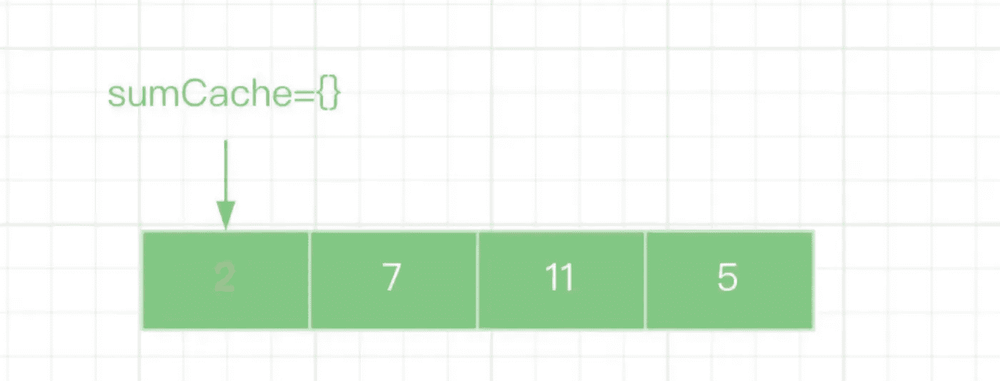
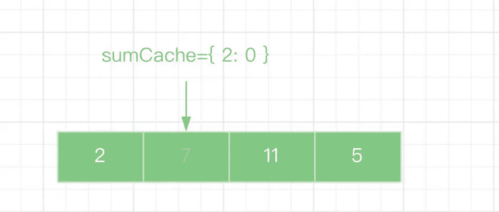
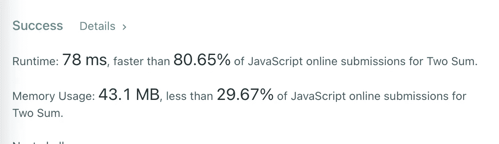

# 面试官:你已经工作 2 年了，就不能回答这个简单的问题？

> 原文：<https://javascript.plainenglish.io/interviewer-you-have-been-working-for-2-years-and-you-cant-answer-this-simple-question-618a718da6bf?source=collection_archive---------1----------------------->

## 一个工作两年的人的面试经历。

# 前言

最近，我的一个好朋友正在换工作。她是一个选择做程序员的人。她很优秀，也很自信，但她在最近的面试中吃了大亏。

她被告知:**你工作 2 年了，这两个问题你都解决不了？**什么样的面试问题会让面试官对某人说如此粗鲁的话？

# 1.两个总和

> ***温馨提示:*** *这是 LeetCode 上的一个原创问题，点击* [*这里*](https://leetcode.com/problems/two-sum/) *查看。*

给定一个整数 num 数组和一个整数 target，返回这两个数字的索引，使它们加起来等于 target。

您可以假设每个输入只有一个解决方案，并且不能两次使用同一个元素。

可以任意顺序返回答案。

示例 1:

示例 2:

示例 3:

约束条件:

这是她的回答

面试官夸她答得快，但他对结果不是很满意，他认为还有进一步优化的可能。

2.2.用“地图”解决问题

通常情况下，当使用两个“for”循环来解决一个问题时，我们需要意识到算法的时间复杂度( **o(n2)** )可能会得到优化。

# 其实我们可以用一个“for”循环来做，只要上瘾变成减法，遍历的值存储在一个对象`sumCache`中。

**比如:**

输入:[2，7，11，15]

**第一步**

# **第二步**

是不是觉得使用“Map”的方式简单明了，比 for 循环简单多了？

太好了。我们得到了更好的结果。我们只多使用了 150 万的空间，并将时间减少了将近一半，

3.如何防止多次请求被重复发送？

3.1.问题信息

在工作中，经常需要只发送一次请求，防止用户重复点击。

请传入请求方法(执行后返回承诺)并返回一个新方法。连续触发时，只会发送一个请求。

**例如:**

3.2.问题分析

# 与算法问题相比，这个问题相对容易，我们只需要利用闭包和“Promise”的特性来完成。

# **测试一下:**

最后

**感谢阅读。**我期待期待您关注和阅读更多高质量的文章。

我老板:你根本不知道反应！😠

# 你必须知道的 React 的 3 种错误用法。

javascript.plainenglish.io

让你看起来像高级开发人员的 8 个很酷的 GitHub 技巧

# 使用 GitHub 可以做的 8 件很酷的事情

javascript.plainenglish.io

 [## 面试官:可以“x！== x "在 JavaScript 中返回 True？

### 你可能不知道的五个神奇的 JavaScript 知识点！

javascript.plainenglish.io](/my-boss-you-dont-know-react-at-all-f493970f1807)  [## 123['toString']。length + 123)用 JavaScript 打印出来？

### 95%的前端开发者回答错误的问题。

javascript.plainenglish.io](/8-cool-github-tricks-to-make-you-look-like-a-senior-developer-ab8fe9ae9b14) 

## [*更多内容看*](/interviewer-can-x-x-return-true-in-javascript-7e1d1fa7b5cd) [***说白了就是 io***](https://plainenglish.io/) *。报名参加我们的* [***免费周报***](http://newsletter.plainenglish.io/) *。关注我们关于*[***Twitter***](https://twitter.com/inPlainEngHQ)*和*[***LinkedIn***](https://www.linkedin.com/company/inplainenglish/)*。查看我们的* [***社区不和谐***](https://discord.gg/GtDtUAvyhW) *加入我们的* [***人才集体***](https://inplainenglish.pallet.com/talent/welcome) *。*

### Five magical JavaScript knowledge points you may not know!

javascript.plainenglish.io

 [## What does (123[‘toString’].length + 123) Print Out in JavaScript?

### A question that 95% of front-end developers answer incorrectly.

javascript.plainenglish.io](/what-does-123-tostring-length-123-print-out-in-javascript-2c804a414325) 

*More content at* [***PlainEnglish.io***](https://plainenglish.io/)*. Sign up for our* [***free weekly newsletter***](http://newsletter.plainenglish.io/)*. Follow us on* [***Twitter***](https://twitter.com/inPlainEngHQ) *and* [***LinkedIn***](https://www.linkedin.com/company/inplainenglish/)*. Check out our* [***Community Discord***](https://discord.gg/GtDtUAvyhW) *and join our* [***Talent Collective***](https://inplainenglish.pallet.com/talent/welcome)*.*