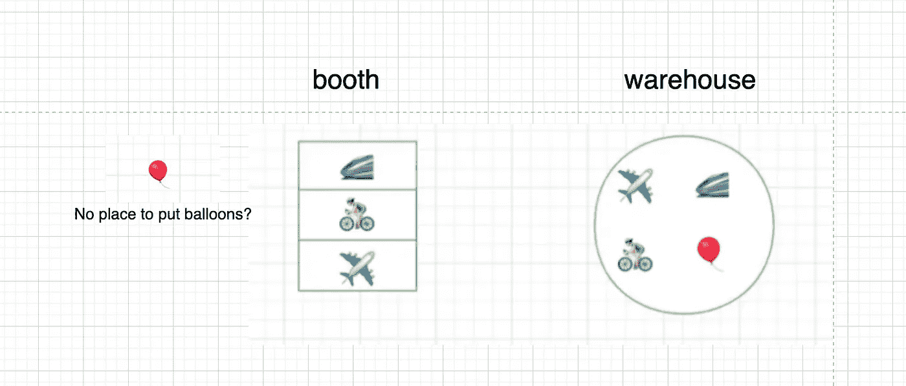

# 面试官:你已经工作 2 年了，就不能回答这个简单的问题？

> 原文：<https://javascript.plainenglish.io/interviewer-you-have-been-working-for-2-years-and-you-cant-answer-this-simple-question-878012c43fb3?source=collection_archive---------2----------------------->

## 一个工作两年的人的面试经历。

最近，我的一个好朋友正在换工作。她是一个选择做程序员的人。她平时很优秀，很自信，但在最近的一次面试中吃了大亏。

她被告知:*“你已经工作 2 年了，你还不能解决这 3 个问题？”什么样的面试问题会让面试官对某人说出如此粗鲁的话？*

你可以在这篇[文章](/interviewer-you-have-been-working-for-2-years-and-you-cant-answer-this-simple-question-618a718da6bf)中看到其中的两个问题。我们将在这里讨论第三个问题。

# 1.问题描述

这是一个难度适中的算法问题，可能确实有一定难度。但是请不要担心我的朋友，我会一步步向你详细解释的。

“LRU”算法广泛应用于缓存机制中，它是一种非常好的机制，即使在 Vue 框架中，它仍然有着非常重要的应用。

设计一个遵循最近最少使用(LRU)缓存约束的数据结构。

实现 LRUCache 类:

1.  LRUCache(int capacity)用正的容量大小初始化 LRU 缓存。
2.  int get(int key)如果键存在则返回键的值，否则返回-1。
3.  void put(int key，int value)如果键存在，更新键的值。否则，将键值对添加到缓存中。如果键的数量超过了该操作的容量，则收回最近最少使用的键。

函数 get 和 put 必须以 O(1)的平均时间复杂度运行。

# 2.让我们开始分析这个问题

1.  问题中的第一个和第二个要求都很简单。
2.  条件 3 是什么意思？

别担心，我会画几个图来帮助我们理解。

# 3.画图理解问题

现在我是一个玩具商，租了一个只能放下三个玩具的摊位(我真的太穷了)，所以大部分玩具不是放出来而是放在仓库里。

我等了很久，终于，有人来咨询玩具，我赶紧把一个玩具放在第一格…

现在我们的生意越来越好了，我又被问到自行车，因为第一个位置是一个黄金位置，所以我要把最新的玩具放在那里…

Omg，我们要发财了，很快我的三个平方就不够了…

由于格子从上到下都是最受欢迎的，我会把下面格子里的玩具放回仓库，为新的腾出空间。

当然，如果顾客想看已经在摊位上的玩具，我会把它放在第一个最热的位置。

# 4.让我们试着把图片和问题联系起来

1.  **三格数为条件一:** LRUCache(int capacity)用正的大小容量初始化 LRU 缓存。
2.  我们不断调整玩具的位置，把玩具从仓库拿到摊位再从摊位放回仓库，这可以理解为条件二和条件三

# 5.两种解决方案

**解决方案 1:使用数组和对象的组合。**

**方案二:地图**

在第一个实现中，我们使用一个数组来存储每个键被访问的顺序(get，set)，这是一种繁琐的方式。

**有没有其他更方便且不需要额外维护阵列的解决方案？**

是的，我们可以使用**地图**来做到这一点，它非常适合。

# 最后

**感谢阅读。**我期待着您的关注和阅读更多高质量的文章。

 [## “我失去了一个工作机会，只是因为承诺。所有”

### 一次让我好难过的面试经历。

javascript.plainenglish.io](/i-lost-a-job-opportunity-just-because-of-promise-all-be396f6efe87)  [## 采访者:“npm 跑 xxx”怎么了？

### 一个大多数人都不知道的秘密。

javascript.plainenglish.io](/interviewer-what-happened-to-npm-run-xxx-cdcb37dbaf44)  [## 面试官:可以“x！== x "在 JavaScript 中返回 True？

### 你可能不知道的五个神奇的 JavaScript 知识点！

javascript.plainenglish.io](/interviewer-can-x-x-return-true-in-javascript-7e1d1fa7b5cd)  [## 现在是 2022 年，不要再滥用箭头功能了

### 不应该使用箭头函数的 4 种情况。

javascript.plainenglish.io](/its-2022-don-t-abuse-the-arrow-function-anymore-905862a9c668) 

*更多内容看* [***说白了。报名参加我们的***](https://plainenglish.io/) **[***免费周报***](http://newsletter.plainenglish.io/) *。关注我们关于*[***Twitter***](https://twitter.com/inPlainEngHQ)，[***LinkedIn***](https://www.linkedin.com/company/inplainenglish/)*，*[***YouTube***](https://www.youtube.com/channel/UCtipWUghju290NWcn8jhyAw)*，以及* [***不和***](https://discord.gg/GtDtUAvyhW) *。***