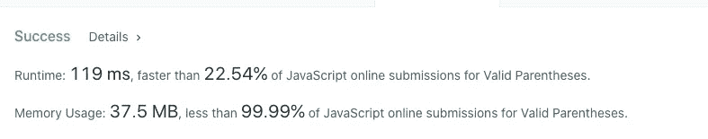
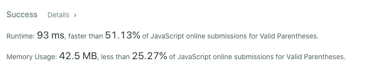

# 面试官:你工作 3 年了，这种算法题你都不会答？

> 原文：<https://javascript.plainenglish.io/interviewer-you-have-been-working-for-3-years-and-you-cant-answer-this-algorithm-question-5f79cba18e06?source=collection_archive---------0----------------------->

## 一个女生的面试经历


三月是再次跳槽的最佳时机。我幻想着只要换个工作，就能离开这个“破地方”，赚更多的钱，做最舒服的事。

但事与愿违。最近，一个女学生在换工作。她在面试前准备了很多问题。我以为她很自信，结果在算法上吃了大亏。

什么样的算法题能让面试官对一个女生说出这么残忍的话:**你工作 3 年了，却解不出这道算法题？**

# 有效括号

这是 [LeetCode，](https://leetcode.com/problems/valid-parentheses/)上的一个算法问题，意在考察考生对“栈”数据结构的熟悉程度。让我们看一看

给定一个只包含字符'('，')'，' { '，' } '，'['和']'的字符串，确定输入字符串是否有效。

输入字符串在以下情况下有效:左括号必须由相同类型的括号括起来。左括号必须以正确的顺序结束。

**例一:**

```
Input: s = "()"
Output: true
```

**例 2:**

```
Input: s = "()[]{}"
Output: true
```

**例 3:**

```
Input: s = "(]"
Output: false
```

**例 4:**

```
Input: s = "([)]"
Output: false
```

**例 5:**

```
Input: s = "{[]}"
Output: true
```

约束条件:

1.  1 <= s.length <= 104
2.  s consists of parentheses only ‘()[]{}’

# Question Information

If we really haven’t learned algorithms and don’t know so many routines, it is very important to get as much information as possible through questions and examples.

So, we can get the following information:

1.  The length of the string s must be an even number, it cannot be an odd number (pair-to-pair match).

2\. The right parenthesis must be preceded by a left parenthesis.

# Violence Elimination Act

After getting the above information, I think since [], {}, () appear in pairs, can I eliminate them one by one? If the final result is an empty string, doesn’t it mean it meets the meaning of the question?

**例如**

**代码**

暴力淘汰的方式还是可以通过 LeetCode 的用例的，只是性能差了一点，哈哈。



# 使用“堆栈”来解决

主题信息中的第二项强调对称。Stack(后进先出)和(push and pop)正好相反，形成了鲜明的对称性。

**例如**

```
Input: abc
Output: cba
```

“abc”和“cba”是对称的，我们可以试着从栈的角度解析一下:

**代号**

虽然暴力解决方案符合我们的常规思维，但是堆栈结构解决方案会更高效。



# 最后

在面试中，算法是否应该成为评价应聘者的重要指标，我们不会抱怨，但近几年几乎每个公司都把算法放到了前端面试中。为了得到自己喜欢的 offer，复习数据结构，刷题还是要刷的。愿你我都能被算法温柔对待。

**感谢阅读。**

*更多内容看* [***说白了。报名参加我们的***](https://plainenglish.io/) **[***免费周报***](http://newsletter.plainenglish.io/) *。关注我们关于*[***Twitter***](https://twitter.com/inPlainEngHQ)*和*[***LinkedIn***](https://www.linkedin.com/company/inplainenglish/)*。加入我们的* [***社区***](https://discord.gg/GtDtUAvyhW) *。***