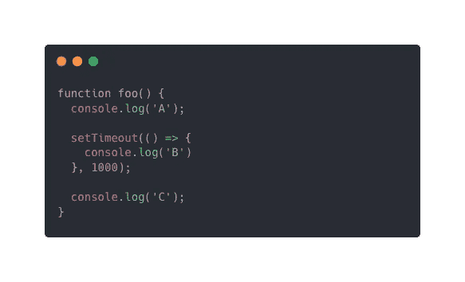

# 面试官:你需要回答这些 JavaScript 问题才能得到一份工作

> 原文：<https://javascript.plainenglish.io/interviewer-you-need-to-answer-these-javascript-questions-to-get-an-offer-347d5267f03e?source=collection_archive---------2----------------------->

作为一名开发人员，我花了几个月的时间才找到第一份工作。在收到数百封拒绝邮件后，我终于得到了一次面试机会。我被问了大量的问题来测试我的能力，其中一些是基本的，但一些对我来说在短暂的面试时间里并不容易弄清楚。我在这里分享问题，这样我们可以一起学习和成长。

如果你对我的答案有任何疑问，或者你有比我更好的解决方案，请留下你的评论。

1.  **`**console.log(1 < 2 < 3)**`**会返回什么？****

**应该是从左到右评价，所以问题基本相当于`console.log(1 < 2)`和`console.log (2 < 3)`。由于`console.log(1 < 2)`的计算结果为 true，JavaScript 试图转换为相同的类型，因此 true 被转换为 1。从这个意义上说，`console.log(1 < 2 < 3)`就是`console.log( true < 3)`的意思，也就是`console.log(1 < 3)`的意思，所以最后的答案是真的。**

**我们再想一步，`console.log(3 > 2 > 1)`会有什么回报？按照上面的逻辑，问题要解析成两部分，`console.log (3 > 2)`和`console.log(2 > 1)`。显然 3 > 2 是真的，所以我们将它转换为 1。下一步是比较与`console.log(1 > 1)`等价的`console.log(true > 1)`，所以会返回 false。**

****2。如何将两个数组合并在一起？****

*   **Array.concat()**

**这个方法将两个或多个数组合并在一起，它不改变现有的数组，而是返回一个新的数组。**

*   **传播算子**

**spread 运算符由三个点(…)组成，它允许您连接数组或复制数组实例。**

****3。** `**array.map**` **和** `**array.forEach**` **有什么区别？****

**这两种方法都遍历数组中的元素。然而，`array.forEach()`并不返回值，它就地改变数组，而`array.map()`创建一个新数组。因此，如果您只是需要迭代一个数组，forEach 是一个不错的选择，如果您不想改变原始数组，那么 map 更好。**

****4。控制台中的打印结果会是什么？****

****

**正确答案应该是 ACB。这是因为代码是从顶部开始的，所以会先执行`console.log(‘A’)`。然后，`setTimeout`被调用，但仅在 1 秒后执行，因此下一步将是`console.log(‘C’)`。b 将是控制台上显示的最后一个字符。**

****5。**`**var**`**`**let**`**`**const**`**有什么区别？********

****这个问题测试你对一些重要的 JavaScript 概念的了解。var 和 let 有几个区别。当您在函数外部定义 var 变量时，它们属于全局范围。全局变量意味着变量可以被任何函数访问。另一方面，使用 let 关键字的变量是块范围的。这意味着该变量只存在于相应的范围内，并且可以在相应的范围内访问。在 JavaScript 中，块由一对花括号{}分隔，就像在 for 语句中一样。****

****`const`是一个用于声明常量的关键字，它基本上与 let 关键字非常相似，只是它创建了一个对值的只读引用，并且值不能被重新分配。例如:****

****准备编码面试是艰难的，需要付出很多努力，幸运的是你可以通过更多的学习和练习变得更好。我希望你面试成功，并祝你好运！****

*****更多内容看* [***说白了就是***](https://plainenglish.io/) *。报名参加我们的* [***免费每周简讯***](http://newsletter.plainenglish.io/) *。关注我们关于* [***推特***](https://twitter.com/inPlainEngHQ) ， [***领英***](https://www.linkedin.com/company/inplainenglish/) ***，*** *和* [***不和***](https://discord.gg/GtDtUAvyhW) ***。*******