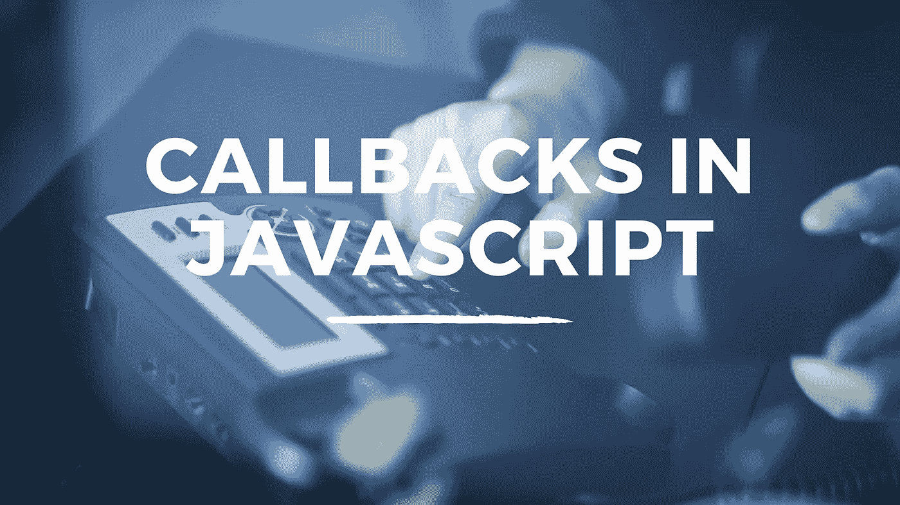

# 在 JavaScript 中引入回调

> 原文：<https://javascript.plainenglish.io/introducing-callbacks-in-javascript-8c01bcbf65db?source=collection_archive---------14----------------------->

## JavaScript 回调初学者入门



我最近写了一篇关于 JavaScript 中高阶函数的文章。高阶函数的一个特点是可以将一个函数作为参数传递给另一个函数。

## 什么是回调？

当我们将一个函数作为参数传递给另一个函数，并且该函数在外部函数或父函数中被调用时，我们就创建了一个回调函数。如果您在 JavaScript 中使用了内置方法，那么很可能您已经使用了回调。让我们看一个基本的例子。

```
function greet(cbFunc) {
  cbFunc();
  cbFunc();
}function sayHello() {
  console.log("Hello");
}greet(sayHello);//Returns --->
'Hello'
'Hello'
```

在上面的例子中，我们创建了一个名为 *greet* 的函数声明，它接受一个参数 *cbFunc* 。在函数体内， *cbFunc* 被调用两次。然后，我们创建另一个名为 *sayHello* 的函数声明，在这个函数的主体中，我们使用 console.log *Hello* 。这将是我们的回调函数。然后我们调用 *greet* 函数并传入 *sayHello* 作为参数，这样它就成为了回调函数。

当我们使用回调函数时，我们经常使用匿名函数，而不是现有的函数。这样做的原因是，如果回调函数不会在其他地方使用，那么就没有必要在回调代码中存储命名函数。在下面的示例中，我们更新代码以使用匿名函数:

```
function greet(cbFunc) {
  cbFunc()
  cbFunc()
}greet(function() {
  console.log("Hello");
})//Returns --->
'Hello'
'Hello'
```

我们声明一个名为 greet 的函数声明，它接受一个名为 *cbFunc* 的参数。这将是回调函数，它在函数体内被调用两次。然后，我们调用 *greet* 函数，并将匿名函数作为参数直接传入。当函数运行时，我们得到相同的输出。

如果你已经在 JavaScript 中使用了 *setTimeout* ，那么你已经在使用回调了。 *setTimeout* 函数接受一个回调并在一段时间后执行。让我们看一个例子。

```
setTimeout(() => {
  console.log("Hello");
}, 1000);//Returns ---> 'Hello'
```

在上面的例子中，我们传递一个匿名函数作为对 *setTimeout* 的回调。回调返回一个控制台日志，打印字符串 *Hello* 。一秒钟后，这被打印在屏幕上。

我希望你喜欢这篇文章。请随时发表任何评论、问题或反馈，并关注我以获取更多内容！

*更多内容请看*[***plain English . io***](https://plainenglish.io/)*。报名参加我们的**[***免费周报***](http://newsletter.plainenglish.io/) *。关注我们关于*[***Twitter***](https://twitter.com/inPlainEngHQ)*和*[***LinkedIn***](https://www.linkedin.com/company/inplainenglish/)*。查看我们的* [***社区不和谐***](https://discord.gg/GtDtUAvyhW) *加入我们的* [***人才集体***](https://inplainenglish.pallet.com/talent/welcome) *。**