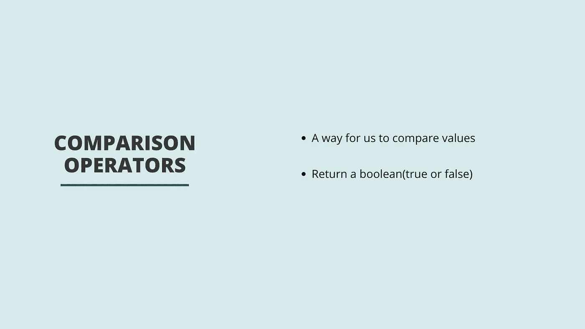
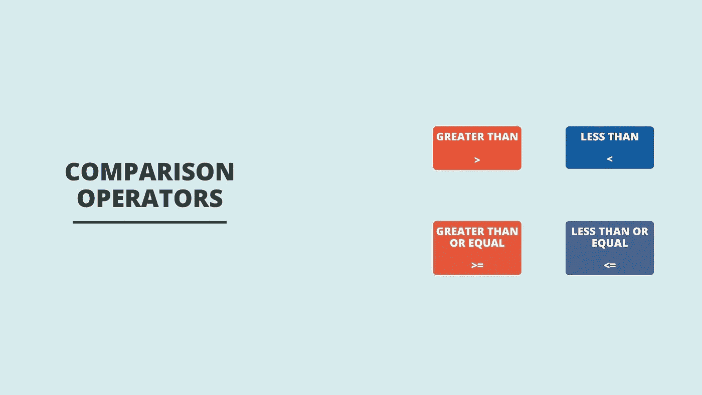
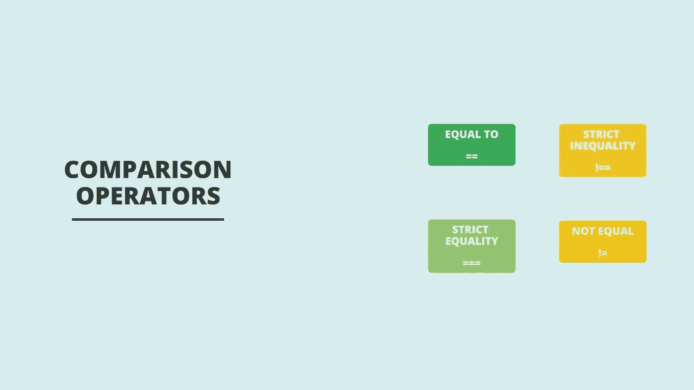

# JavaScript 中的比较运算符简介

> 原文：<https://javascript.plainenglish.io/introducing-comparison-operators-in-javascript-c2334a8fdea1?source=collection_archive---------19----------------------->



JavaScript 为我们提供了一组叫做**比较运算符**的运算符。比较运算符允许我们比较值并返回布尔值(真或假)。

我们要看的第一组运算符是:

*   大于:检查某个值是否大于某个值。
*   小于:检查某个值是否小于某个值。
*   大于或等于:检查某个值是否大于或等于某个值。
*   小于或等于:检查值是否小于或等于某个值。



The first set of comparison operators

如果我们正在制作一个基于超市库存的程序，我们可能会遇到这样一种情况:如果我们有库存香蕉，我们只希望用户能够下订单。为此，我们需要检查可用香蕉的数量是否大于 0，这是使用大于号操作符的一个例子。

稍后，我们可能希望将客户一次订购的香蕉数量限制为 5 个，以确保订购系统公平。在这种情况下，我们希望检查香蕉的订单数是否小于或等于 5，我们将使用小于或等于运算符。



我们将从一个使用大于号操作符的简单例子开始。我们将检查 1 是否小于 2，然后得到 true。

```
1 < 2
// ---> Returns true
```

现在我们继续，检查一是否大于二，我们得到假。

```
1 > 2
// ---> Returns false
```

现在让我们用小于或等于运算符做一个例子。我们将检查 5 是小于还是等于 5，我们得到真值。

```
5 <= 5
// ---> Returns true
```

下一组比较运算符让我们检查一个值是否等于另一个值，并根据是否相等返回一个布尔值。这些运算符包括以下内容:

*   等式运算符(有时称为松散等式)
*   不等式算子(有时称为松散不等式)
*   严格平等
*   严格不等式

在 JavaScript 中，我们有所谓的松散相等和严格相等。当我们使用松散的等式操作符时，Javascript 执行所谓的**类型强制**。

类型强制是一种数据类型到另一种数据类型的自动转换。因此，如果我们想比较整数 0 和包含 0 的字符串，使用松散等式的比较将返回 true。这是因为字符串零将被强制转换为整数类型，然后执行的比较将是数字 0 与数字 0 的比较。另一方面，如果我们使用严格相等运算符执行相同的比较，返回值将为 false，因为严格相等运算符不执行任何类型强制。

因此，让我们从测试等式运算符开始。我们将比较整数 5 和字符串 5。如您所见，我们得到了 true，因为在执行比较之前，字符串 five 被强制转换为 integer 类型。

```
5 == '5'
// ---> Returns true
```

现在让我们再试一次，但是比较整数 5 和字符串 6。这些不相等，所以我们得到假。

```
5 == '6'
// ---> Returns false
```

如果我们再次这样做，并使用不等式操作符，我们会得到 true，因为不等式操作符会检查值是否不相等。

```
6 != '6'
// ---> Returns true
```

最后，我们将看看严格的等式操作符。我们将比较整数十和整数十。这两个值是相同的，所以我们得到真。

```
10 === 10
// ---> Returns true
```

让我们试着稍微改变一下，比较一下整数 10 和字符串 10。现在我们得到 false，这是因为我们使用了严格的等式运算符，因此这次字符串不会被强制。

```
10 === '10'
// ---> Returns false
```

但是，如果我们使用严格的不等式运算符检查这些值是否相等，我们将得到 true，因为它们不属于同一数据类型。

```
10 !== '10'
// ---> Returns true
```

请随意发表任何评论、问题或反馈！

你可以在这里观看这篇文章的视频:

我还有一门 Udemy 的课程，涵盖了这个话题以及更多。

下次见！

*更多内容看* [***说白了。报名参加我们的***](http://plainenglish.io/) **[***免费周报***](http://newsletter.plainenglish.io/) *。在我们的* [***社区获得独家访问写作机会和建议***](https://discord.gg/GtDtUAvyhW) *。***