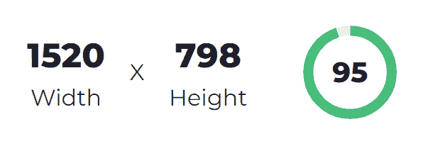

# 介绍 CropScore:内容创作者✂️✨的图像裁剪器

> 原文：<https://javascript.plainenglish.io/introducing-cropscore-an-image-cropper-for-content-creators-9c9b3686eee1?source=collection_archive---------22----------------------->

如果你是一个内容创作者，在你的材料发布后，你可能会遇到拉伸、收缩、不居中或像素化的图像。这些大多是由于上传的图像分辨率低或长宽比不合适造成的。

视觉材料最受关注，也是为你的作品创造专业印象的主要标准之一，因此正确处理尤为重要。举例来说，没有什么比封面图片格式不佳的优秀博客更糟糕的了。

在这个月，我想出了一个解决方案，让你忘记所有分辨率和长宽比的技术问题。在这篇文章中，我们将回顾它。

> 💻该项目位于: [cropper.madza.dev](https://cropper.madza.dev)
> 
> 💾代码可从 [GitHub repo](https://github.com/madzadev/cropper) 获得

这个项目是作为 [Hashnode](https://hashnode.com) 和 [Netlify](https://netlify.com) 黑客马拉松的参赛项目而特别构建的。这是一次很棒的经历，因为参与激励了我，我想出了一个产品，希望也能让其他人受益。

## 分辨率和长宽比有什么关系？👀

我相信你已经知道这两者的定义了:

*   图像分辨率将图像大小描述为其包含的像素数。用宽度对高度来表示，比如“1920x1080”。
*   图像的纵横比是其宽度与高度的比例，用冒号分隔的两个数字表示，如“16:9”。

如果分辨率已知，就可以计算出长宽比。换一种方式，如果纵横比已知，您可以放大和缩小图像，直到它达到某个分辨率。

## 内容创作者最头疼的问题🤯

上传的推荐分辨率通常是隐藏的。有时网站会在上传按钮下面有一个注释，但是对于自定义分辨率，我们必须首先找到正确的纵横比，然后使用第三方工具来放大或缩小。

一些网站试图通过在上传步骤使用裁剪工具来解决这个问题，但即使他们这样做了，你可能仍然会在上传后得到一个像素化的图像，因为只设置了正确的纵横比，而没有提供关于推荐分辨率的信息。

最重要的是，不同的网站可能使用不同的图像处理技术。如果上传的图像没有提供所需的纵横比，它可能会被定位为适合父容器的宽度或高度。

手动使用浏览器开发工具来检查图像分辨率，计算它们的比例，并使用外部工具，如 [GIMP](https://www.gimp.org/) 或 [Photoshop](https://www.adobe.com/products/photoshop.html) 来裁剪图像，并不是最有效的方法。在 [Canva](https://canva.com) 中创建几十个分辨率模板可能也不是最好的解决方案。

我们应该关注内容创作本身。分辨率和长宽比应该是我们最不担心的事情。这就是我创建 [CropScore](https://cropper.madza.dev) 的原因。

## CropScore 是如何工作的？✨

[CropScore](https://cropper.madza.dev) 计算实时裁剪适合目标用途的程度的分数(从名称开始)。你所要做的就是拖动看看魔法。

该应用程序提供了一些与内容创建相关的最受欢迎的网站的常用图像预设。一旦选择了预设，正确的宽高比就被锁定，并且分辨率可以根据分数进一步改变。

## CropScore 组件⚛️

当用户拖动裁剪窗口时， [CropScore](https://cropper.madza.dev) 会给用户一个合适的分数，它以百分比的形式描述了裁剪窗口和目标使用之间的匹配程度。

例如，如果上传的推荐分辨率(由目标站点提供)为 1600x840，而您在应用程序中的当前裁剪窗口大小为 800x420，则裁剪分数将为 50。

很明显，你的目标是 100，虽然接近的值也可以，因为大多数网站显示的实际图像分辨率较低。

推荐的分辨率通常设置得较高，因为它允许进行布局更改，这可能需要在将来以更高的分辨率显示图像。

## 定制尺寸呢？🗜️

有了 [CropScore](https://cropper.madza.dev) ，您不仅仅局限于普通图像类型的预定义值。事实上，一旦你需要更多的定制选项，天空就是极限。

在自定义面板中，用户可以绘制任何他们想要的裁剪窗口大小。裁剪窗口在 X 轴和 Y 轴上都是灵活的。

用户可以输入具体的分辨率和长宽比。提供了输入验证，因此如果用户输入了无法在图像上执行的配置，将会显示警告消息。

用户还可以锁定特定的分辨率和长宽比。这样，拖动窗口将始终保持初始拖动区域的宽度和高度比例。只需输入它，锁定它，然后拖动它到任何你想要的分辨率。

在自定义模式下，应用程序将根据图像宽度计算 CropScore，返回以下格式:标清(标清)、高清(高清)、FHD(全高清)和 UHD(超高清)，因为没有推荐的分辨率进行比较。

## 图像处理🕹️

由于画布下面的 UI，用户可以完全控制图像本身和在图像上创建的裁剪区域。

各种动作按钮提供了拖动、移动、缩放、旋转、变换和重置的功能。如果需要精确裁剪，并且不能在初始加载时对图像进行裁剪，那么所有这些都特别有用。

为了给用户保留最大的灵活性，裁剪窗口在预置和定制模式下都是可移动的。由于辅助网格系统，用户能够实现居中的作物。

## 下载图像💾

一旦完成调整，就该下载图像了。

您可以选择 JPG 和 PNG 格式。最终的图像名称将在原始名称的末尾加上"-cropped "，因此您可以很容易地知道哪个图像是通过 [CropScore](https://cropper.madza.dev) 处理的。

## 在任何设备上使用

需要即时裁剪图像吗？没问题！所有桌面功能在平板电脑和移动设备上都完全可用:

## 功能列表📋

*   图像上传—支持的格式 JPG 和 PNG
*   预设—目前有来自 10 个常用平台的 33 个预设
*   自定义模式—允许用户切换到自定义分辨率
*   比率锁定—用户可以锁定任何自定义纵横比
*   输入验证—无效输入的信息性警告消息
*   移动工具—用户可以四处移动图像
*   缩放工具—放大或缩小图像以获得精确的裁剪
*   旋转工具—顺时针或逆时针旋转图像，增量为 45 度
*   变换图像—在 X 或 Y 轴上交换图像
*   辅助网格-为居中提供帮助
*   分辨率数据—在您调整裁剪窗口大小时实时更新
*   裁剪分数—适合目标用途的实时裁剪分数
*   图像预览—允许用户预览裁剪
*   重置—将图像和裁剪窗口重置为上传图像时的状态
*   下载—下载巴布亚新几内亚和 JPG 的图像
*   响应式—在任何设备上使用

## 我用🛠️的技术堆栈

[Next.js](https://nextjs.org/) — React 应用框架

[反应裁剪器](https://www.npmjs.com/package/react-cropper) —用于核心裁剪器功能

[平面图标](https://www.flaticon.com/)，[反应图标](https://react-icons.github.io/react-icons/) —图标

[脉轮 UI](https://chakra-ui.com/)——针对组件

[GitHub](/github.com) —托管代码

[Netlify](https://netlify.com) —部署项目

[ESLint](https://eslint.org/) ，[更漂亮](https://prettier.io/) —用于林挺和代码格式化

[Namecheap](https://www.namecheap.com/) —用于自定义子域(在 Netlify 上配置)

## 谁会从 CropScore 中受益？👍

CropScore 旨在将内容创作者作为主要目标受众。对于那些跨不同平台交叉发布内容的人来说，这应该特别有用。

不过，由于它的定制选项，其他人也可以有效地使用它。

## 未来改进计划🔮

目前支持的平台有 [Hashnode](https://hashnode.com) 、 [DEV](https://dev.to) 、 [Medium](https://medium.com) 、 [Hackernoon](https://hackernoon.com) 、 [Twitter](https://twitter.com) 、 [LinkedIn](https://linkedin.com) 、 [YouTube](https://youtube.com) 、 [Pinterest](https://pinterest.com) 、[脸书](https://facebook.com)、 [Instagram](https://instagram.com) 。将来，我可能会添加用户推荐的其他网站。

我的目标是跟踪网站未来的布局变化，这可能会影响图像分辨率和纵横比的使用，以及添加新引入的媒体类型。

## 最终注释🙌

CropScore 是一个开源项目，代码可以在 [GitHub 库](https://cropper.madza.dev)上找到。欢迎功能请求。该项目受麻省理工学院[许可](https://choosealicense.com/licenses/mit/)条款的约束。

我很高兴我有机会创建一个实用程序，让 [Hashnode](https://hashnode.com) 社区也能从中受益。用户的定制意见是他们的主要优先事项之一，因此，有更多不同的图像类型可以上传。

同样，感谢 [Netlify](https://netlify.com) 给我这个机会！在这次黑客马拉松之前，我已经在那里主持了[多个项目](https://madza.hashnode.dev/8-projects-to-build-to-master-your-front-end-skills),我会推荐给那些正在寻找一个易于配置且有效的解决方案来部署他们的应用的人。

建设项目一直是我的激情所在，帮助和激励他人让我感到快乐。如果您有任何问题，请随时联系我们！

在 [Twitter](https://twitter.com/madzadev) 、 [LinkedIn](https://www.linkedin.com/in/madzadev/) 和 [GitHub](https://github.com/madzadev) 上连接我！

访问我的[组合](https://madza.dev/code)获得更多这样的项目！

*更多内容请看*[***plain English . io***](https://plainenglish.io/)*。报名参加我们的* [***免费周报***](http://newsletter.plainenglish.io/) *。关注我们关于*[***Twitter***](https://twitter.com/inPlainEngHQ)*和**[***LinkedIn***](https://www.linkedin.com/company/inplainenglish/)*。加入我们的* [***社区***](https://discord.gg/GtDtUAvyhW) *。**