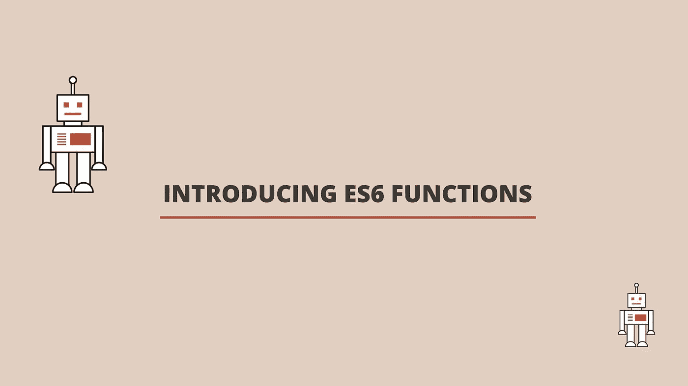

# JavaScript 中的 ES6 箭头函数和参数

> 原文：<https://javascript.plainenglish.io/introducing-es6-arrow-functions-and-parameters-766b3d929558?source=collection_archive---------7----------------------->



## 函数表达式

函数表达式描述了函数何时存储在变量中。我们可以声明一个命名函数表达式，其中的函数有一个名字，但通常函数表达式没有名字，所以我们称之为匿名函数。当我们只想将函数作为参数传递给另一个函数时，匿名函数特别有用。这种可能性背后的原因是因为函数是 JavaScript 中的对象。当你调用一个函数表达式时，你使用的是变量名而不是函数名。当你使用一个函数表达式时，JavaScript 解释器不会对函数做任何事情，直到它到达初始化函数的那一行。让我们来看一个函数表达式的例子。

```
const myFavouriteGame = function(game) {
  return `My favourite game is: ${game}.`
};myFavouriteGame("Monopoly");
//Returns ---> 'My favourite game is: Monopoly.'
```

上面的例子声明了一个名为 *myFavouriteGame* 的变量，它是用匿名函数初始化的。该函数采用参数*游戏*。在函数体内，使用一个模板文本，返回一个值为*游戏*的字符串。

## 箭头功能

Es6 引入了箭头函数语法，这意味着我们可以省略关键字 *function* 。下面是上面例子的重复，但是这次使用了一个箭头函数。

```
const myFavouriteGame = (game) => {
  return `My favourite game is: ${game}.`
};myFavouriteGame("Monopoly");
//Returns ---> 'My favourite game is: Monopoly.'
```

## 单线箭头功能

如果我们只需要从函数中返回一个值，我们可以进一步简化，省略花括号和关键字 return，所以我们只使用一行语句。下面的例子和上面的一样，但是这次使用了单线箭头函数。

```
const myFavouriteGame = (game) => `My favourite game is: ${game}.`;myFavouriteGame("Monopoly");
//Returns ---> 'My favourite game is: Monopoly.'
```

## 箭头函数参数

我们将字符串 *Monopoly* 作为参数 *game* 的函数的参数。如果我们只使用一个参数，arrow 函数可以让我们进一步简化函数。如果是这种情况，我们可以省略参数周围的括号，如下例所示。不过请注意，这仅在仅使用一个参数时才有可能。如果使用一个以上的参数，必须使用括号。

```
const myFavouriteGame = game => `My favourite game is: ${game}.`;myFavouriteGame("Monopoly");
//Returns ---> 'My favourite game is: Monopoly.'
```

## 默认参数

ES6 还引入了默认参数。这些允许我们在使用参数时设置默认值，以防在调用函数时没有给定参数，否则将是未定义的。下面的第一个例子显示了如果我们不使用缺省参数，而返回值是 undefined，会发生什么。

```
const myFavouriteGame = game => `My favourite game is: ${game}.`;myFavouriteGame();
//Returns ---> 'My favourite game is: undefined.'
```

接下来让我们看看同一个例子，但这次我们将在函数中设置默认参数。请注意，这需要我们使用括号，如果我们不这样做，我们将得到一个语法错误。

```
const myFavouriteGame = (game = "Monopoly") => `My favourite game is: ${game}.`;myFavouriteGame();//Returns ---> 'My favourite game is: Monopoly.'
```

最后让我们看一下同一个例子，但是这次我们将在调用函数时传入一个参数。

```
const myFavouriteGame = (game = "Monopoly") => `My favourite game is: ${game}.`;myFavouriteGame("Chess");//Returns --> 'My favourite game is: Chess.'
```

## 休息参数

如果我们想创建一个使用任意数量参数的函数，那么我们可以使用 rest 参数。其余部分由三个点(…)组成。传递给函数的参数存储在一个数组中，这个数组可以从函数体中访问。

```
const myFavouriteGames = (...games) => `We have ${games.length} games`;myFavouriteGames("Monopoly", "Chess");
//Returns ---> 'We have 2 games'
```

上面的例子修改了前面的例子，使用了 rest 参数和一个名为 games 的数组。当我们调用这个函数时，我们传入两个参数，*垄断*和*象棋*。在函数内部，我们修改了字符串以返回*游戏*数组的长度。当我们传入两个参数时，返回的字符串表示我们有两个游戏。

我希望你喜欢这篇文章，如果你想看这篇文章的视频，请看下面。

欢迎发表任何评论、问题或反馈，并关注我以获取更多内容！

*更多内容看* [***说白了就是 io***](https://plainenglish.io/) *。报名参加我们的* [***免费周报***](http://newsletter.plainenglish.io/) *。关注我们关于*[***Twitter***](https://twitter.com/inPlainEngHQ)*和*[***LinkedIn***](https://www.linkedin.com/company/inplainenglish/)*。加入我们的* [***社区***](https://discord.gg/GtDtUAvyhW) *。*