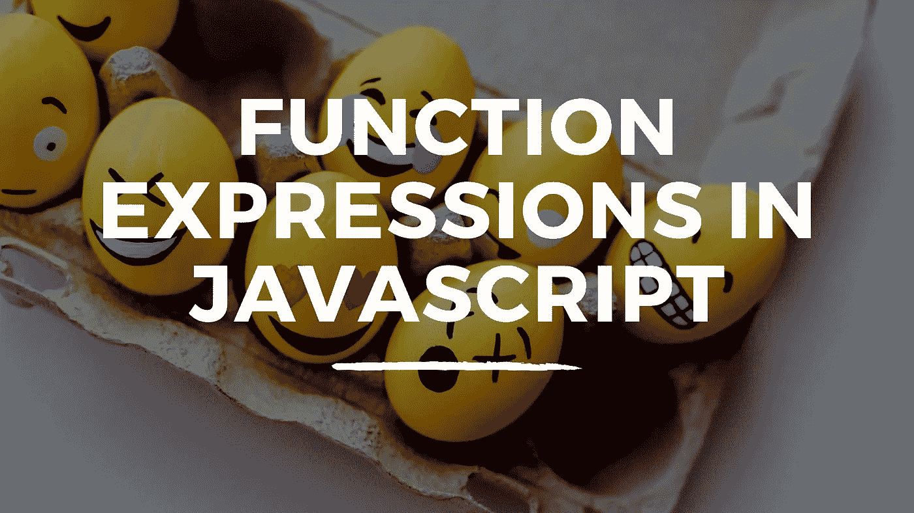

# JavaScript 中的函数表达式简介

> 原文：<https://javascript.plainenglish.io/introducing-function-expressions-in-javascript-4867237709c5?source=collection_archive---------11----------------------->

## JavaScript 中函数表达式的介绍



## 函数声明

当我们开始学习如何用 JavaScript 编写函数时，我们通常从使用函数声明(也称为函数语句)开始。如果我们有一个函数，我们想返回一个字符串，使用函数声明，我们将通过下面的例子来实现。

```
function sayHello(name) {
  return `Hello ${name}`;
}sayHello("Bob");
//Returns ---> Hello Bob
```

在上面的例子中，我们声明了一个名为 *sayHello* 的函数，并设置了一个名为 *name* 的参数。在函数体内，我们返回一个模板文本，它插入了*名*参数。当我们调用函数时，我们为 name 参数传入参数 *Bob* 。

## 函数表达式

当我们使用一个函数表达式时，函数的作用是一样的，但是我们把函数存储在一个变量中。JavaScript 中的函数是对象，这意味着我们能够做到这一点。让我们以最初的例子为例，但这次我们将使用函数表达式来创建它。

```
const sayHello = function(name) {
 return `Hello ${name}`;
}sayHello("Bob");
//Returns ---> Hello Bob
```

在上面的例子中，我们声明了一个名为 *sayHello* 的变量，并为其指定了一个本身没有名字的函数。函数体的工作方式和以前一样。当我们调用函数时，我们使用变量的名称，在我们的例子中是 *sayHello* 。我们得到相同的返回值。

我希望您喜欢这篇关于用 JavaScript 创建函数表达式的文章。更多内容请关注我。

*更多内容看* [***说白了。报名参加我们的***](https://plainenglish.io/) **[***免费周报***](http://newsletter.plainenglish.io/) *。关注我们*[***Twitter***](https://twitter.com/inPlainEngHQ)*和*[***LinkedIn***](https://www.linkedin.com/company/inplainenglish/)*。查看我们的* [***社区不和谐***](https://discord.gg/GtDtUAvyhW) *加入我们的* [***人才集体***](https://inplainenglish.pallet.com/talent/welcome) *。***