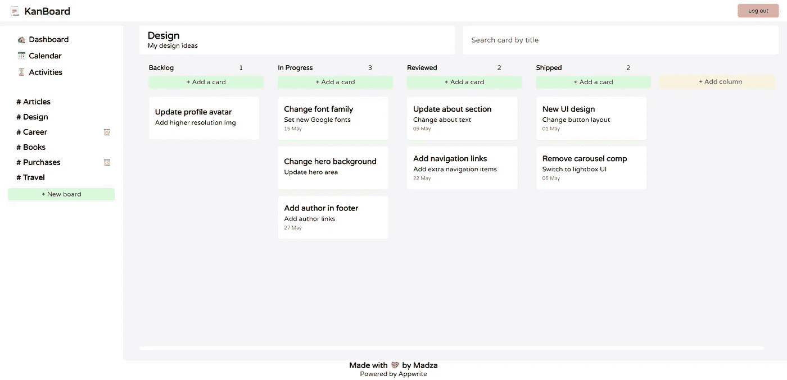

# 介绍 Kan board——您的个人项目管理工具

> 原文：<https://javascript.plainenglish.io/introducing-kanboard-your-personal-project-management-tool-aef99afd7a78?source=collection_archive---------11----------------------->

## 安装指南，功能和我用来构建 KanBoard 的技术堆栈。


无论是 web 开发、写文章，还是实现个人目标，适当的规划一直都是至关重要的。这让我们可以将主要任务分成小部分，跟踪进度，并为每项任务设定切实可行的最后期限。

我看到了四月中旬宣布的[DEV](https://dev.to)x[app write](https://appwrite.io)hackathon，并且知道这是一个构建我自己的自主项目管理工具的绝佳机会。这就是 KanBoard 的诞生。



在本文中，我们将浏览我提交的安装指南、特性和技术堆栈。

## 提交类别:Web2 向导

## 该项目可在 [GitHub](https://github.com/madzadev/kanboard) 上获得

[](https://github.com/madzadev/kanboard) [## GitHub - madzadev/kanboard:📃看板-你的个人项目管理工具

### 你的个人项目管理工具为了建立你自己的 KanBoard 实例，你必须首先安装 Docker…

github.com](https://github.com/madzadev/kanboard) 

## 装置

为了设置您自己的 KanBoard 实例，您必须首先安装 Docker，设置 Appwrite，创建必要的数据集合，克隆 KanBoard repo，并配置环境变量。

我们将在下面更详细地介绍一切:

`1️⃣`要安装 [Docker](https://docker.com) ，请在此查看官方安装指南[。](https://docs.docker.com/get-docker/)

`2️⃣`接下来，根据您使用的操作系统，您必须使用以下命令安装 [Appwrite](https://appwrite.io) :

*   Mac / Linux 或 Unix 兼容:

```
docker run -it --rm \
    --volume /var/run/docker.sock:/var/run/docker.sock \
    --volume "$(pwd)"/appwrite:/usr/src/code/appwrite:rw \
    --entrypoint="install" \
    appwrite/appwrite:latest
```

*   Windows(命令提示符)

```
docker run -it --rm ^
    --volume //var/run/docker.sock:/var/run/docker.sock ^
    --volume "%cd%"/appwrite:/usr/src/code/appwrite:rw ^
    --entrypoint="install" ^
    appwrite/appwrite:latest
```

*   Windows (PowerShell)

```
docker run -it --rm ,
    --volume /var/run/docker.sock:/var/run/docker.sock ,
    --volume ${pwd}/appwrite:/usr/src/code/appwrite:rw ,
    --entrypoint="install" ,
    appwrite/appwrite:latest
```

`3️⃣`接下来，打开 Docker，运行 Appwrite 应用。此时，您应该能够通过 [localhost](http://localhost) 访问 Appwrite 控制台。创建一个帐户，登录并创建一个新项目。


`4️⃣`要初始化您的 SDK 并与 Appwrite 服务交互，您需要向您的项目添加一个 Web 平台。为此，选择您创建的项目，然后单击“添加平台”按钮。

`5️⃣`创建四个数据库集合:帖子、专栏、公告板和活动。


现在为每个集合设置属性和索引，如下所示:

🔻**帖子属性和索引**


🔻**列属性和索引**


🔻**板卡属性**


🔻**活动属性**


`6️⃣`进入每个集合的设置，将读写权限设置为`role:member`。


`7️⃣`导航至用户面板，添加一个新用户，您将使用该用户登录您的应用程序并访问看板。

`8️⃣`通过运行`git clone https://github.com/madzadev/kanboard.git`将 repo 克隆到你的机器上，然后在`cd kanboard`之前将工作目录转换到其中，并在`npm install`之前安装项目包。

`9️⃣`用命令`cp .env.example .env.local`克隆 env 文件。在新创建的`.env.local`文件中，填写来自 Appwrite 控制台的密钥。前两个可以在看板项目的设置中找到。其他四个可以在每个系列的设置中找到。

`1️⃣0️⃣`运行命令`npm run dev`启动 app。

## 证明

一旦你完成了所有的设置，并且你的应用程序正在运行，你应该会在 [localhost:3000](http://localhost:3000) 上看到登录界面。


要求用户提供电子邮件地址和密码。这些应该与您在安装步骤中在 [Appwrite](https://appwrite.io) 控制台中创建用户时提供的记录相匹配。

## 统计数据

登录后，用户将看到 stats 页面。


这些包括在整个应用程序中创建的所有卡片、栏和板。

用户还可以看到应用程序上执行的最后活动，如创建、编辑和删除卡片、栏和板。活动按最近的排列在顶部，每个活动都有一个时间属性，以查看操作是何时执行的。

还有即将和之前的任务。同样，当任务已经/计划完成时，这两种类型的任务都按照顶部带有时间属性的最新任务进行排序。

## 行动历史

对于更详细的行动历史，也有一个活动页面。


活动按列排序。第一列列出所有添加的操作，第二列是所有编辑操作，第三列显示所有最近删除的电路板、列和卡。

每一列都按最近的活动排序，每一张卡片都包含描述操作执行时间的时间戳。

## 日历

所有用户任务也可以在日历视图中查看。


用户能够在不同月份之间导航，以查看过去和未来的任务。日历上的当天被突出显示，用户可以通过“今天”按钮从任何月份访问它。

如果同一天有多个任务，这些任务将依次显示在下方。

## 添加/删除板和栏

要开始使用该应用程序，用户必须创建至少一个董事会和列。


可以随时添加新的板。你需要提供公告板的标题和公告板内容的描述。

创建完成后，用户将被带到新创建的电路板，在创建模式中提供的所有信息将显示在电路板标题中。

可以随时为任何板添加新列。您需要提供该列的标题。它将显示在列的顶部，显示包含的卡的数量。


如果该列中没有卡片，则可以将其删除。如果板中没有列，可以将其删除。

在这两种情况下，警告模式都会出现，以确保用户确实想要删除该板/列。

## 添加新卡

当至少有一块板和一列在里面时，可以创建一张新卡。


要创建卡，用户单击列顶部的 Add a card 按钮，在 modal 中填写必要的信息，然后保存卡。

之后，页面将刷新并从服务器获取新数据，显示添加到列中的新卡。

## 查看/更新/删除卡片

任何卡片都可以通过点击打开。该卡将在 modal 上打开，所有数据都提取在其中。这是查看卡片的只读模式。


为了编辑卡片，用户必须单击卡片右上角的编辑图标，字段将变为可编辑状态，并可选择保存更改。


为了删除卡片，用户必须点击卡片右上角的删除按钮。这将弹出删除警告消息，以确保用户接受删除操作。

## 输入验证

对于应用程序中的每个输入字段，都提供了输入验证。


如果用户试图提交所需的空值，将显示警告消息。

## 四处移动卡片

用户可以垂直和水平移动卡片。


垂直移动卡片允许用户改变特定列中卡片的顺序，而水平拖动允许用户在不同列之间交换卡片。

拖放功能带有现代外观的效果，以改善 UX，使您的工作流程感觉更自然。

## 垂直/水平滚动

如果卡片在视窗之外，滚动功能可用。


如果列中的卡片在视图之外，列表右侧的垂直滚动条将会出现。

如果列本身出现在视图之外，则水平滚动条会出现在列包装器下。

## 按标题搜索卡片

一旦你创建了大量的卡片，搜索功能可能会派上用场。


用户能够通过卡片标题搜索卡片。当用户键入搜索查询时，结果会实时显示。

## 注销

完成后，用户可以注销。


这将把用户带回到登录屏幕。

## 我使用的技术堆栈:

[Next.js](https://nextjs.org/) — React 应用框架

[app write](https://appwrite.io)——[开源](https://github.com/appwrite/appwrite)端到端后端服务器

[react-beautiful-dnd](https://www.npmjs.com/package/react-beautiful-dnd) —用于拖放功能

[react-hook-form](https://www.npmjs.com/package/react-hook-form) —跟踪输入状态并提供验证

[模态对话框](https://www.npmjs.com/package/@atlaskit/modal-dialog) —为用户交互提供模态对话框

[FullCalendar](https://www.npmjs.com/package/fullcalendar) —按月显示用户任务

[反冲](https://www.npmjs.com/package/recoil) —一套状态管理的工具

[url-slug](https://www.npmjs.com/package/url-slug) ， [Day.js](https://www.npmjs.com/package/dayjs) —用于 slug 创建和日期格式化的帮助程序库

## 未来计划

我可能会考虑添加额外的认证方法。我们大多数人都使用像 [Twitter](https://twitter.com) 和 [GitHub](https://github.com) 这样的平台，所以 OAuth 解决方案会很棒，它已经得到了[账户 API](https://appwrite.io/docs/client/account) 的支持。

如果我遇到需要扩展应用程序以与某人合作，我会考虑为应用程序添加成员系统，其中有一个邀请系统和一个通过[用户 API](https://appwrite.io/docs/server/users) 为每个成员设置角色的选项。

目前，用户能够存储文本和日期。我可能会考虑将它扩展到文件上传，因为 Appwrite 附带了一个有用的存储 API。

## 结论

首先，我要感谢 [Forem](https://www.forem.com/) 创建并积极维护这样一个令人敬畏的平台，在这里我们可以学习，并分享我们的发现。我发现这个黑客马拉松是因为[开发](https://dev.to)！

我很高兴我发现了 [Appwrite](https://appwrite.io) ！我学会了一种创建后端系统和存储数据的新方法。文档写得很好，控制台中的 UI 非常直观。

另外， [KanBoard](https://github.com/madzadev/kanboard) 是一个拥有[麻省理工许可](https://choosealicense.com/licenses/mit/)的开源项目。欢迎拉取请求。

在 [Twitter](https://twitter.com/madzadev) 、 [LinkedIn](https://www.linkedin.com/in/madzadev/) 和 [GitHub](https://github.com/madzadev) 上连接我！

访问我的[投资组合](https://madza.dev/blog)更多这样的项目。

*更多内容看* [***说白了。报名参加我们的***](https://plainenglish.io/) **[***免费每周简讯***](http://newsletter.plainenglish.io/) *。关注我们关于*[***Twitter***](https://twitter.com/inPlainEngHQ)*和**[***LinkedIn***](https://www.linkedin.com/company/inplainenglish/)*。加入我们的* [***社区不和谐***](https://discord.gg/GtDtUAvyhW) *。****