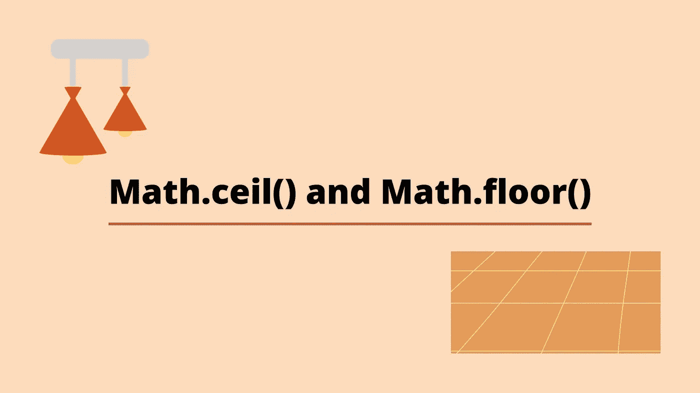
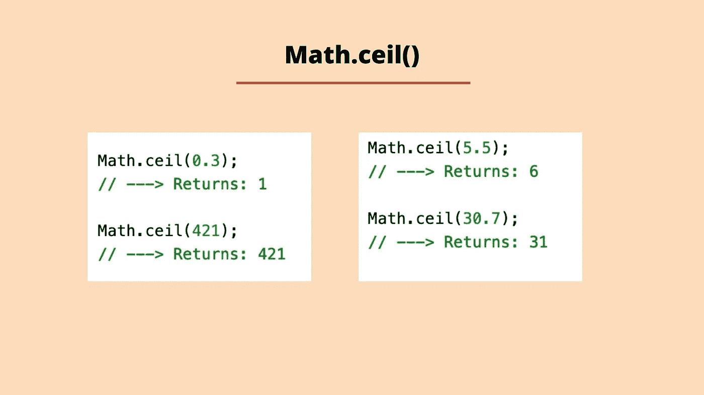
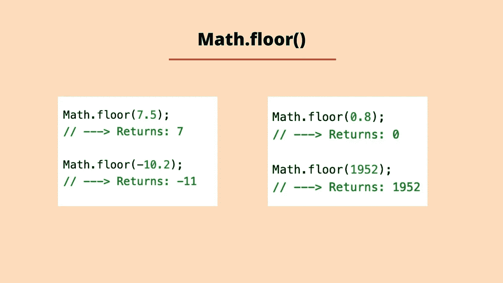

# 介绍 Math.ceil()和 Math . floor():JavaScript 中 Math 对象的两种方法

> 原文：<https://javascript.plainenglish.io/introducing-math-ceil-and-math-floor-4c106f83e7b?source=collection_archive---------16----------------------->

## JavaScript 中 Math 对象的两种方法帮助您执行数学计算。



## 标准内置对象

JavaScript 有一套所谓的标准内置对象。这些扩展了语言的功能，帮助我们使用它。有一个日期对象用于处理日期，一个字符串对象用于处理字符串，还有一个数学对象帮助我们进行数学计算。

每个标准内置对象都有一组内置属性和方法。方法本质上是一些内置的功能，允许我们执行一些过程或动作。所有方法都遵循您要调用方法的项的相同结构，后跟一个点、方法名、左括号和右括号。下面的例子说明了这一点:

```
someVariable.methodName();
```

Math 对象是一个全局对象，这意味着要使用附加到它上面的任何属性或方法，您可以使用名称 Math，后跟一个点，再后跟您希望使用的属性或方法名称。我们将会看到两种方法*天花板*和*地板*。

## Math.ceil()

当我们处理浮点数(十进制数值)时，我们可能希望将数值四舍五入为整数。标准的内置数学对象有一个名为 ceil 的方法，它为我们提供了一个解决方案。方法将数字向上舍入到最接近的整数，并返回新值。记住这一点的一个好方法是天花板通常在我们头顶上！该方法的返回值是向上舍入到最接近的整数的浮点数。



## Math.floor()

**Math.floor()** 方法提供了一种将浮点数向下舍入到最接近的整数的方法。新值就是返回值。楼层通常在我们下面，所以数字四舍五入是有道理的！该方法的返回值是向下舍入到最接近的整数的值。



我希望你喜欢这篇文章，请随时发表任何意见，问题或反馈，并关注我的更多内容！

*更多内容看* [***说白了就是 io***](http://plainenglish.io/) *。报名参加我们的* [***免费周报***](http://newsletter.plainenglish.io/) *。在我们的* [***社区获得独家访问写作机会和建议***](https://discord.gg/GtDtUAvyhW) *。*