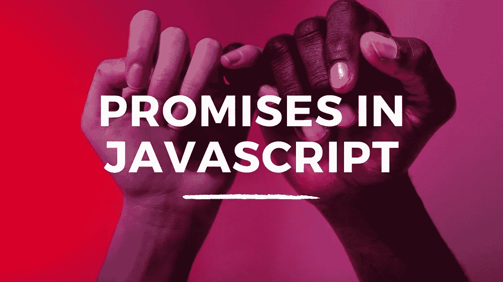
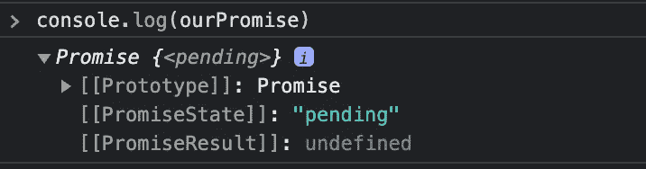
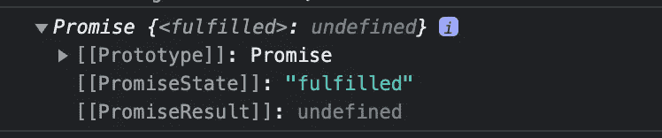
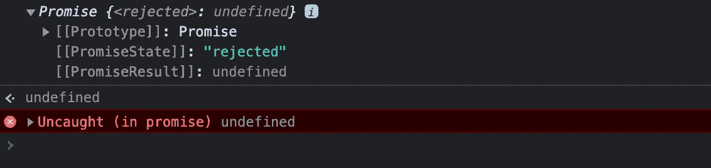

# 在 JavaScript 中引入承诺

> 原文：<https://javascript.plainenglish.io/introducing-promises-in-javascript-62b7558aebf2?source=collection_archive---------5----------------------->

## 新手承诺循序渐进指南。



如果你想看这篇文章的视频，可以在下面找到。

## 什么是异步？

通常，当你在 JavaScript 中听到承诺时，你也会听到**异步**这个词。什么是异步？首先，我们有同步，这意味着一步一步地执行。当你走路时，你把一只脚放在另一只脚的前面，除非你在跳跃，否则你不会同时做这两只脚。另一个例子是等水壶烧开后再泡茶。另一方面，异步意味着您可以在后台做其他事情，而不必停下来等待。这有点像说你可能会在等水壶烧开的时候看电视，而不是站着盯着水壶等它。

JavaScript 是我们所说的单线程语言，这意味着一次只能发生一件事。异步 JavaScript 是后台任务(比如对服务器的请求)可以发生的方式，不会因为等待单个任务完成而导致一切都停止。这意味着异步任务在程序的主流程之外运行。

## 介绍承诺

在你的日常生活中，你经常会在实际行动之前向人们承诺一些事情。也许你说，“我保证我会洗碗，”或者，“我保证我会买些牛奶。”这就是 JavaScript 中承诺的基本工作方式。当你使用承诺时，你通常是在编写异步代码，你是在为将要完成的事情做出承诺或交易。

一旦承诺完成，那么任务要么完成，要么失败。这就像你要么履行了买牛奶的承诺，要么你忘记了，所以你的承诺失败了。

当你在承诺中工作时，有两部分需要理解。创造承诺，然后如何使用承诺。

## 创造承诺

承诺是一个构造函数，所以你必须使用 *new* 关键字，当你创建一个承诺时，它就变成了 *Promise* 。promise 将一个函数作为带有两个参数的实参: *resolve* 和 *reject* 。

Resolve 和 reject 是可以调用的函数，因此需要用括号来执行它们。解决和拒绝用来决定当承诺运行时会发生什么。让我们看看创建承诺的基本语法。

```
const ourPromise = new Promise((resolve, reject) => {});console.log(ourPromise);
```

在上面的例子中，我们使用 const 并声明一个名为 *ourPromise* 的变量。最初，这是未初始化的，但是我们使用关键字 *new* 和 *Promise* (promise 是一个构造函数)。我们传入*解决*和*拒绝*参数。下图显示了*我们的承诺*的控制台日志结果。



## 承诺状态

承诺有三种状态。待定、已完成和已拒绝。我们创建的 *ourPromise* 不解决或拒绝任何事情，因此它将无限期地保持在待定状态。有点像有人等着你出去买你的牛奶。

为了完成一个承诺，我们使用解决或拒绝。解决意味着承诺成功，拒绝意味着失败。任何参数都可以被传递到 resolve 和 reject 中，但通常当我们处理承诺时，我们会发出数据请求，所以它是一个可以从中提取数据的对象。

## 解决和拒绝

让我们更新我们的例子，以显示解决然后拒绝承诺的结果。

```
const ourPromise = new Promise((resolve, reject) => {
  resolve();
});console.log(ourPromise);
```



```
const ourPromise = new Promise((resolve, reject) => {
  reject();
});console.log(ourPromise);
```



当我们下定决心实现我们的承诺时，这个状态就实现了。当我们拒绝它时，这个状态就被拒绝了。现在，我们还将更新我们的示例，以便更好地表示请求。

```
const ourPromise = new Promise((resolve, reject) => {
  let didGetMilk = true;

  if(didGetMilk) {
    resolve("We got the milk");
  } else {
    reject("Ooops we did not get the milk");
  }
});console.log(ourPromise);
//Returns ---> Promise {<fulfilled>: 'We got the milk'}
```

在上面的例子中，我们创建了一个名为 *didGetMilk* 的变量，它可以伪造来自服务器的响应。出于演示目的，我们将此设置为 true。然后，我们使用一个 if/else 语句，该语句根据变量 *didGetMilk* 的值来解析或拒绝承诺。

当我们因为 *didGetMilk* 为真而运行这个函数时，承诺会随着消息一起被解析。如果我们将 *didGetMilk* 设置为 false，承诺将被拒绝，如下例所示。

```
const ourPromise = new Promise((resolve, reject) => {
  let didGetMilk = false;

  if(didGetMilk) {
    resolve("We got the milk");
  } else {
    reject("Ooops we did not get the milk");
  }
});console.log(ourPromise);
//Returns ---> Promise {<rejected>: 'Ooops we did not get the milk'}
```

## 使用承诺和理解

一旦承诺被解决，我们可以使用*然后*来运行代码。*那么*是一个在承诺完成后立即执行的方法。

我们可以向*传递一个回调函数，然后向*传递一个回调函数，这个回调函数的代码将在承诺兑现后运行。让我们更新我们的例子来说明这一点。

```
const ourPromise = new Promise((resolve, reject) => {
  let didGetMilk = true;

  if(didGetMilk) {
    resolve("We got the milk")
  } else {
    reject("Ooops we did not get the milk");
  }
});ourPromise.then(res => {
  console.log(res, "RES");
});console.log(ourPromise);
//Returns ---> 
Promise {<fulfilled>: 'We got the milk'}
We got the milk RES
```

在上面的例子中，我们将 *didGetMilk* 设置回 true，这样承诺将被解析。我们继续使用*然后*的方法来实现我们的承诺。我们为结果设置了一个参数 *res* ,并且我们控制台记录了这个结果。

当 promise 运行时，我们得到已履行的状态，但我们也看到打印的 *res* 参数。 *res* 从我们给 resolve 方法的参数中传递。让我们改变我们给出的论点来巩固我们对此的理解。

```
const ourPromise = new Promise((resolve, reject) => {
  let didGetMilk = true;

  if(didGetMilk) {
    resolve({message: "We got the milk"})
  } else {
    reject("Ooops we did not get the milk");
  }
});ourPromise.then(res => {
  console.log(res.message, "RES");
});console.log(ourPromise);
//Returns ---> 
Promise {<fulfilled>: 'We got the milk'}
We got the milk RES
```

在上面的例子中，我们改变了传递的参数，以解析为一个对象。该对象有一个以字符串为值的*消息*键。我们更新*的控制台日志，然后*回调以打印来自对象的*消息*。

## 捕捉

当承诺被拒绝时，我们通过使用 *catch* 来处理。这与我们使用*然后使用*来解决承诺的方式类似。 *Catch* 承诺被拒绝后会立即执行。让我们看一个例子。

```
const ourPromise = new Promise((resolve, reject) => {
  let didGetMilk = false;

  if(didGetMilk) {
    resolve({message: "We got the milk"})
  } else {
    reject("Ooops we did not get the milk");
  }
});ourPromise
.then(res => {
  console.log(res.message, "RES");
})
.catch(error => {
  console.log(error);
})console.log(ourPromise);
//Returns ---> 
Promise {<rejected>: 'Ooops we did not get the milk'}
Ooops we did not get the milk
```

这一次，当代码运行时，承诺被拒绝，因此 catch 中的代码得到运行，我们得到传递给调用 reject 的参数，并打印到控制台。

我希望你喜欢这篇文章，请随时发表任何意见，问题或反馈，并关注我的更多内容！

*更多内容请看*[***plain English . io***](https://plainenglish.io/)*。报名参加我们的* [***免费周报***](http://newsletter.plainenglish.io/) *。关注我们关于*[***Twitter***](https://twitter.com/inPlainEngHQ)*和*[***LinkedIn***](https://www.linkedin.com/company/inplainenglish/)*。查看我们的* [***社区不和谐***](https://discord.gg/GtDtUAvyhW) *加入我们的* [***人才集体***](https://inplainenglish.pallet.com/talent/welcome) *。*