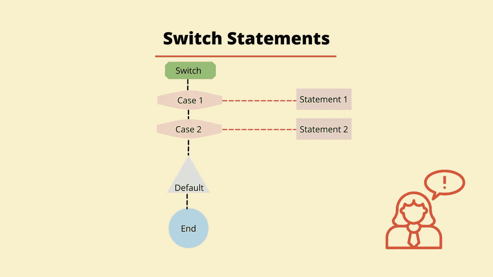

# JavaScript 中的 Switch 语句简介

> 原文：<https://javascript.plainenglish.io/introducing-switch-statements-in-javascript-6b943a957478?source=collection_archive---------18----------------------->

## 什么是 switch 语句？它是一个条件语句，使用事例来计算表达式。



让我们设想一个场景，您正在编写一些代码来检查星期几是否是星期三。您已经决定使用条件语句来实现这一点，但是由于一周中有许多天，您希望检查是否已经使用了许多 *else if* 语句。这将看起来像下面的例子。

```
const day = "Wednesday";if (day === "Monday") {
  console.log("The day is Monday");
} else if (day === "Tuesday") {
  console.log("The day is Tuesday");
} else if (day === "Wednesday"); {
  console.log("The day is Wednesday");
} else if (day === "Thursday") {
  console.log("The day is Thursday");
} else if (day === "Friday") {
  console.log("The day is Friday");
} else {
  console.log("It is the weekend");
}
```

虽然上面的例子可以达到我们的要求，但是 JavaScript 为我们提供了另一种检查这些条件的方法，叫做*开关语句*。

switch 语句是一种条件语句，它使用 cases 来计算表达式。如果没有一个案例与表达式匹配，那么你可以使用一个默认选项来代替，这有点像上面例子末尾的 *else* 。

switch 语句也可以使用关键字 *break* 来停止 switch 语句的其余部分运行。让我们看看上面的例子，但这一次是作为一个开关语句。

```
const day = "Wednesday";switch (day) {
  case "Monday":
    console.log("The day is Monday");
    break;case "Tuesday":
    console.log("The day is Tuesday");
    break;case "Wednesday":
    console.log("The day is Wednesday");
    break;case "Thursday":
    console.log("The day is Thursday");
    break;case "Friday":
    console.log("The day is Tuesday");
    break;default:
    console.log("It's the weekend");
    break;
 }//Returns ---> The day is Wednesday
```

让我们一步一步地完成上面的例子:

*   要创建 switch 语句，首先要使用 switch 关键字。
*   在 switch 关键字之后，我们创建了一对括号，在括号内放置我们想要检查的值。在上面的例子中，这是*日*变量。将使用严格相等来检查该值。
*   接下来，我们继续讨论定义这种情况的案例。我们用关键字 case、该条件的 case 值和一个冒号创建一个 case。在上面的例子中，我们检查了一周中的不同日子，因此我们可以将它们用作案例。因此，在上述 switch 语句的第一种情况下，我们使用关键字 case，后跟字符串 Monday 和冒号:

```
case "Monday":
```

*   接下来，我们定义条件为真时要执行的代码。上面我们只运行控制台日志，但是任何代码都可以放在这里。
*   最后，如果我们不想执行剩余的 case 语句，我们使用关键字 break。
*   我们能够在 switch 语句的末尾定义一个 default 语句，对于在前面的 case 语句中没有找到前面的匹配的情况，这是一个有用的后备语句。

将执行第一个案例中与初始值相等的代码。所以上面的例子会一直运行到下面的情况:

```
case "Wednesday":
    console.log("The day is Wednesday");
    break;
```

如果 case 不使用 break 关键字，那么下面的所有 case 语句(包括 default)也将运行，直到遇到 break 为止。如果我们从案例中删除*星期三*的中断，并再次运行代码，正如我们在下面的示例中可以看到的，我们会打印出“*这一天是星期三”的控制台日志。*然后我们还打印出“*今天是星期四”*的控制台日志，直到有一个中断，代码停止运行 switch 语句的其余部分。

```
const day = "Wednesday";switch (day) {
  case "Monday":
    console.log("The day is Monday");
    break;case "Tuesday":
    console.log("The day is Tuesday");
    break;case "Wednesday":
   return 1 console.log("The day is Wednesday");case "Thursday":
    console.log("The day is Thursday");
    break;case "Friday":
    console.log("The day is Tuesday");
    break;default:
    console.log("It's the weekend");
    break;
 }//Returns ---> 
// The day is Wednesday
// The day is Thursday
```

虽然这种行为在我们有一些想要运行多个案例的代码时很有用，但是如果我们不想让剩余的案例运行，记住包含一个 break 是很重要的。最后，我们将看看*默认*选项是如何工作的。

```
const day = "Sunday";switch (day) {
  case "Monday":
    console.log("The day is Monday");
    break; case "Tuesday":
    console.log("The day is Tuesday");
    break; case "Wednesday":
    console.log("The day is Wednesday");
    break; case "Thursday":
    console.log("The day is Thursday");
    break; case "Friday":
    console.log("The day is Tuesday");
    break; default:
    console.log("It's the weekend");
    break;
 }//Returns ---> It's the weekend
```

在上面的例子中，我们将变量 *day* 的值改为字符串 *Sunday* 。这次运行 switch 语句时，没有一个事例与 day 变量的值匹配。这意味着*默认*案例中的代码被执行，我们得到控制台日志，并打印出字符串*“这是周末”*。

我希望你喜欢这篇文章，请随时发表任何意见，问题或反馈，并关注我的更多内容！

*更多内容看* [***说白了。报名参加我们的***](http://plainenglish.io/) **[***免费周报***](http://newsletter.plainenglish.io/) *。在我们的* [***社区不和谐***](https://discord.gg/GtDtUAvyhW) *获得独家获取写作机会和建议。***