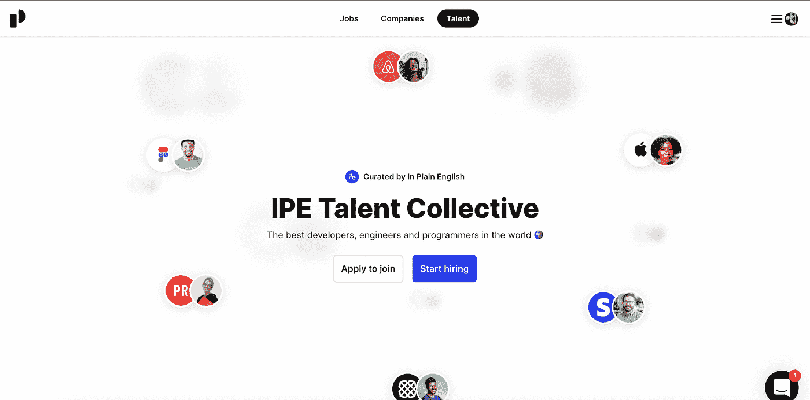
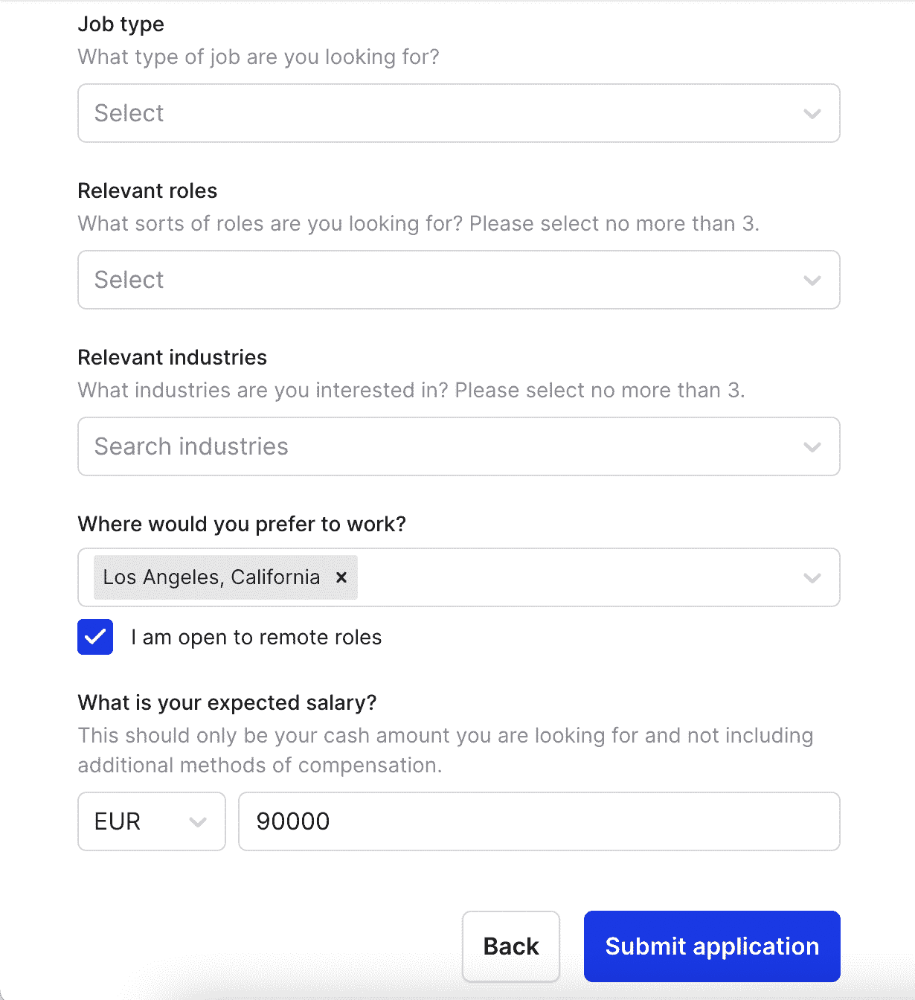
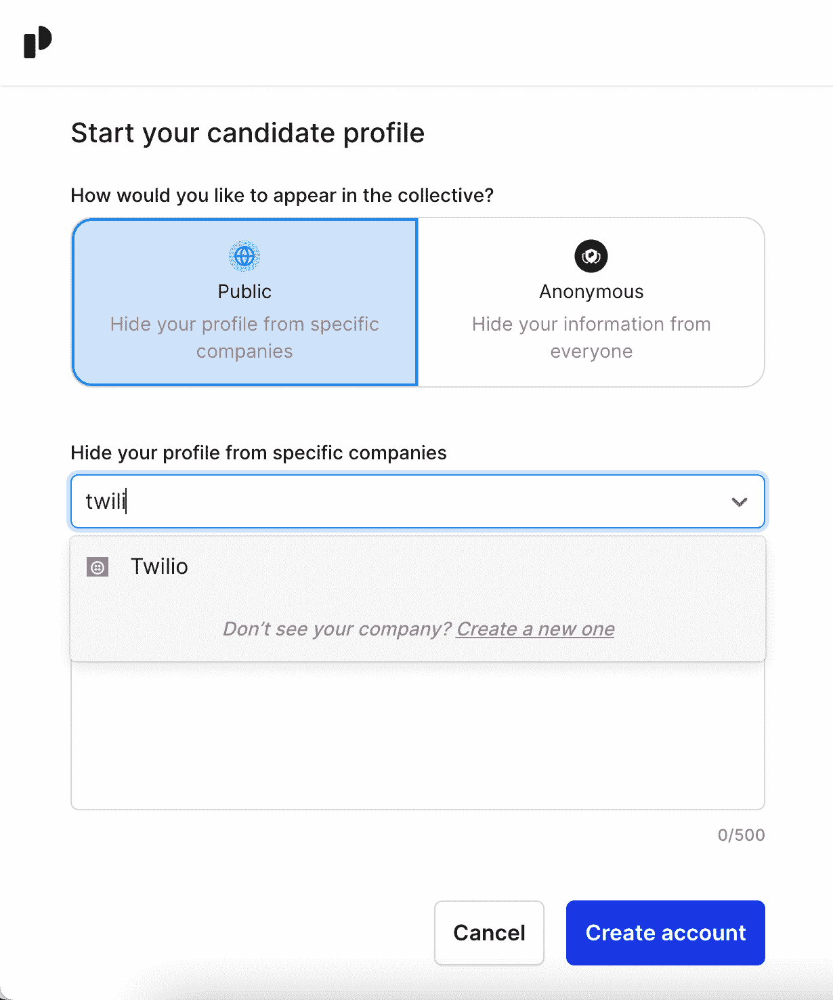
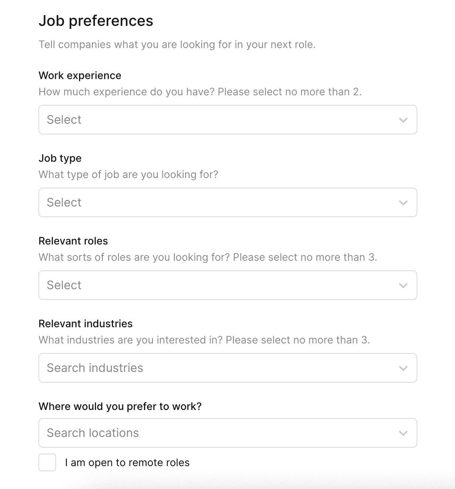
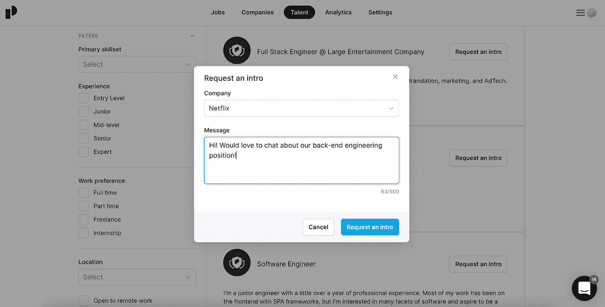

# 介绍 IPE 人才集合:全球天才开发人员的中心

> 原文：<https://javascript.plainenglish.io/introducing-the-ipe-talent-collective-a-hub-for-talented-developers-across-the-globe-45f0fa8e83b?source=collection_archive---------3----------------------->

## 联系全球范围内寻找新员工的专业人才和公司。

作为一名开发人员，想象一下有一个空间，在那里世界上最好的和最有声望的公司可以根据你的个人资料向你寻求工作机会，并在你梦想的地方向你提供你梦想的工作！你也可以指定你的工资范围，并相应地收到报价。您只会收到与您设定的标准相关的报价。

作为一家公司，想象一下，有一个由来自世界各地的高技能人才组成的完整人才库供您使用，包括一张照片让您看到您要雇用的候选人，他们的最新/当前角色让您了解候选人的技能水平或专业领域，让您了解候选人的技能组合，经验水平以选择适合您的团队，位置(如果您需要本地或远程人员)，最后，首选薪资以找到符合您预算的最佳人才。

说白了就是现在推出自己的 [**人才集体**](https://inplainenglish.pallet.com/talent/welcome) **，以及我们新的就业委员会**，让开发者和公司做到这一点。

 [## IPE 人才集体

### 世界上最好的开发人员、工程师和程序员🌍

inplainenglish.pallet.com](https://inplainenglish.pallet.com/talent/welcome) 

简而言之，人才集体是一群对新机遇开放的专业人士。它们被设计成在你寻找的时候帮助你，而在你不在的时候让你保持原样。

如果你是一家打算招聘员工的公司，你可以根据自己选择的过滤器在全球范围内搜索简历，直到找到最符合你需求的，然后发送介绍请求。

# **对于有才华的专业人士**

对于开发者来说，这个集体可以自由加入，没有任何义务。您只需点击**“申请加入”**，然后点击**“开始我的申请”**。在申请过程中，为你的下一个角色设定偏好，以帮助公司找到你:告诉我们你对什么类型的角色感兴趣，你的工作经历，你工作过的相关行业，以及你是否愿意远程工作。最后但同样重要的是，提及你期望的薪水。

你可以自由地在集体中公开或匿名，甚至向特定的公司隐藏你的个人资料，这样你就可以货比三家，寻找更好的职位，而不会让你目前的职位面临风险。你**也不必为了加入集体而积极寻找工作**——你可以根据自己的方便选择将偏好设置为“愿意交谈”、“准备好面试”或“不愿意交谈”。提供的工作范围将从远程到全球办公室。

加入人才集体的另一个主要好处是，申请过程将为您创建一份**职业简介**，其中包括照片、当前角色或专业领域、经验水平和地点。

当一家公司在你的领域寻找候选人时，人才库会显示你的个人资料，而**会让招聘人员选择直接给你发信息**并给你提供面试机会——你可以选择接受哪家公司的信息，并按照你的条件进行沟通。

集体**允许你和你的人才直接进入我们已经招聘的公司**。

如果你的申请被接受，你可以期待:

*   用简单的英语审查招聘公司的介绍请求。
*   保持匿名或隐藏特定公司的能力。
*   绝对没有不想要的对话，所有的介绍请求都是按照你的条件完成的。

# **对于寻找新员工的公司**

人才集合的另一个方面是就业委员会，这是一个针对希望招聘新员工的公司的功能。公司将只需支付很少的费用，就能独家接触到一群有才华的人。

我们的人才集合**将你与他们所在社区推荐的顶级候选人直接联系起来——在他们将自己推向市场之前。你可以通过一个可靠的来源发布职位，吸引那些已经花了时间的人才。此外，作为一个企业，你将能够脱颖而出。拥有大量追随者的社区领袖在我们的人才集体中提升角色，引发关于贵公司的对话。**

通常，最好的候选人不会在 LinkedIn 上找工作；相反，他们沉浸在拥有合格专家的利基社区中。人才集合让你接触到这些社区。

 [## 坦白地说

### 全球最激动人心的开发人员、程序员和工程师机会。

inplainenglish.pallet.com](https://inplainenglish.pallet.com/companies) 

## 向老式的求职板说再见

传统的求职板既不能竞争，也不能一成不变。Monster、ZipRecruiter、LinkedIn，事实上它们都依赖耗时的搜索平台，将寻找工作的负担放在候选人身上，同时将他们埋葬在不相关的机会中。这个过程让求职者精疲力尽——高达 75%的人从“主动”转为“被动”——并让你的招聘信息在匿名中挣扎。

我们的 Talent Collective posts **通过个性化的交叉推广，找到合适的候选人，而不是依靠合适的候选人来找到工作，从而逆转了求职过程。**

一旦发布，你的职位就有了自己的生命。这里有一个快速纲要。

**第一步:创建你的帖子**

当你的帖子发布时，它会显示两次:

1.在一篇迷你帖子中，展示了这份工作的基本要素

2.在完整的帖子里，你可以阐述它的特点

每个版本本质上都伴随着你的创造者的认可。与所有职位都集中在一起的大型职位公告板不同，人才集体职位是经过馆长批准、组织和推荐的。

首先，你的职位将类似于任何其他职位:

*   你提供公司使命、价值观和主要产品的背景，然后进入角色的细节。
*   你给最佳候选人一个简洁的描述。
*   你用鼓舞人心的语言来填补这个职位，以激发合适的人。

然而，除了这些标准元素之外，我们的人才集合允许企业用定性信息补充他们的发布。例如，一个出版气候变化时事通讯的创作者可能会问公司，“你们正在采取什么具体措施来应对气候变化？”

因为这些帖子会被特定的受众看到，所以像这样的定性信息非常重要。它可以让你突出自己的价值，从而获得候选人的额外认同，这是传统求职板所不能提供的。

**第二步:初级推广**

我们的人才集体策略师与创作者/社区合作，在整个出版前阶段制定强有力的推广策略。创建者已经有了一个计划，在你的职位发布的那一刻，就在他们的个人频道上发布。这些可能包括:

*   子堆栈
*   推特
*   不调和
*   松弛的

…或者互联网上人们聚集的任何地方。

因为所有的创作者和社区都以略微不同的方式吸引他们的受众，所以每个人才集体职位都会收到独特的第一波晋升。因此，这些职位可以获得定制的、个性化的晋升，避开了传统求职网站一刀切的单色方式。

**第三步:二次推广**

在创建者/社区通过他们的个人渠道推广该工作后，帖子属于受众。受众成员有机会讨论这份工作，并将其转发到自己的网络，从而通过二次口碑传播延长帖子的寿命。

我们人才集合上的职位公告包含了一个潜在的信息，即**每次求职都可以而且应该是独一无二的**。人们应该有更多的机会在与他们的兴趣和技能更相关的领域工作。他们不应该筛选成千上万的无关职位；他们应该能够通过深思熟虑、精心策划的帖子，直接与像你这样的企业建立联系。

专业化是我们人才集体运作的基础。**我们将令人兴奋的公司与对其特定领域感兴趣的个人联系起来。**

我们的招聘启事与传统的招聘启事是从同一个地方开始的，但随后发展到完全属于自己的空间。

# **今天报名**

作为一名开发人员，这是一个增加薪水、为世界知名公司工作、甚至将城市切换到你梦想的地点的绝妙方法。如果你是一家寻求招聘的公司，你可以从全球顶级候选人中选择，根据你的要求进行筛选。今天就加入简明英语达人集体。

 [## IPE 人才集体

### 世界上最好的开发人员、工程师和程序员🌍

inplainenglish.pallet.com](https://inplainenglish.pallet.com/talent/welcome)