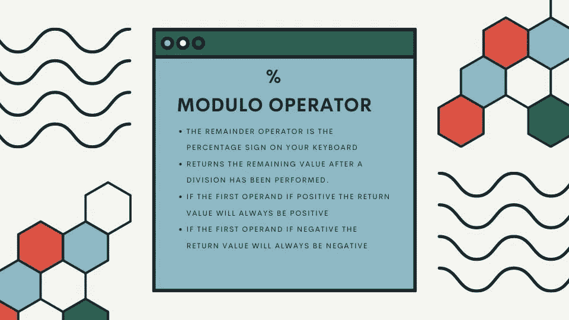

# JavaScript 中的模运算符简介

> 原文：<https://javascript.plainenglish.io/introducing-the-modulo-operator-64b3b53f0bc3?source=collection_archive---------5----------------------->

## 学习使用 JavaScript 中的模或余数运算符



## 介绍模运算符

模运算符是键盘上的百分号(%)。该运算符有时也称为余数运算符。它将两个值相除，并返回相除后的余数。让我们看一个基本的例子:

```
27 % 2;
//Returns ---> 1
```

在上面的例子中，2 乘 13 等于 27，但在此之后，还剩 1。因此，当我们使用模运算符执行此计算时，我们得到 1 作为返回值。让我们通过看另一个例子来巩固这种理解:

```
100 % 2;
//Returns ---> 0
```

在上面的例子中，2 是 100 的 50 倍，所以我们得到 0 作为余数，因为没有剩余。

## 正值和负值

值得注意的是，当您使用模运算符时，如果第一个操作数(值)的值为正，则返回值将始终为正。如果第一个操作数的值是负的，那么返回值将总是负的。让我们看另一个例子:

```
-10 % 3;
//Returns ---> -1
```

在上面的例子中，3 乘以 10，剩下 1。这一次因为第一个值(-10)是负的，所以我们得到-1 作为返回值。

我希望你喜欢这篇文章，如果你想看这篇文章的视频，你可以在这里看:

请随时发表任何评论、问题或反馈，并关注我以获取更多内容！

*更多内容请看*[***plain English . io***](https://plainenglish.io/)*。报名参加我们的* [***免费周报***](http://newsletter.plainenglish.io/) *。关注我们关于*[***Twitter***](https://twitter.com/inPlainEngHQ)*和*[***LinkedIn***](https://www.linkedin.com/company/inplainenglish/)*。加入我们的* [***社区不和谐***](https://discord.gg/GtDtUAvyhW) *。*