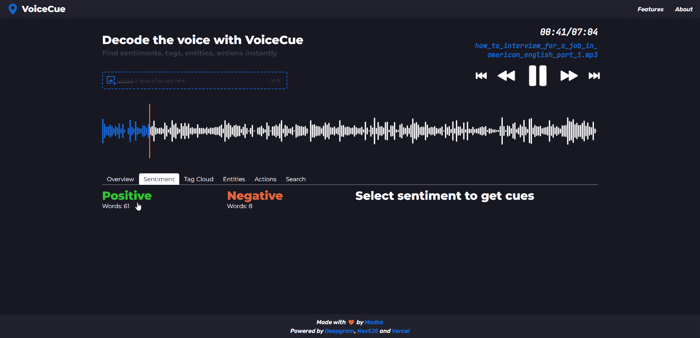

# 介绍 VoiceCue —像 DJ 一样查找情感、标签、实体和动作🔥✨

> 原文：<https://javascript.plainenglish.io/introducing-voicecue-find-sentiments-tags-entities-actions-like-a-dj-9a9104d52f21?source=collection_archive---------15----------------------->

## 一个应用程序，让您只需点击一下，就可以找到所有重要的录音部分，如情感、实体和标签。

我们中的许多人都遇到过语音记录分析这一棘手的任务，在这种情况下，你必须听完整段音频来识别最重要的部分。

手动处理非常费时。仅仅从头到尾听完通常是不够的。你将不得不加倍甚至三倍的时间，因为你将不得不暂停和重放音频的某些部分。

从三月中旬到四月中旬，我开发了一款名为 [VoiceCue](https://cue.madza.dev) 的应用，这款应用可以生成提示时间码，让你只需点击一下鼠标，就能找到语音记录中所有重要的部分，如情感、实体和标签。

在这篇文章中，我们将回顾它。

这个项目是作为 [DEV](https://dev.com) 和 [Deepgram](https://deepgram.com) 黑客马拉松的一个入口而特别构建的。这是一次很棒的经历，因为参与激励了我，我想出了一个产品，希望也能让其他人受益。

## 🧑‍💻链接到代码:

 [## GitHub - madzadev/voice-cue:📣在你的声音中寻找情感、标签、实体和行动…

### 忘掉听冗长无聊的录音，手动处理。VoiceCue 可让您找到…

github.com](https://github.com/madzadev/voice-cue) 

## 🎉部署的应用程序:

 [## VoiceCue:像 DJ 一样查找情感、标签、实体和动作💿📍

### VoiceCue 让您可以立即在语音记录中找到情感、标签、实体和动作。

cue.madza.dev](https://cue.madza.dev/) 

## 它是如何工作的？

该应用程序的根本思想来自音乐行业中世界闻名的 DJ。在演出之前，他们为将要播放的音轨设置提示，标记分解、下降、结尾等等。这样，如果需要，他们可以快速找到特定的零件。

音频提示基本上是一种快捷方式，可以让您跳到音频中预定义的位置。

多亏了 Deepgram API，我能够实现我自己的提示系统，并将其与录音分析结合起来。正在为正面和负面情绪、频繁使用的词语、众多实体和动作以及定制搜索查询生成提示。

该应用程序的工作流程非常简单，只需上传您的语音记录，选择要执行的分析类型，然后单击列表中生成的线索，即可立即导航到它在语音记录中的确切位置。

## 概述和统计

概述统计给出了记录的总体摘要。

该分析包括全部字符、句子和单词、全部识别的情感线索和它们的累积声调得分，以及全部识别的标签、命名实体、动作和语音记录中的说话者计数。

## 互动抄本

生成的文字稿是交互式的，突出显示在语音记录中听到的单词。该功能使得在整体环境中跟踪当前位置变得更加容易，并且增加了听力有问题的人的可访问性。

此外，用户可以点击抄本上的任何单词，音频进度将自动设置为该单词在语音记录中的位置。

音频波形让用户可以直观地感知声音的动态并识别无声。对于回放，用户可以在音频控制之间切换，并手动调整波形上的进度标记。

## 情感分析

情感分析检查具有积极和消极意义的单词。

选择情感后，返回情感词列表。标题显示了所选的情感以及该情感在录音中出现的字数。

列表中的每个标签都显示单词、时间码及其情感等级，等级从-4 表示负面单词，到+4 表示正面单词。

两者都有不同的实际使用案例。例如，用户可以检查正面情绪来编辑个人网站的推荐列表。或者，他/她可能会检查负面情绪，以获得一些关于如何改进的反馈。

## 标签云

标签云返回语音记录中使用最多的单词。

记录中出现的次数越多，云中使用的标签字体就越大。此外，每个标签使用不同的配色方案，以便更容易区分。

选择标签后，列表标题会显示标签在整个录像中出现的次数。对于个别线索，出现的顺序与时间代码一起显示。

通过观察“云”这个词，很容易理解对话的主题是什么。例如，如果有人想知道哪些产品或服务被提及最多，这可能非常有用。

## 命名实体

命名实体分析让您根据单词分类找到线索。

目前支持的命名实体有人员、地点、组织、货币、单位和日期。

选择命名实体后，标题中将显示记录中出现的总次数。每个单独生成的提示代表实体的特定单词、其出现顺序以及时间码。

命名实体非常有用。例如，一家公司将检查一个人实体，以便为记录中提到的董事会成员快速生成时间码。或者搜索 Money entity 快速跳转到提到公司预算的地方。

## 行动

动作分析通过将动词分为过去、现在和将来来返回动词。目前支持的类别有过去式、不定式、系动词、情态动词和动名词。

与命名实体类似，一旦选择了动作，它将显示在列表标题上，并带有记录中出现的总次数。每个单独生成的线索代表了动作的特定单词、其出现顺序以及时间代码。

由于时态的分类，如果有人想找到关于一些主题的信息，如已完成的里程碑、当前的过程或未来的计划任务，那么动作提示实际上是可以使用的。

## 自定义搜索

如果你不能通过任何以前的分析方法找到你正在寻找的线索，有一个自定义搜索，让你搜索自定义单词。

用户需要输入至少 3 个字符来生成提示列表。如果搜索查询返回多个提示，则所有提示都显示在彼此下方，并带有包含查询的单词、其序列号和时间码。

## 响应性

在我们的日常生活中，我们通常使用手机采访某人或记录会议或事件。因此，让应用程序完全响应不同的屏幕宽度是主要的优先事项之一。

由于所有功能在较小的屏幕上也受支持，因此该应用程序可以在任何情况下使用，只要您随身携带一台设备。

## 功能列表:

1.  语音识别——基于 [Deepgram API](https://developers.deepgram.com/)
2.  常规统计—语音记录概述
3.  情感分析—正面和负面单词检测
4.  词云生成—最常用的词分类
5.  实体名称识别——如人、地点等类别
6.  活动跟踪—查找过去、现在或未来的行动
7.  互动抄本—查看进度或点击控制进度
8.  扬声器检测—录音中的扬声器总数
9.  提示词用法—短文本示例有助于更好地理解上下文
10.  自定义搜索—扩展的线索查询能力
11.  波形预览—查看声音的动态，识别无声
12.  音频控制—播放、暂停、快进和后退
13.  拖放支持—在文件选择区域拖放音频
14.  上传 MP3 文件——最常用的音频格式
15.  进度加载器——改进了加载抄本的 UX
16.  全面响应—在移动设备和平板电脑上运行良好
17.  丰富多彩的用户界面—便于交互和突出显示文字

## 技术堆栈

[Next.js](https://nextjs.org) — React 应用框架

[Deepgram](https://deepgram.com) —用于基于人工智能的语音识别

[妥协](https://www.npmjs.com/package/compromise)，[感悟](https://www.npmjs.com/package/sentiment) —用于文字处理

[react-tag cloud](https://www.npmjs.com/package/react-tagcloud)——生成单词云

[反应标签](https://www.npmjs.com/package/react-tabs) —用于导航面板

[反应-拖放-文件](https://www.npmjs.com/package/react-drag-drop-files)-用于拖放支持

[wavesurfer.js](https://www.npmjs.com/package/wavesurfer.js) —生成音频波形

[GitHub](https://github.com) —托管代码

[Vercel](https://vercel.com) —部署项目

[ESLint](https://eslint.org/) ，[更漂亮](https://prettier.io/) —用于林挺和代码格式化

[Namecheap](https://namecheap.com) —用于自定义子域

## 结论

我要感谢 Forem 为我们提供了一个学习、分享发现和与优秀的人交流的平台。每天访问 DEV 已经成为我多年的习惯，我已经发布了 300 多个帖子。

我很高兴发现这个黑客马拉松的联合主持人提供他们的 API 来构建令人敬畏的东西。从现在起，我的口袋里将会有一个有价值的工具，当我必须处理语音识别项目时，我将已经知道如何使用它。

声音是交流的工具，每秒钟都有大量有价值的信息通过它传递。Deepgram 的强大 API 是聪明工作的一大步，而不是努力工作，这将成为未来击败竞争对手的更重要的技能。

建设项目一直是我的激情所在，帮助和激励他人让我感到快乐。如果您有任何问题，请随时联系我们！

在 [Twitter](https://twitter.com/madzadev) 、 [LinkedIn](https://www.linkedin.com/in/madzadev/) 和 [GitHub](https://github.com/madzadev) 上给我接通！

更多类似的项目，请访问我的作品集:

 [## Code - Madza.dev

### 这是我所有编码项目的集合。从实用程序和应用程序到网站和游戏。

www.madza.dev](https://www.madza.dev/code) 

*更多内容看* [***说白了就是 io***](https://plainenglish.io/) *。报名参加我们的* [***免费周报***](http://newsletter.plainenglish.io/) *。关注我们关于*[***Twitter***](https://twitter.com/inPlainEngHQ)*和*[***LinkedIn***](https://www.linkedin.com/company/inplainenglish/)*。加入我们的* [***社区***](https://discord.gg/GtDtUAvyhW) *。*