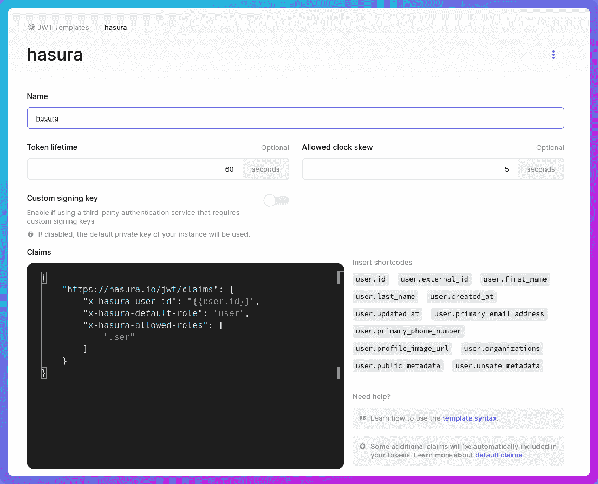

# 介绍 XdoX —开始挑战，记录你的进步，并向全世界展示它们

> 原文：<https://javascript.plainenglish.io/introducing-xdox-start-challenges-log-your-progress-and-show-them-off-to-the-world-9500eb3639a0?source=collection_archive---------19----------------------->

# 🤔XdoX 是什么？

XdoX 是一个网络应用程序，让你开始挑战，并记录你每天的进展。您还可以通过您独特的个人资料页面向世界展示您的进步。这些挑战可以是从 100 天的代码到 30 天的信任，甚至 60 天的烹饪！

这也是我提交给 [Hasura x Hashnode Hackathon](https://townhall.hashnode.com/hasura-hackathon) 的。

[现场演示](https://xdox.me/) / [GitHub 资源库](https://github.com/AnishDe12020/xdox)

# ❓什么是哈苏拉？

GraphQL 是一种带有模式的 API 查询语言。它具有多种功能，如查询特定字段、分页、聚合查询等。

然而，制作一个 GraphQL 后端比制作一个简单的 REST 后端更复杂，这就是 Hasura 的用武之地。Hasura 为我们提供了一种简单的方法来创建一个连接数据库和应用程序的 GraphQL 后端，而无需编写任何代码！

Hasura 也有一个不错的免费层的云产品，这样我们就可以开始托管我们的 GaphQL 后端，而不需要担心成本。它是开源的，也是自托管的。

# 📚技术堆栈

我对 XdoX 使用了哪些技术？

首先，我使用 [Hasura](https://hasura.io/) 作为应用程序的后端。

除此之外，我还使用了以下服务-

*   [Clerk](https://clerk.dev/) 向我的应用程序添加认证。它还与 Hasura 很好地集成在一起，并且我能够通过使用 JWT 认证来保护我的后端(在本文后面会有更多的介绍)
*   我的数据库。它还与 Hasura 很好地集成在一起
*   托管我的前端

这是我在应用程序中使用的库和框架

*   我的应用程序前端的 [Next.js](https://nextjs.org/)
*   用于设计我的前端
*   [Radix UI](https://www.radix-ui.com/) 用于非风格化的 UI 组件，如模态和弹出框
*   [无头用户界面](https://headlessui.dev/)用于过渡
*   [Apollo React 客户端](https://www.apollographql.com/docs/react/)从我的前端发出 GraphQL 请求。它还负责缓存。
*   [Tiptap](https://tiptap.dev/) 用于支持 markdown 的富文本编辑器，用于记录进度

# xdox 是如何工作的？

这是一个简单的三步过程。一个人使用谷歌或电子邮件注册一个帐户，然后开始挑战(例如 100DaysOfCode)。然后一个人每天记录他们的进步。

接下来，人们可以分享他们独特的个人资料页面，向世界展示他们的进步。

同样，没有必要每天记录你的进步。该应用程序的构建方式让您可以灵活应对挑战。去度假了？没问题，XdoX 不会因为没有记录你的进度而出错。

# 保护后端

后端可以直接访问数据库，保护它们被认为是一种最佳实践。我需要从我的前端使用 GraphQL API，因此它必须是一个公共 API。但是，我必须确保它的安全，以便只能发出有限的未授权请求和授权请求。

当我使用 Clerk 进行用户认证时，我没有花很长时间就实现了这一点。职员使用 JWT 模板与 Hasura 集成。这里是解释如何实现这个的[文档。](https://docs.clerk.dev/integrations/hasura)

在这里，我们从职员仪表板创建一个 JWT 模板。这是我的样子:

当向 API 发出请求时，我们传入一个名为`Authorization`的头，以一个不记名令牌作为值。这是由 Hasura 使用签名密钥验证的(这是在 Hasura 中通过环境变量设置的)。

这是前端中的代码，它负责在发出请求时传递不记名令牌:

我们简单地通过使用职员 React SDK 提供给我们的`getToken`函数得到一个不记名令牌，并在`Authorization`头中传递它。

现在，如果承载令牌是有效的，`X-Hasura-User-Id`报头被添加到请求中，其中包含发出请求的用户的用户 id。`user`角色的头也被传入。请注意，这是由 Hasura 一方负责的。

我还使用`viewer`角色发出了一些未经验证的请求。这在我的 Hasura 实例中被设置为未授权角色，并在公共用户配置文件页面中使用。下面是处理未经身份验证的请求的代码:

# 为数据设置行级权限

尽管 API 现在是安全的，但默认情况下没有数据是可访问的。我们需要设置权限，这也将让我们限制一个人可以访问的数据。例如，我们将让用户仅访问他们自己的用户数据，并且仅访问他们创建的私人质询。

令人欣慰的是，Hasura 又一次让这项工作变得非常容易。让我们看一个例子:

在这里，我已经为`user`角色设置了插入权限，这样，只有当`user_id`列等于发出请求的用户的用户 id 时，才能插入行(这是作为标题传入的)。

我也允许`user`只更新特定的栏目。这里，`id`列是用`gen_random_uuid()` PostgreSQL 函数自动生成的。`created_at`和`updated_at`字段也由后端处理。

我还为`user_id`列添加了一个列预设，它将等于`X-Hasura-User-Id`标题。现在，这是疯狂的强大！

类似地，我为`user`角色设置了更新、选择和删除权限，在这里我检查了`user_id`列是否与`X-Hasura-User-Id`标题匹配。

对于`viewer`角色，我是这样设置的:

这里，查看器只能从数据库中选择行(也就是说，只能读取数据)。我另外添加了一个检查来确保挑战是公开的。

# 👓我从这次黑客马拉松中学到的是

虽然我过去使用过 GraphQL，但我的经验相当有限。此外，我从未构建过 GraphQL 后端，我只是使用公共的 GraphQL APIs。我以前也从未使用过 Hasura，也从未在任何生产项目中使用过 SQL 数据库。

这次黑客马拉松让我有机会通过 Hasura 探索 GraphQL 的后端，并理解更深层次的概念。我还在使用 PostgreSQL 数据库和学习更多关系数据方面度过了一段美好的时光。这是疯狂的强大！

# ✨结论

在过去的一个月里，我一直在做 XdoX，并且一直在探索和学习很多新的东西。我很兴奋看到 XdoX 在现实世界中的表现！

再见，祝你愉快！😁🤞

# 🔗重要链接

*   [XdoX](https://www.xdox.me/)
*   [XdoX GitHub 库](https://github.com/AnishDe12020/xdox)
*   [我在 XdoX 上的个人资料](https://www.xdox.me/@anishde12020)

*原发布于*[*https://blog . anishde . dev*](https://blog.anishde.dev/introducing-xdox-start-challenges-log-your-progress-and-show-them-off-to-the-world)*。*

*更多内容看* [***说白了。报名参加我们的***](https://plainenglish.io/) **[***免费周报***](http://newsletter.plainenglish.io/) *。关注我们关于*[***Twitter***](https://twitter.com/inPlainEngHQ)*和*[***LinkedIn***](https://www.linkedin.com/company/inplainenglish/)*。加入我们的* [***社区***](https://discord.gg/GtDtUAvyhW) *。***