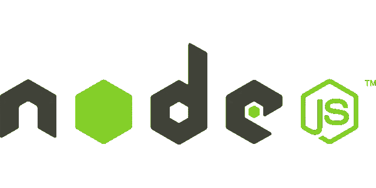
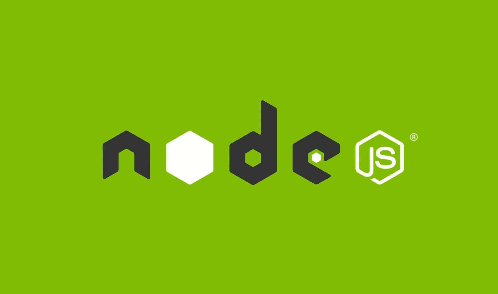

# 面向初学者的 Node.js 介绍

> 原文：<https://javascript.plainenglish.io/introduction-a370b8d7dfd6?source=collection_archive---------22----------------------->

## Node.js 是什么？它是一个开源的 JavaScript 运行时环境。

# 介绍

Node.js 是一个 JavaScript 运行时环境。它是一个开源的、跨平台的后端标准工具，几乎适用于任何类型的项目。它运行在 V8 引擎上，在网络浏览器外执行 JavaScript 代码。

Node.js 允许开发人员使用 JavaScript 编写命令行工具。它的应用程序在一个进程中运行，不需要为每个请求创建一个新线程。它在其标准库中给出了一组异步 I/O 原语。这阻止了 JavaScript 代码阻塞。Node.js 中的库是使用非阻塞模型编写的。这使得屏蔽显示为例外而非常态。

在本文中，我们将简要介绍 Node.js、它的用途和重要框架以及工具。

# 描述

Node.js 支持使用 JavaScript 创建 Web 服务器和网络工具。它是一组控制不同核心功能的模块。当响应返回时，它将重新开始操作。

这使得 Node.js 可以用一台服务器控制数千个并发连接，而不用承担管理线程并发性的负载。这可能是漏洞的一个重要来源。

Node.js 拥有数百万前端开发者带来的独家优势。为浏览器编写 JavaScript 的人目前能够编写服务器端代码。此外，编写客户端代码不需要学习完全不同的语言。

# Node.js 亮点

以下是一些重要的亮点。[这些使得 Node.js 成为软件设计师的最爱。](https://www.technologiesinindustry4.com/2022/01/javascript-data-types.html)

## **异步和事件驱动**

Node.js 库的完整 API 是异步和非阻塞的。它的基本意思是一个节点。js 构建的服务器从不等待 API 返回数据。当调用它时，服务器改变到下一个 API。Node.js 的事件通知设备支持服务器成为前面 API 调用的响应。

## **最快**

Node.js 库是构建在 Google Chrome 的 V8 JavaScript 引擎上的代码执行速度最快的库。

## **高度可扩展**

Node.js 实践了具有事件循环的单线程模型。事件[工具支持服务器以非阻塞方式回复。](https://www.technologiesinindustry4.com/2022/01/javascript-data-types.html)它使服务器具有高度的可扩展性，区别于传统服务器。Node.js 用法单线程程序和相同的程序可以向比传统服务器多得多的请求提供服务，与 Apache HTTP Server 相当。

## **根本不缓冲**

Node.js 应用程序从不缓冲任何数据。这些应用程序只是产生零碎的数据。

## **授权**

Node.js 在 MIT 证书下逍遥法外。

# Node.js 的使用

以下是 Node.js 作为一个完美的技术合作伙伴所展示的能力。

*   输入/输出受限的应用
*   数据流应用
*   数据密集型实时应用程序(DIRT)
*   JSON APIs 构建的应用程序
*   单页应用程序

# Node.js 的框架和工具

## **AdonisJS:**

这是一个基于类型脚本的框架。非常强调开发者实力和自我保证。Adonis 是最坚定的 Node.js web 框架之一。

## **Egg.js:**

Egg.js 是一个用 Node.js & Koa 构建良好的企业框架和应用的框架。

## **快递:**

Express 提供了一种迄今为止最简单的制作 web 服务器的方法。它成功的关键是一种简单的方法，专注于服务器的基本特性。

## **Fastify:**

web 框架非常注重给开发者最好的体验。这需要最小的开销和有影响力的插件架构。[是鲁莽 Node.js web 框架之一。](https://www.technologiesinindustry4.com/2022/01/javascript-data-types.html)

## **FeatherJS:**

这是一个轻量级的 web 框架。它创建实时应用程序和 REST APIs。那些是用 JavaScript 和 TypeScript 做的。

## 盖茨比:

这是一个基于 React 的 GraphQL 框架。它也是一个静态站点生成器，带有一个非常讽刺的插件和启动器生态系统。

## 哈皮:

对于构建应用程序和服务来说，这是一个具有讽刺意味的框架。它允许开发人员专注于编写可重用的应用程序逻辑，而不是花费时间构建设置。

## **koa:**

这个框架是由 Express 背后的同一个团队构建的。它的目标是更简单、更小巧。这个新项目诞生于在不破坏现有社区的情况下进行不匹配修改的需求。

## **Loopback.io:**

Loopback.io 使塑造现代应用程序变得容易。它需要多方面的整合。

## **流星:**

Meteor 是一个非常强大的全栈框架。它赋予我们一种同构的方法来用 JavaScript 制作应用程序。此外，它使我们能够在客户机和服务器上共享代码。

## **微:**

Micro 提供了一个非常轻量级的服务器来制作异步 HTTP 微服务。

## **NestJS:**

这是一个 typeScript 构建的高级 Node.js 框架。它用于构建组织良好、可靠且可访问的企业级服务器端应用程序。

## **Next.js:**

这是一个 React 框架。它为我们提供了最棒的开发者体验，包括我们生产所需的所有种类。这些包括混合静态和服务器渲染，智能捆绑，等等。

## **Nx:**

这是一个用于全栈 monorepo 开发的工具包。它与 NestJS、Express、React 和 Angular 一起使用。它支持将开发从一个团队构建一个应用程序扩展到多个团队一起开发各种应用程序。

## **混音:**

这是一个全栈的 web 框架。它用于为 web 构建出色的用户体验。它为我们提供了构建现代 web 应用程序所需的一切。我们可以将它们部署到任何基于 JavaScript 的运行时环境中。

## **工兵:**

[Sapper 框架用于构建各种规模的 web 应用。](https://www.technologiesinindustry4.com/2022/01/javascript-data-types.html)它提供了吸引人的开发体验。

## **Socket.io:**

这是一个构建网络应用程序的实时通信引擎。

欲了解更多详情，请访问:

 [## Node.js 简介

### 简介 Node.js 是一个 JavaScript 运行时环境。它是一个开源的、跨平台的后端标准…

www.technologiesinindustry4.com](https://www.technologiesinindustry4.com/2022/01/an-introduction-to-node-js.html) 

*更多内容请看* [***说白了就是***](http://plainenglish.io/) *。报名参加我们的* [***免费每周简讯***](http://newsletter.plainenglish.io/) *。在我们的* [***社区不和谐***](https://discord.gg/GtDtUAvyhW) *获得独家获取写作机会和建议。*