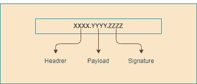
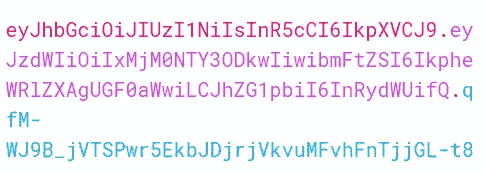
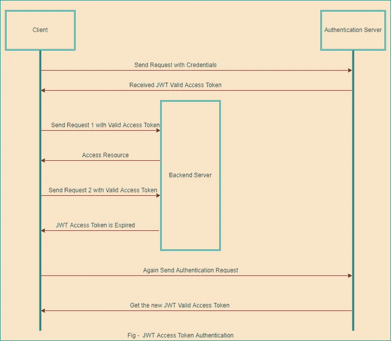
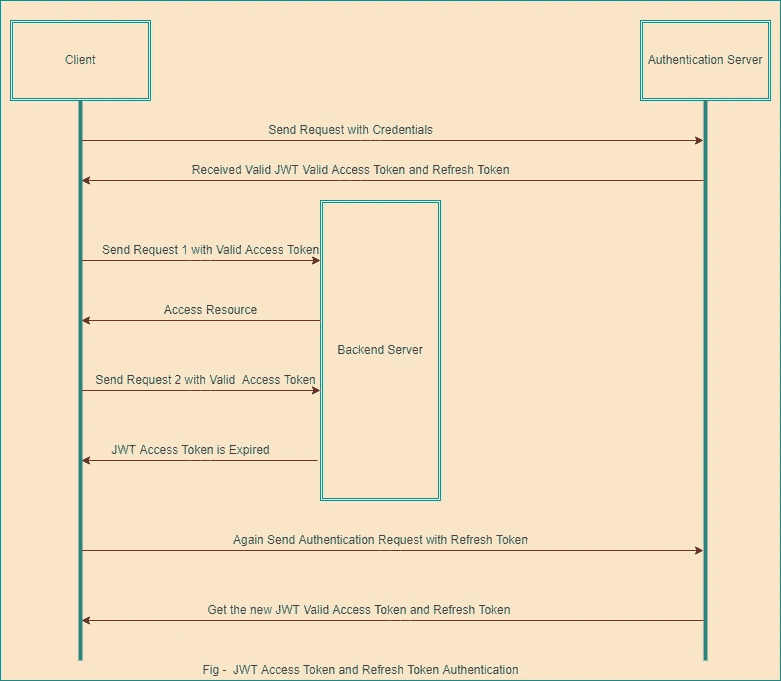

# JWT 认证和授权的详细介绍

> 原文：<https://javascript.plainenglish.io/introduction-and-detail-about-the-jwt-authentication-and-authorization-5a812e6d154c?source=collection_archive---------1----------------------->


Photo by [Kevin Ku](https://unsplash.com/@ikukevk?utm_source=medium&utm_medium=referral) on [Unsplash](https://unsplash.com?utm_source=medium&utm_medium=referral)

我们将讨论使用 JWT 令牌和不同的加密算法和技术的认证和授权。因此，我们将一个接一个地看下面的事情。

*   JWT Token 简介
*   为什么是 JWT·托肯
*   JWT 令牌的结构
*   使用 JWT 令牌的客户端-服务器场景
*   使用 JWT 刷新令牌的客户端-服务器场景

让我们从基础和实时场景开始。

基本上，JWT 用于不同用户的认证和授权。

**认证**

*   在这个过程中，我们将用户名和密码发送到认证服务器。
*   认证服务器将验证这些凭证，并将它们存储在浏览器会话和 Cookies 中的某个位置，并将 ID 发送给最终用户。

**授权**

*   在中，授权我们检查用户在身份验证过程中输入的任何凭据，该用户将使用我们在身份验证过程中存储的凭据授予对资源的访问权限，然后授权该特定用户。

所以，这通常都是关于认证和授权的。

**JWT 令牌介绍**

*   JSON Web Token 是开放标准(RFC 7519)的自包含方式，它将作为 JSON 对象在不同的环境中安全地传输数据。
*   RFC(征求意见稿)是远程函数调用的简称，也是互联网工程任务组的正式文档。RFC 7519 JSON Web Token(JWT)2015 年 5 月版权声明版权所有 2015 IETF Trust 和文档作者。保留所有权利。
*   JWT 是可信的身份验证方式，因为它使用 HMAC 算法进行数字签名和保密，或者有时使用 RSA 的公钥/私钥。
*   基本上，HMAC 代表基于哈希的消息认证码，它使用一些伟大的加密哈希技术，为我们提供了很大的安全性。
*   此外，JWT 是 OAuth 和 OpenID 等强大的身份验证和授权框架的一部分，这些框架将提供安全传输数据的强大机制。

**为什么 JWT 令牌**

*   用户将使用 JWT 令牌进行身份验证，它是一个带有密钥的数字签名，密钥由颁发者颁发。因此，它将用于安全地对用户进行身份验证，并管理索赔，等等。
*   而不是将用户凭证信息存储在服务器上的某个地方，这样攻击者就可以通过互联网轻松获取这些信息。因此，我们使用 JWT，利用它我们用不同的加密算法维护用户秘密，并对其进行编码以认证用户。
*   这就是为什么许多 web 应用程序使用 JWT 来安全地认证用户

**JWT 令牌的结构**

基本上，JSON Web 令牌由三部分组成，这三部分用于在令牌中存储用户信息，用点(.)

例如–



正如你在上面的图表中看到的，它是用 Base64Url 编码的，它把用户的秘密和信息分成三个部分。

**1。标题**

报头存储了关于 JWT 令牌的信息，比如令牌的类型以及我们在创建 JWT 令牌时使用的算法。

例如–

```
{
  "alg": "HS256",
  "typ": "JWT"
}
```

**2。有效载荷**

有效负载是 JWT 令牌的第二部分，用于存储关于用户的信息，如声明、角色、主题和一些与用户相关的附加信息。

比如说-

```
{
  "sub": "1234567890",
  "name": "Jaydeep Patil",
  "admin": "true"
}
```

**3。签名**

签名用于检查标头和有效负载中的用户信息，并使用密钥和数据验证 Base64Url 编码字符串中的内容。基本上，密钥存在于服务器中，我们在创建令牌时使用它。该密钥防止用户被外部攻击者破解令牌。所以，在这个过程中，Base64Url 编码的字符串被创建用来进行认证和授权。

```
HMACSHA256(
  base64UrlEncode(header) + "." +
  base64UrlEncode(payload),//This is the Secret Key which is store at server side and use in signature
your-256-bit-secret)
```

因此，这是 Base64Url 字符串中存在的令牌的三个部分，由点分隔，存储用户的秘密信息以验证用户。

**使用 JWT 令牌的客户端-服务器场景**

*   在下图中，您可以看到当用户想要从后端服务器访问资源时，身份验证过程是如何工作的。



*   首先，用户用用户名和密码等凭证向身份验证服务器发送请求。
*   然后，认证服务器将验证该信息以及用户提供的任何正确信息，并成功认证，然后认证服务器将向用户发放 JWT 有效访问令牌。
*   接下来，用户使用有效的 JWT 访问令牌向后端服务器发送第一个请求，服务器将向用户提供所请求的资源。
*   稍后，如果用户想要从后端服务器访问另一个服务，那么他将向服务器发送第二个请求。
*   现在，如图所示，当用户向服务器发送第二个请求以访问受保护的资源时，但此时令牌已过期，因此服务器响应终端用户。
*   最后，正如您在图的最后部分看到的，用户需要再次登录，并将用户凭证发送到身份验证服务器，以获得新的 JWT 有效访问令牌，并将其存储在客户端的本地存储中，类似于 Base64Url 编码的 Url。
*   因此，这样正常的认证过程将会工作。

**使用 JWT 刷新令牌的客户端-服务器场景**

*   您可以在下图中看到 JWT 刷新令牌是如何逐步工作的。
*   首先，用户将使用用户名和密码等凭证向身份验证服务器发送请求。
*   接下来，认证服务器验证用户信息和凭证是否正确，然后服务器将提供 JWT 有效访问令牌和刷新令牌。然后，用户将根据需要和要求，将该令牌存储在客户端本地存储中的某个位置。
*   随后，用户向后端服务器发送第一个请求，以使用报头中的 JWT 有效访问令牌来访问受保护的资源。
*   接下来，后端服务器检查用户的角色和权限，如登录用户被授权获得受保护的资源，这将是有效和适当的，然后后端服务器向最终用户提供所请求的受保护的资源。



*   同时，用户向后端服务器发送第二个请求以访问另一个服务，如果同时 JWT 有效访问令牌过期，那么服务器将响应最终用户，如上图所示。
*   在这种情况下，当 JWT 有效访问令牌过期时，用户使用刷新令牌向身份验证服务器发送身份验证请求，以获得新的 JWT 访问令牌。
*   接下来，服务器将验证用户信息，并向终端用户提供带有刷新令牌的新的访问令牌，并且刷新令牌比简单的 JWT 有效访问令牌具有更长的寿命
*   因此，在浏览 web 应用程序和通过互联网访问新的服务和资源时，上述所有步骤都会连续执行。

这就是 JWT 令牌以及身份验证和授权过程中的工作原理。

我希望你了解所有与 JWT 有关的事情，现在对它有一个基本的概念。

编码快乐！

*更多内容请看*[***plain English . io***](https://plainenglish.io/)*。报名参加我们的* [***免费周报***](http://newsletter.plainenglish.io/) *。关注我们关于*[***Twitter***](https://twitter.com/inPlainEngHQ)*和*[***LinkedIn***](https://www.linkedin.com/company/inplainenglish/)*。查看我们的* [***社区不和谐***](https://discord.gg/GtDtUAvyhW) *加入我们的* [***人才集体***](https://inplainenglish.pallet.com/talent/welcome) *。*