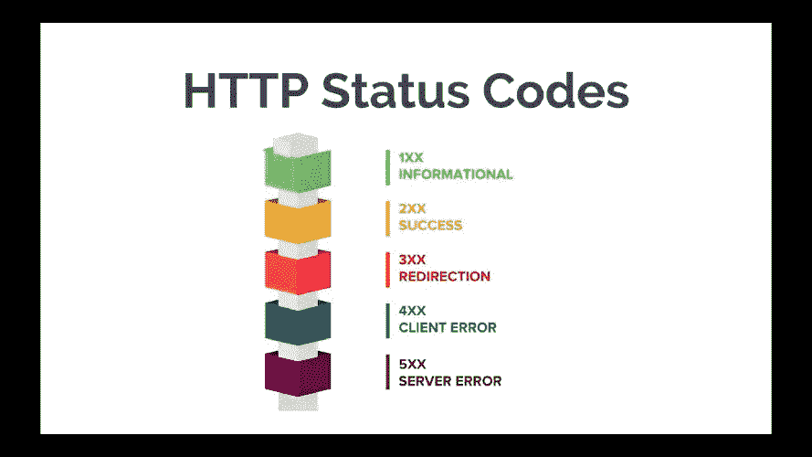
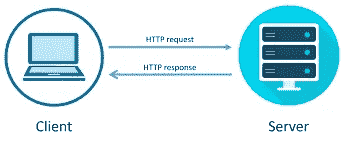

# 简介 HTTP 状态代码

> 原文：<https://javascript.plainenglish.io/introduction-http-status-codes-86145f1979be?source=collection_archive---------10----------------------->

## 为什么我们需要学习它们？



[https://devqa.io/assets/images/http-status-codes.png](https://devqa.io/assets/images/http-status-codes.png)

嗨，欢迎来到我的博客。今天，我将弄清楚 http 状态码，以及为什么我们需要学习这个规则？

# 什么是 HTTP 状态代码？

HTTP 状态码是通过 HTTP 响应反馈给您的响应。什么是 **HTTP 响应？**我以后再讨论。所以，简单的解释就是当你的浏览器向服务器请求某些东西时，服务器会反馈内容、元数据或其他响应。包括 HTTP 状态代码。



[https://medium.com/@rohitpatil97/http-request-http-response-context-and-headers-part-iii-5c37bd4cb06b](https://medium.com/@rohitpatil97/http-request-http-response-context-and-headers-part-iii-5c37bd4cb06b)

可能会出现反馈的变体。不管结果是不是成功，内容能不能访问，甚至服务器运行的好不好，或者其他很多反馈。在这一部分，我将只告诉你那里经常发生什么。

这里有很多最常见的 http 状态代码。看看这个:

# 常见的 HTTP 状态代码类:

**1xxs —信息响应:**服务器正在考虑请求。

2xxs 成功！请求成功完成，服务器给了浏览器预期的响应。

**3xxs** — **重定向:**你被重定向到了别的地方。请求已收到，但有某种重定向。

**4xxs —客户端错误:**找不到页面。无法访问该网站或页面。(请求已发出，但页面无效——这是网站对话方的错误，通常出现在页面不存在于网站上的情况下。)

**5xx-服务器错误:**失败。客户端发出了一个有效的请求，但服务器无法完成该请求。

## 200 好吧

结果成功了。此响应的意思是您请求的页面已被获取。

后端 Javascript 中的简单响应。通常是来自 GET、POST 或 PUT、TRACE 或 HEAD 的 HTTP 方法。

*   `GET`:消息体中已经取到并发送了资源。
*   `HEAD`:表示头包含在响应中，没有任何消息体。
*   `PUT`或`POST`:描述动作结果的资源在消息体中传递。
*   `TRACE`:消息体包含服务器收到的请求消息。

```
res.status(200).send({
  status: 'OK',
  code: 200
})
```

## 201 已创建

请求完成后，创建了一个新资源。通常仅来自 POST 的 HTTP 方法。

```
res.status(201).send({
  status: 'CREATED',
  code: 201,
})
```

## 400 错误请求

服务器不理解该请求。当客户端请求一个页面，而服务器无法理解任何内容时，它会显示一个 400 HTTP 状态代码。客户端不应该在没有任何更改的情况下重复请求。请求可能是格式错误、欺骗性的请求路由或无效的请求。

```
res.status(201).send({
  status: 'BAD_REQUEST',
  code: 400,
})
```

## 401 未经授权

这意味着您应该在访问资源之前进行身份验证。如果你不这样做，你会得到未经授权的回应。

```
res.status(201).send({
  status: 'UNAUTHORIZED',
  code: 401,
})
```

## 403 禁止

并且仍然与之前的状态码 401 相联系，如果你授权了但是你的授权还没有访问权限，也就是角色没有访问权限，你将得到禁止响应

```
res.status(201).send({
  status: 'FORBIDDEN',
  code: 403,
})
```

## 404 未找到

> 服务器找不到请求的资源。在浏览器中，这意味着 URL 无法识别。在 API 中，这也意味着端点是有效的，但是资源本身并不存在。服务器也可以发送这个响应而不是`403 Forbidden`来对未授权的客户端隐藏资源的存在。这个响应代码可能是最广为人知的，因为它在 web 上频繁出现。——[https://developer.mozilla.org/en-US/docs/Web/HTTP/Status](https://developer.mozilla.org/en-US/docs/Web/HTTP/Status)

也许如果你想在你的服务中声明，还是和上面一样:

```
res.status(201).send({
  status: 'NOT_FOUND',
  code: 404,
})
```

## 不允许 405 方法

不允许请求中指定的方法。

> 超文本传输协议(HTTP) `405 Method Not Allowed`响应状态码表示服务器知道请求方法，但目标资源不支持该方法。—[https://developer . Mozilla . org/en-US/docs/Web/HTTP/Status/405 #:~:text = The %20 hypertext % 20 transfer % 20 protocol % 20(HTTP，不支持% 20 这种% 20 方法。](https://developer.mozilla.org/en-US/docs/Web/HTTP/Status/405#:~:text=The%20HyperText%20Transfer%20Protocol%20(HTTP,doesn't%20support%20this%20method.)

## 411 所需长度

你应该输入“内容长度”。如果你不输入它，它将被拒绝。

## 413 请求实体太大

服务器不会接受请求，因为请求实体太大。请求实体大于服务器定义的限制。服务器可能会关闭连接或返回一个`Retry-After`头字段。

## 500 内部服务器错误

服务器遇到了它不知道如何处理的情况。

## 502 错误网关

请求未完成。服务器收到来自上游服务器的无效响应。

## 503 服务不可用

服务器无法处理该请求。常见问题通常是过载或停机维护。503 状态码确保搜索引擎知道很快回来，因为页面或网站只会关闭一小段时间。

## 504 网关超时

网关超时

## 参考

[](https://moz.com/learn/seo/http-status-codes) [## 什么是 HTTP 状态代码？重要状态代码列表

### HTTP 状态码是服务器对浏览器请求的响应。当你访问一个网站时，你的浏览器发送一个请求…

moz.com](https://moz.com/learn/seo/http-status-codes) [](https://developer.mozilla.org/en-US/docs/Web/HTTP/Status) [## HTTP 响应状态代码- HTTP | MDN

### 这个临时响应表明客户端应该继续请求或者忽略响应，如果请求…

developer.mozilla.org](https://developer.mozilla.org/en-US/docs/Web/HTTP/Status) [](https://www.geeksforgeeks.org/10-most-common-http-status-codes/) [## 10 个最常见的 HTTP 状态代码- GeeksforGeeks

### 你在谷歌上搜索任何东西，这样，一个请求被发送到服务器，然后服务器响应。这个…

www.geeksforgeeks.org](https://www.geeksforgeeks.org/10-most-common-http-status-codes/) [](https://developer.mozilla.org/en-US/docs/Web/HTTP/Status/405#:~:text=The%20HyperText%20Transfer%20Protocol%20%28HTTP,doesn%27t%20support%20this%20method.) [## 405 不允许方法- HTTP | MDN

### 超文本传输协议(HTTP) 405 方法不允许响应状态代码表示服务器知道…

developer.mozilla.org](https://developer.mozilla.org/en-US/docs/Web/HTTP/Status/405#:~:text=The%20HyperText%20Transfer%20Protocol%20%28HTTP,doesn%27t%20support%20this%20method.) 

*更多内容请看*[***plain English . io***](https://plainenglish.io/)*。报名参加我们的* [***免费周报***](http://newsletter.plainenglish.io/) *。关注我们上*[***Twitter***](https://twitter.com/inPlainEngHQ)[***LinkedIn***](https://www.linkedin.com/company/inplainenglish/)*[***YouTube***](https://www.youtube.com/channel/UCtipWUghju290NWcn8jhyAw)**和* [***不和***](https://discord.gg/GtDtUAvyhW) *对成长黑客感兴趣？检查* [***电路***](https://circuit.ooo/) ***。*****