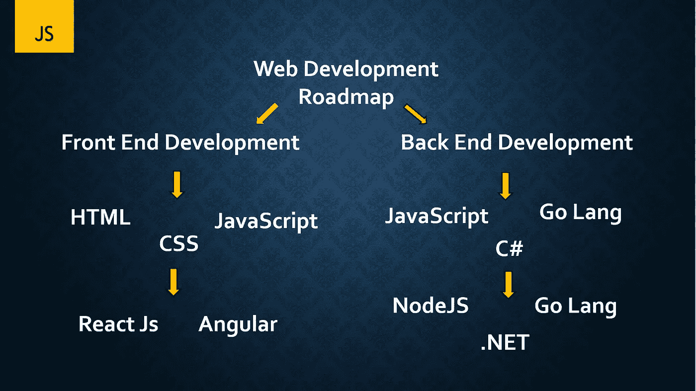
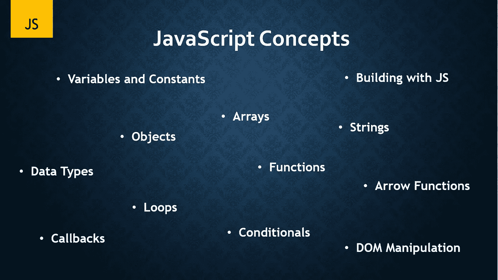
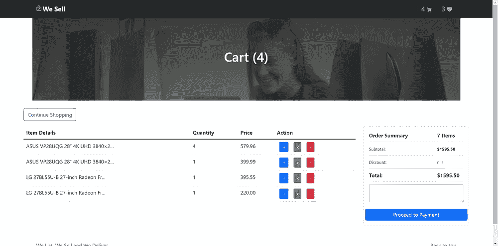
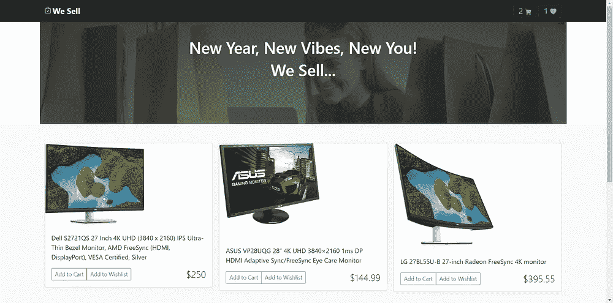

# 面向初学者的 JavaScript 介绍

> 原文：<https://javascript.plainenglish.io/introduction-javascript-series-for-beginners-8ddd09b75926?source=collection_archive---------10----------------------->

## 第 1 部分:JavaScript 从零到精通的路线图。

# 介绍

本系列旨在帮助之前对 JavaScript 一无所知的初学者入门，并最终成为使用 JavaScript 的专业人士，或者帮助那些希望进一步提高 JavaScript 技能的人。

# (尤指为开车者设计的) 公路交通图

在上面的路线图中，我们目前专注于前端开发，我们已经广泛地处理了 HTML 和 CSS，如果你对上述内容不了解，请抽出时间来观看和练习我们的 [HTML & CSS](https://www.youtube.com/playlist?list=PLcGrCiqDz4AlTZnvehVRCHhZGNRdS1xwZ) 视频，让你跟上速度。

# 我为什么要关心 JavaScript？

JavaScript 是开发者生态系统中最成功、使用最广泛、最流行的语言之一。成千上万的用户，包括 NASA、IBM、微软、PayPal、沃尔玛、优步、LinkedIn、网飞、Meta 等等，使用 Javascript 来构建他们面向客户的应用程序或内部工具。它也是初创企业中采用最多的语言，主要是因为，有了 JavaScript 的知识，你可以构建大量可扩展的程序，并且可以快速交付产品。
因此，你对 JavaScript 的了解比任何其他编程语言都要多，这能让你得到一份高薪的开发工作。

# 我们将要学习的概念

所有上述概念都将在本系列课程中得到很好的阐述。

# 我们在建什么项目？

在本系列的最后，我们将构建一个全功能的电子商务 web 应用程序。

我们将要开发的一些功能包括:

*   将商品添加到购物车
*   将商品添加到愿望清单
*   与作为主存储的浏览器本地存储进行交互
*   从本地存储中读取用户产品
*   Dom 操作
*   JavaScript 事件监听器
*   实时计算多种价格等等…

我对这个系列感到非常兴奋，相信你也一样！

下一篇文章再见！😉

*更多内容尽在* [***说白了. io***](http://plainenglish.io/) *。报名参加我们的* [***免费周报***](http://newsletter.plainenglish.io/) *。在我们的* [***社区获得独家访问写作机会和建议***](https://discord.gg/GtDtUAvyhW) *。*