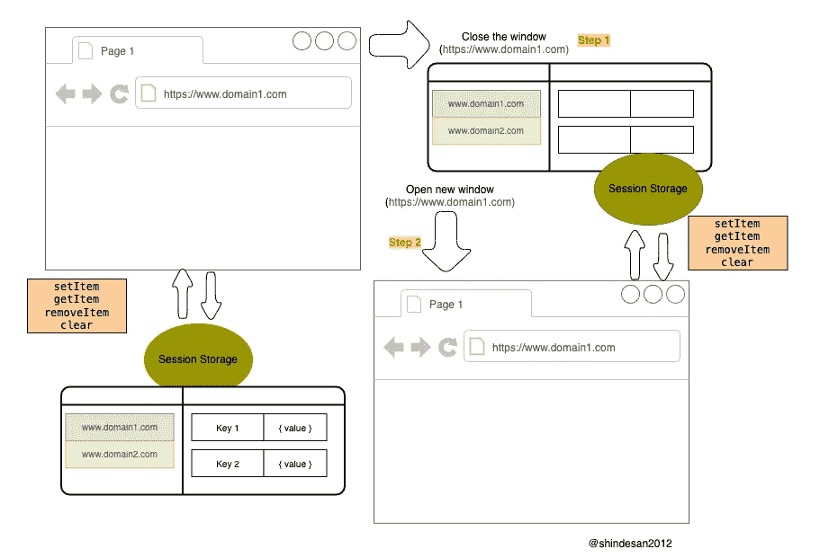

# 面向初学者的客户端存储介绍

> 原文：<https://javascript.plainenglish.io/introduction-to-client-side-storage-31b103909fb9?source=collection_archive---------4----------------------->

## 什么是客户端存储？客户端存储允许用户在客户端存储数据，并在需要时检索数据。

# 介绍

众所周知，现代网络浏览器有多种方式允许网站将用户数据存储在其机器上，以便在需要时检索。

您可以长期保存数据、存储文档或网站以供离线使用、保留网站的用户特定设置等等。

Client Storage

# **什么是客户端存储？**

顾名思义，客户端存储允许用户在客户端存储数据，它使用 JavaScript APIs，允许用户访问存储在客户端(即他们的机器上)的数据，并在需要时检索这些数据。

Client-Side Storage

# 为什么我们需要客户端存储？

1.  快速和独立于网络的数据访问
2.  存储用户首选项和配置(例如，自定义小部件和主题设置)
3.  存储之前活动的会话(例如，登录帐户和购物车)
4.  将数据保存在本地以供脱机使用

# 客户端存储的类型

1.  Web 存储(本地存储和会话存储)
2.  cookie(会话 cookie 和持久 cookie)
3.  索引 b
4.  缓存 API
5.  文件系统存储

## 1.网络存储

Web 存储，有时也称为 *DOM 存储(文档对象模型存储)*，提供用于在 web 浏览器中存储数据的 web 应用软件方法和协议。

Web 存储中有两种机制，如下所示:

*   局部存储器
*   会话存储

**a .什么是会话存储？**

`sessionStorage`为每个给定的原点维护一个单独的存储区域，该区域在页面会话期间可用(只要浏览器打开，包括页面重新加载和恢复)。

这个`sessionStorage`属性允许你访问一个当前原点的会话`Storage`对象。sessionStorage 与`Window.localStorage`类似，唯一的区别是存储在 localStorage 中的数据没有设置到期时间，当页面会话结束时，存储在 sessionStorage 中的数据会被清除。只要浏览器打开，页面会话就会持续，并在页面重新加载和恢复后继续存在。在新标签页或新窗口中打开页面将导致启动新会话，这与会话 cookies 的工作方式不同。

Sesson Storage

**b .什么是本地存储？**

`localStorage`做同样的事情，但是即使当浏览器被关闭并重新打开时仍然存在。

只读的`localStorage`属性允许你访问一个`Storage`对象作为`Document`的原点；存储的数据跨浏览器会话保存。`localStorage`类似于`sessionStorage`，除了当存储在`localStorage`中的数据没有到期时间时，存储在`sessionStorage`中的数据在页面会话结束时被清除——也就是当页面关闭时。

Local storage

## 2.饼干

一个`HTTP cookie`(网络 cookie，浏览器 cookie)是服务器发送给用户网络浏览器的一小段数据。

浏览器可以存储它并将它与下一个请求一起发送回同一个服务器。例如，它通常用于判断两个请求是否来自保持用户登录的同一个浏览器。它记住了无状态 HTTP 协议的有状态信息。

Cookies

**答:什么是会话 cookies？**

一旦我们关闭您的浏览器，会话 cookies 将被删除。

这些 cookies 不指定到期日期或最长期限，因此当浏览器关闭时，它们会被删除。

**b .什么是持久性 cookies？**

持久 cookies 指定过期或最大年龄属性。这些 cookies 不会在关闭浏览器时过期，但会在特定的日期(过期)或时间长度(最长期限)过期。

## 3.索引 b

IndexedDB 是一个低级 API，用于客户端存储大量结构化数据，包括文件/blob。这个 API 使用索引来实现对这些数据的高性能搜索。

IndexedDB 是一个事务数据库系统，类似于基于 SQL 的 RDBMS。然而，与使用固定列表的基于 SQL 的 RDBMSes 不同，IndexedDB 是基于 JavaScript 的面向对象数据库。

[IndexedDB API](https://developer.mozilla.org/en-US/docs/Web/API/IndexedDB_API) 为浏览器提供了一个完整的数据库系统，用于存储复杂的数据。这可以用于从完整的客户记录集到复杂的数据类型，如音频或视频文件。

**我们为什么需要 IndexedDB？**

*   存储比本地存储大得多的数据量
*   基于{ key: value }对存储任何类型的值
*   提供查找接口
*   对于不需要持续互联网连接的 web 应用程序非常有用
*   可以存储应用程序状态

**indexed db 的特性**

*   有一个异步 API
*   支持可靠性事务
*   支持版本控制
*   专用于域

## 4.缓存 API

[缓存应用编程接口](https://developer.mozilla.org/docs/Web/API/Cache)存储 HTTP 请求和响应对象。它主要用于渐进式网络应用程序中，以缓存网络响应，因此应用程序可以在脱机时为缓存的资源提供服务。存储其他类型的数据是不切实际的。

该接口的`Cache`为缓存在长寿命内存中的`[Request](https://developer.mozilla.org/en-US/docs/Web/API/Request)` / `[Response](https://developer.mozilla.org/en-US/docs/Web/API/Response)`对象对提供了持久存储机制。

## 5.文件系统存储

[文件和目录条目 API](https://developer.mozilla.org/docs/Web/API/File_and_Directory_Entries_API) 提供了一个沙盒文件系统，可用于创建、写入、读取和删除目录和文件的域。

感谢阅读，请分享你的评论，如果这个博客对你的学习有价值，请鼓掌。在 LinkedIn *上跟我来 [*推特*](https://twitter.com/shindesan2012) 和 [*。*](https://www.linkedin.com/in/shindesantosh/)*

# 参考

 [## 客户端存储-学习网络开发| MDN

### 到此为止。我们希望您已经发现我们的客户端存储技术概要很有用。

developer.mozilla.org](https://developer.mozilla.org/en-US/docs/Learn/JavaScript/Client-side_web_APIs/Client-side_storage)  [## 缓存-网络 APIs | MDN

### 缓存接口为长时间缓存的请求/响应对象对提供了持久存储机制…

developer.mozilla.org](https://developer.mozilla.org/en-US/docs/Web/API/Cache) 

*更多内容请看*[***plain English . io***](https://plainenglish.io/)*。报名参加我们的* [***免费周报***](http://newsletter.plainenglish.io/) *。关注我们关于*[***Twitter***](https://twitter.com/inPlainEngHQ)*和**[***LinkedIn***](https://www.linkedin.com/company/inplainenglish/)*。加入我们的* [***社区***](https://discord.gg/GtDtUAvyhW) *。**