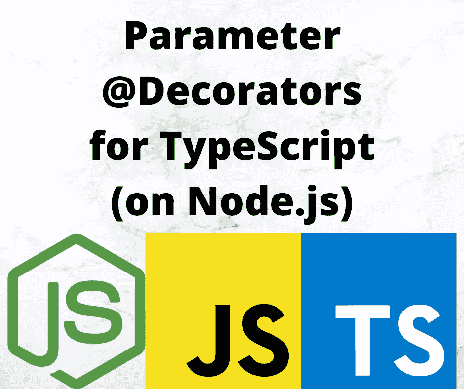

# TypeScript 中的参数修饰符简介

> 原文：<https://javascript.plainenglish.io/introduction-to-parameter-decorators-in-typescript-b0042b5474ed?source=collection_archive---------9----------------------->

## 探索参数装饰器的使用和发展，为方法装饰器做准备



Image by Author using corresponding project logos

Decorators 允许我们向 TypeScript 中的类或方法添加附加信息，类似于 Java 中的注释。参数修饰符应用于 TypeScript 中的方法参数定义。通过它们，我们可以记录有关参数的信息，包括在其他特征中使用该数据的定制信息。

在本文中，我们将探索在 TypeScript 中为方法参数开发装饰器。这就是参数装饰器在实践中的样子:

```
@ClassDecorator() 
class A { 
    ...
    @MethodDecorator()
    fly(
         @ParameterDecorator(?? optional parameters)
         meters: number
    ) {
         // code
    }
 ...
}
```

正如我们将看到的，我们不能对参数装饰器本身做太多，因为装饰器函数接收的信息很少。这使得在参数装饰器和其他代码(比如方法装饰器)之间共享数据变得非常重要。

要使用 decorator，必须在 TypeScript 中启用两个特性，所以请务必[阅读本系列的 decorator 介绍文章](/deep-introduction-to-using-and-implementing-typescript-decorators-a9e876ad0d43)。

本文是系列文章的一部分:

*   [装修工入门](/deep-introduction-to-using-and-implementing-typescript-decorators-a9e876ad0d43)
*   [类装修工](https://itnext.io/deep-introduction-to-class-decorators-in-typescript-23005ea5d035)
*   [物业装修工](/a-deep-introduction-to-property-decorators-in-typescript-8ef011169ec)
*   [访问器装饰器](/typescript-accessor-decorators-in-depth-take-control-over-get-and-set-accessor-methods-8b85c95124f9)
*   **参数装饰者** *本条*
*   [方法装饰者](/a-deep-introduction-to-method-decorators-in-typescript-6045d52e10a6)
*   [混合装修工](/implement-hybrid-decorator-functions-in-typescript-f6d24bc5abb0)
*   [用装饰器使用反射和反射 API](/using-the-reflection-and-reflection-metadata-apis-with-typescript-decorators-c56ba9c690c7)
*   [运行时使用装饰器进行数据验证](/runtime-data-validation-in-typescript-using-decorators-and-reflection-metadata-3219fdf5dfb5)

# 探索 TypeScript 中的参数修饰符

参数装饰器附加到类构造函数或类成员方法的参数上。它们不能和一个独立的函数一起使用，因为你会得到*decorator 在这里无效*的错误。它们只能与作为类定义一部分的函数的参数一起使用，如上所示。

参数装饰函数的签名是:

1.  静态成员的类的构造函数或实例成员的类的原型。
2.  给出属性名称的字符串
3.  函数的参数列表中参数的序号索引

前两个参数类似于提供给属性和访问器装饰函数的参数。第三个引用类方法的参数列表中的位置:

```
class ClassName {
     method(param0, param1, param2, param3, ...) {
        ..
     }
}
```

参数以从 0 开始的索引进行编号，如下所示。第三个参数只是一个给出索引的整数，比如`0`、`1`、`2`等。

对于其他 decorators，一个名为 PropertyDescriptor 的对象出现在第三个参数中。人们可以用这个描述符做很多有趣的事情，但是它不能用于参数装饰器。

# TypeScript 中参数修饰符的简单示例

为了了解它是如何工作的，让我们尝试一个简单的例子来打印我们收到的值:

```
import * as util from 'util'; function logParameter(target: Object, 
                      propertyKey: string | symbol,
                      parameterIndex: number) {
      console.log(`logParameter ${target} ${util.inspect(target)} ${String(propertyKey)} ${parameterIndex}`);
}class ParameterExample {
      member(@logParameter x: number,
             @logParameter y: number) {
         console.log(`member ${x} ${y}`);
      }
}const pex = new ParameterExample();pex.member(2, 3); 
pex.member(3, 5); 
pex.member(5, 8);
```

`target`的类型被指定为通用`Object`。`propertyKey`是函数的名称，在本例中是`member`。`parameterIndex`是一个整数，从`0`开始，枚举这个装饰器所附加的参数。

运行这个脚本，我们得到以下输出:

```
$ npx ts-node lib/parameters/parameters.ts  
logParameter [object Object] {} member 1 
logParameter [object Object] {} member 0 
member 2 3 
member 3 5
 member 5 8
```

`target`原来是一个匿名对象。否则，键和索引值是预期的。

注意，参数装饰器没有机会对包含参数的对象实例执行代码。相反，它的影响范围是在创建类对象期间。与其他 decorators 不同，我们没有被赋予任何可以被修改来影响类实例行为的对象。

相反，参数装饰器主要用作向方法参数添加信息的标记。官方文件明确指出:

> *参数装饰器只能用于观察一个参数已经在一个方法上声明。*

在大多数情况下，使用参数装饰器做任何有意义的事情都需要与其他装饰器合作。例如，参数装饰器可以使用反射和反射元数据 API 存储数据，其他装饰器可以在实现其他功能时使用这些数据。

# 深入了解参数修饰者可用的数据

深入检查`target`对象有潜在的价值。我们从 TypeScript 文档中看到它是类对象，所以让我们验证一下这是什么意思。

在`[decorator-inspectors](https://www.npmjs.com/package/decorator-inspectors)`包中，有一个我们可以使用的装饰器。这个例子来自于那个装饰器:

```
export function ParameterInspector(target: Object,
                                   propertyKey: string | symbol,
                                   parameterIndex: number) {
      const ret = {
         target, propertyKey, parameterIndex,
         ownKeys: Object.getOwnPropertyNames(target),
         members: {}
      };
      for (const key of Object.getOwnPropertyNames(target)) {
         ret.members[key] = {
             obj: target[key],
             descriptor: util.inspect(
                 Object.getOwnPropertyDescriptor(target, key)
             )
         };
     }
     console.log(ret);
}
```

它检索属性名列表，然后获取这些属性的更多细节。

如果我们用`@ParameterInspector`代替上面例子中的`@logInspector`，我们会得到这样的输出:

```
{
   target: {},
   propertyKey: 'member',
   parameterIndex: 0,
   ownKeys: [ 'constructor', 'member' ],
   members: {
     constructor: {
       obj: [class ParameterExample],
       descriptor: '{\n' +
         '  value: [class ParameterExample],\n' +
         '  writable: true,\n' +
         '  enumerable: false,\n' +
         '  configurable: true\n' +
         '}'
     },
     member: {
       obj: [Function: member],
       descriptor: '{\n' +
         '  value: [Function: member],\n' +
         '  writable: true,\n' +
         '  enumerable: false,\n' +
         '  configurable: true\n' +
         '}'
     }
   }
}
```

事实上，这清楚地表明`target`就是上面显示的类。由`getOwnPropertyNames`返回的列表是方法名——包括作为方法的`constructor`,即使我们没有显式地创建一个构造函数。甚至还有一个可用的 PropertyDescriptor。

# 向框架注册参数装饰器

我们刚刚讨论了将参数装饰器数据保存在某个地方是如何有益的，以便其他装饰器可以使用该数据做一些事情。正如我们对[类装饰者](https://itnext.io/deep-introduction-to-class-decorators-in-typescript-23005ea5d035)和[属性装饰者](/a-deep-introduction-to-property-decorators-in-typescript-8ef011169ec)所说的，你的装饰者可以是一个“框架”的一部分，在这个框架中，每一个装饰者为了一个更大的目标而一起工作。

一个例子可能是在像 Express 这样的 web 框架中表示路由器的类中的路由处理方法。我们可能希望将它注入到从 URL 中的查询字符串捕获的参数值中，或者注入到 POST 请求的主体参数中。

```
@Router('/blog') 
class BlogRouter {
     @Get('/view/:id')
     viewPost(req, res, next,
         @URLParam('id') id: string
     ) {
         // handle route
     } 
}
```

Reflet decorator library for Express 有这样的参数装饰器，以及这里显示的其他装饰器。对于这个例子，让我们只实现`URLParam`中记录一些数据的部分。当我们使用[方法装饰器](https://techsparx.com/nodejs/typescript/decorators/methods.html)时，我们将创建一个更完整的例子，其中方法和参数装饰器一起工作。

```
const registered = []; function URLParam(id: string) {
     return (target: Object,
         propertyKey: string | symbol,
         parameterIndex: number) => {
          const topush = {
             target, propertyKey, parameterIndex, urlparam: id,
             ownKeys: Object.getOwnPropertyNames(target),
             function: target[propertyKey],
             // funcDescriptor: Object.getOwnPropertyDescriptor(target, propertyKey)
         };
         registered.push(topush);
     } 
} class BlogRouter {
      viewPost(req, res, next,
         @URLParam('id') id: string
     ) {
         console.log(`viewPost`);
     } viewComments(req, res, next,
                 @URLParam('id') id: string,
                 @URLParam('commentID') commentID: string
     ) {
         console.log(`viewComments`);
     } 
} console.log(registered);
```

`URLParam`是一个参数描述符函数，它收集一些关于参数装饰器和包含参数的方法的数据。它将这些数据保存到一个数组中，目的是让其他装饰者或框架使用这些数据来构造有用的东西。当讨论[反射和元数据 API](https://techsparx.com/nodejs/typescript/decorators/reflection.html)时，我们将看到一种更实用的方法来存储这些数据。

在`BlogRouter`类中，我们有两个方法，它们之间有一些参数，一些参数有`@URLParam`装饰器。

我们可以这样运行脚本:

```
$ npx ts-node lib/parameters/urlparam.ts 
[
   { 
     target: {},
     propertyKey: 'viewPost',
     parameterIndex: 3,
     urlparam: 'id',
     ownKeys: [ 'constructor', 'viewPost', 'viewComments' ],
     function: [Function: viewPost]
   },
   {
     target: {},
     propertyKey: 'viewComments',
     parameterIndex: 4,
     urlparam: 'commentID',
     ownKeys: [ 'constructor', 'viewPost', 'viewComments' ],
     function: [Function: viewComments]
   },
   {
     target: {},
     propertyKey: 'viewComments',
     parameterIndex: 3,
     urlparam: 'id',
     ownKeys: [ 'constructor', 'viewPost', 'viewComments' ],
     function: [Function: viewComments]
   } 
]
```

这给了我们三个相应的数据对象。`propertyKey`字段包含包含参数的方法名，而`parameterIndex`包含其在参数列表中的索引。然后我们在`urlparam`中记录从 URL 中获取哪个项目。然后我们记录函数名列表，以及方法的函数对象，因为这些可能会有用。

我们已经证明，在另一个地方记录任何我们喜欢的关于房产的数据是非常容易的。

# 摘要

我们能够将装饰器附加到方法参数上。这意味着我们可以记录关于附加到每个参数的装饰者的信息，然后用这些数据做一些事情。

提供给装饰函数的数据的性质限制了该函数的能力。这意味着我们将期待一个方法装饰器函数利用关于参数装饰器的数据来做一些有用的事情。

# 关于作者

[***David Herron***](https://davidherron.com)*:David Herron 是一名作家和软件工程师，专注于技术的明智使用。他对太阳能、风能和电动汽车等清洁能源技术特别感兴趣。David 在硅谷从事了近 30 年的软件工作，从电子邮件系统到视频流，再到 Java 编程语言，他已经出版了几本关于 Node.js 编程和电动汽车的书籍。*

*原载于*[](https://techsparx.com/nodejs/typescript/decorators/parameters.html)**。**

**更多内容看* [***说白了. io***](http://plainenglish.io/) *。报名参加我们的* [***免费周报***](http://newsletter.plainenglish.io/) *。在我们的* [***社区获得独家访问写作机会和建议***](https://discord.gg/GtDtUAvyhW) *。**